# 資料分析

## 票房分析

### 一、疫情前後的票房差異


2019年底，全球疫情爆發，隨著八大場所的關閉，電影院的生意也因此大受打擊。時至今日，疫苗逐漸普及，疫情稍為緩和，我們想要知道「電影營收是否依舊受到影響」。我們假設2020/10/01（第四季）後的電影依舊受到疫情影響，以此假設分析：「2019/10/01 - 2019/12/31」與「2020/10/01 - 2020/12/31」的電影票房是否有差異。


```python
covid_df = u_movie_df[((u_movie_df.release_date >= '2019-01-01'))]
covid_df_t1 = covid_df[((covid_df.release_date >= '2019-10-01') & (covid_df.release_date <= '2019-12-31'))]
covid_df_t2 = covid_df[((covid_df.release_date >= '2020-10-01'))]
covid_revenue = {'before_covid': covid_df_t1.revenue.dropna().reset_index().revenue,
                 'after_covid' : covid_df_t2.revenue.dropna().reset_index().revenue}
covid_df_revenue = pd.DataFrame(covid_revenue)
display(covid_df_revenue.head())
display(covid_df_revenue.tail())
```


<div>
<style scoped>
    .dataframe tbody tr th:only-of-type {
        vertical-align: middle;
    }

    .dataframe tbody tr th {
        vertical-align: top;
    }

    .dataframe thead th {
        text-align: right;
    }
</style>
<table border="1" class="dataframe">
  <thead>
    <tr style="text-align: right;">
      <th></th>
      <th>before_covid</th>
      <th>after_covid</th>
    </tr>
  </thead>
  <tbody>
    <tr>
      <th>0</th>
      <td>1074251311</td>
      <td>1070714.0</td>
    </tr>
    <tr>
      <th>1</th>
      <td>173469516</td>
      <td>15104310.0</td>
    </tr>
    <tr>
      <th>2</th>
      <td>122801777</td>
      <td>168285000.0</td>
    </tr>
    <tr>
      <th>3</th>
      <td>203044905</td>
      <td>25814306.0</td>
    </tr>
    <tr>
      <th>4</th>
      <td>491570967</td>
      <td>12886100.0</td>
    </tr>
  </tbody>
</table>
</div>


<div>
<style scoped>
    .dataframe tbody tr th:only-of-type {
        vertical-align: middle;
    }

    .dataframe tbody tr th {
        vertical-align: top;
    }

    .dataframe thead th {
        text-align: right;
    }
</style>
<table border="1" class="dataframe">
  <thead>
    <tr style="text-align: right;">
      <th></th>
      <th>before_covid</th>
      <th>after_covid</th>
    </tr>
  </thead>
  <tbody>
    <tr>
      <th>30</th>
      <td>17133446</td>
      <td>NaN</td>
    </tr>
    <tr>
      <th>31</th>
      <td>73515024</td>
      <td>NaN</td>
    </tr>
    <tr>
      <th>32</th>
      <td>191540586</td>
      <td>NaN</td>
    </tr>
    <tr>
      <th>33</th>
      <td>50401502</td>
      <td>NaN</td>
    </tr>
    <tr>
      <th>34</th>
      <td>374733942</td>
      <td>NaN</td>
    </tr>
  </tbody>
</table>
</div>


```python
before = covid_df_revenue['before_covid'].dropna().values
after = covid_df_revenue['after_covid'].dropna().values
```

**檢查資料是否為常態分佈**


```python
_ = plt.hist(before, bins = 'auto', alpha=0.5)
plt.title('Revenue of Q4 in 2020')
plt.show()

_ = plt.hist(after, bins = 'auto', alpha=0.5)
plt.title('Revenue of Q4 in 2019')
plt.show()
```


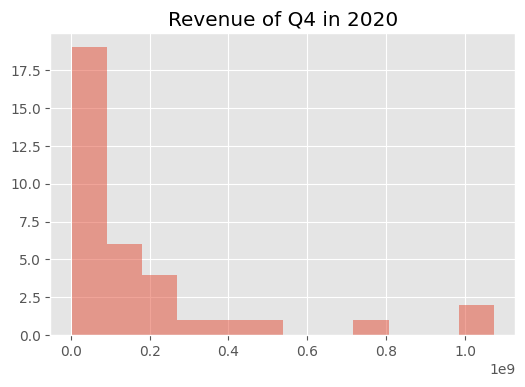


```python
# the histogram of the data
bins_list = [0, 0.2e8, 0.4e8, 0.6e8, 0.8e8, 1e8]
fig, ax = plt.subplots()
counts, bins, patches = plt.hist(before, bins=bins_list, density=False, facecolor='b', alpha=0.5)
plt.xlabel('Revenue in 2019')
plt.ylabel('Frequency')
plt.title('Histogram of Revenue of Movie in 2019')
plt.grid(True)
plt.xticks(bins_list)
bin_centers = [np.mean(k) for k in zip(bins[:-1], bins[1:])]
ax.plot(bin_centers, counts.cumsum(), 'ro-')
plt.show()

# the histogram of the data
bins_list = [0, 0.2e8, 0.4e8, 0.6e8, 0.8e8, 1e8]
fig, ax = plt.subplots()
counts, bins, patches = plt.hist(after, bins=bins_list, density=False, facecolor='b', alpha=0.5)
plt.xlabel('Revenue in 2020')
plt.ylabel('Frequency')
plt.title('Histogram of Revenue of Movie in 2020')
plt.grid(True)
plt.xticks(bins_list)
bin_centers = [np.mean(k) for k in zip(bins[:-1], bins[1:])]
ax.plot(bin_centers, counts.cumsum(), 'ro-')
plt.show()
```


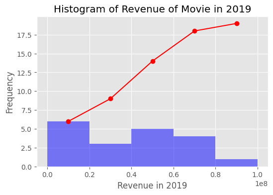


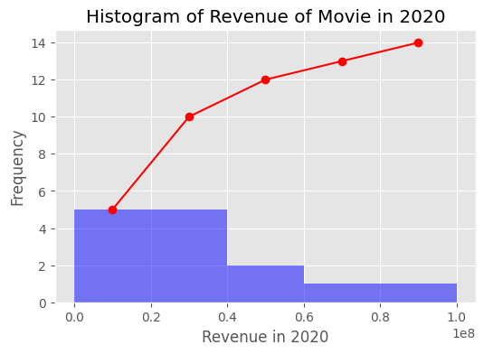


由以上的長條圖，我們可以認定兩資料非常態分佈，因此使用 Wilcoxon Rank Sum Test。

+ $H_0:$ The locations of the two populations are the same. <br>
+ $H_1:$ The locations of before_covid(2019/10 - 2019/12) is greater than after_covid(2020/10 - 2020/12).


```python
stats.mannwhitneyu(before , after , alternative = 'greater')
```


    MannwhitneyuResult(statistic=447.0, pvalue=0.019465268036451523)


由檢定結果發現 p-value < 0.05，因此我們可以拒絕虛無假設，推論一直到2020/10第四季後的電影票房依然受到影響。若將信心水準調整至0.01，則會顯示沒有差異，因此我們認為電影票房一直到2020年底之後，就有回穩的趨勢。

我們接著拿 2020/07 - 2020/09 的資料與 2020/10 - 2020/12 比較，確認是否有回穩的趨勢。


```python
covid_df_t1 =  covid_df[((covid_df.release_date >= '2020-07-01') & (covid_df.release_date <= '2020-09-30'))]
covid_df_t2 =  covid_df[((covid_df.release_date >= '2020-10-01'))]
covid_revenue = {'phase1': covid_df_t1.revenue.dropna().reset_index().revenue,
                 'phase2' : covid_df_t2.revenue.dropna().reset_index().revenue}
covid_df_revenue = pd.DataFrame(covid_revenue)
display(covid_df_revenue.head())
display(covid_df_revenue.tail())

phase1 = covid_df_revenue['phase1'].dropna().values
phase2 = covid_df_revenue['phase2'].dropna().values
```


<div>
<style scoped>
    .dataframe tbody tr th:only-of-type {
        vertical-align: middle;
    }

    .dataframe tbody tr th {
        vertical-align: top;
    }

    .dataframe thead th {
        text-align: right;
    }
</style>
<table border="1" class="dataframe">
  <thead>
    <tr style="text-align: right;">
      <th></th>
      <th>phase1</th>
      <th>phase2</th>
    </tr>
  </thead>
  <tbody>
    <tr>
      <th>0</th>
      <td>39657073.0</td>
      <td>1070714</td>
    </tr>
    <tr>
      <th>1</th>
      <td>39238300.0</td>
      <td>15104310</td>
    </tr>
    <tr>
      <th>2</th>
      <td>47800000.0</td>
      <td>168285000</td>
    </tr>
    <tr>
      <th>3</th>
      <td>4700000.0</td>
      <td>25814306</td>
    </tr>
    <tr>
      <th>4</th>
      <td>363129000.0</td>
      <td>12886100</td>
    </tr>
  </tbody>
</table>
</div>


<div>
<style scoped>
    .dataframe tbody tr th:only-of-type {
        vertical-align: middle;
    }

    .dataframe tbody tr th {
        vertical-align: top;
    }

    .dataframe thead th {
        text-align: right;
    }
</style>
<table border="1" class="dataframe">
  <thead>
    <tr style="text-align: right;">
      <th></th>
      <th>phase1</th>
      <th>phase2</th>
    </tr>
  </thead>
  <tbody>
    <tr>
      <th>14</th>
      <td>NaN</td>
      <td>47019435</td>
    </tr>
    <tr>
      <th>15</th>
      <td>NaN</td>
      <td>30763855</td>
    </tr>
    <tr>
      <th>16</th>
      <td>NaN</td>
      <td>76706000</td>
    </tr>
    <tr>
      <th>17</th>
      <td>NaN</td>
      <td>80648577</td>
    </tr>
    <tr>
      <th>18</th>
      <td>NaN</td>
      <td>46586903</td>
    </tr>
  </tbody>
</table>
</div>


+ $H_0:$ The locations of the two populations are the same. <br>
+ $H_1:$ The locations of phase1(2020/7 - 2020/9) is less than phase2(2020/10 - 2020/12).


```python
stats.mannwhitneyu(phase1 , phase2 , alternative = 'less')
```


    MannwhitneyuResult(statistic=80.0, pvalue=0.40285679813398884)


由檢定結果發現 p-value > 0.05，因此我們不可以拒絕虛無假設，推論一直到2020/10第四季後的電影票房相較於第三季已有好轉，不過因為疫情後之票房依然受到影響，因此接下來的分析，我們將去除疫情後的資料。

### 二、票房與投入成本的關係


```python
data_b_r = u_movie_df[['budget', 'revenue']]

fig, ax = plt.subplots(figsize=(16,8))
ax.scatter(data_b_r['budget'], data_b_r['revenue'])
ax.set_xlabel('movie budget (dollars)')
ax.set_ylabel('revenue (dollars)')
plt.show()

corr = data_b_r.corr()
_ = sns.heatmap(corr, annot=True)
```


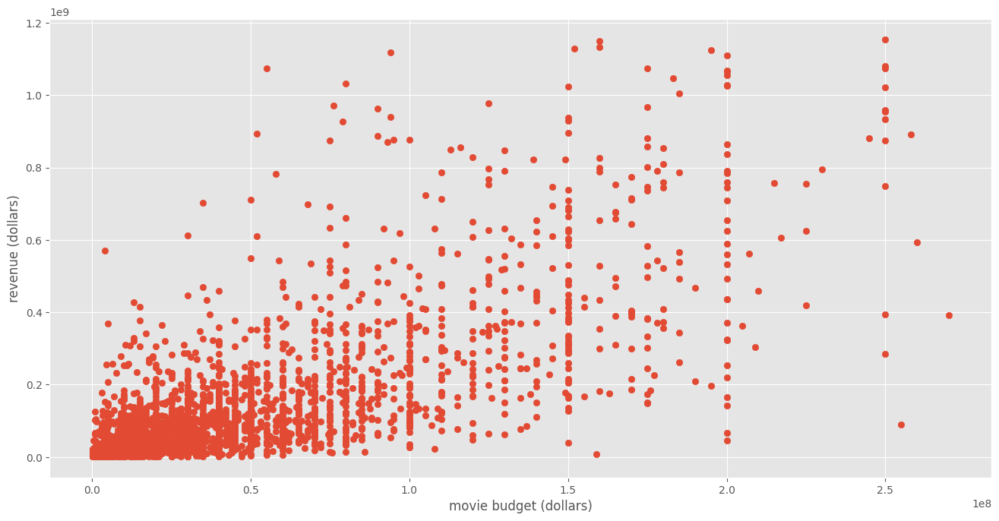


從以上的散布圖我們可以看見具備一定程度的線性關係，我們使用 Pearson Correlation of Coefficient test 來驗證。

兩變數 budget, revenue 之間的關係為 $\rho$，當 $\rho = 0$ 時，代表選定的兩變數無關。

+ $H_0$: $\rho = 0$<br>
+ $H_1$: $\rho \neq  0$


```python
stats.spearmanr(data_b_r['budget'], data_b_r['revenue'])
```


    SpearmanrResult(correlation=0.7033468696684063, pvalue=0.0)


由檢定結果發現 p-value < 0.05，因此我們可以拒絕虛無假設，推測投入成本與票房相關。

### 三、票房與參演者的關係 - 男女演員的多寡會不會影響票房

隨著性別平權議題、女權意識抬頭，越來越多人對於這樣的思潮越來越關注。2017年的#metoo運動，更是揭露了美國影視產業對於女性的種種不平等。以此為發想，我們希望可以探究：觀眾喜好是否有受到自19世紀後期開始的女權思潮影響。

<div class="alert alert-block alert-info">
<b>🍿 你知道嗎？</b><br>
    
在2007年到2012年間，有台詞的女性角色比例僅佔30.8%</div>


```python
cast_gender = u_movie_df[['revenue', 'female_cast_cnt', 'male_cast_cnt']].copy()
cast_col = ['female_cast_cnt', 'male_cast_cnt']
mgt2001.model.multi_scatter_plot(1, 2, cast_gender, cast_col, 'revenue', figsize=(13, 5))
```


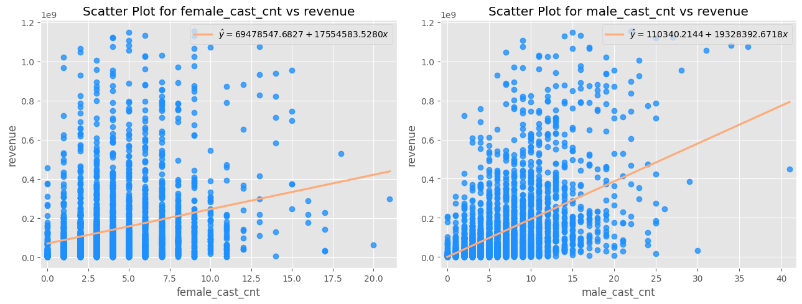


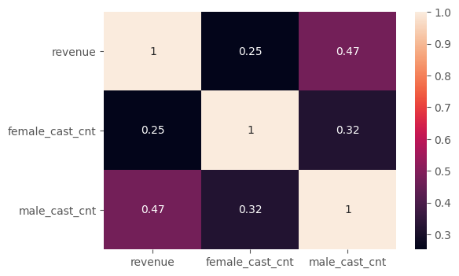


可以自散佈圖x軸線發現，男性演員數量明顯大於女性演員數量。然而這樣依然無法看出女性演員對於電影票房的影響力（演員數量多，投入成本相對較高，根據上一個檢定，票房也相對較高），因此我們決定探究：女性演員不少於男性演員的電影，票房是否較高。


```python
cast_gender["diff"] = cast_gender["female_cast_cnt"] - cast_gender["male_cast_cnt"]
print(cast_gender)   

m = cast_gender['diff'] > 0
positive, negative = cast_gender[m], cast_gender[~m]
```

            revenue  female_cast_cnt  male_cast_cnt  diff
    0     161834276                8             12    -4
    1     144056873                4              3     1
    2      45554533                1              5    -4
    3      28780255                2             12   -10
    4     106371651                5              5     0
    ...         ...              ...            ...   ...
    2783   47019435                2             10    -8
    2784   30763855                3              4    -1
    2785   76706000                1             12   -11
    2786   80648577                3             13   -10
    2787   46586903                5              7    -2
    
    [2788 rows x 4 columns]


$t$-test:

+ $H_0$: $\mu_1 - \mu_2 = 0$
+ $H_1$: $\mu_1 - \mu_2 < 0$.

其中，
+ $\mu_1$: average revenue that female cast count is greater than male cast count
+ $\mu_2$: average revenue that female cast count is smaller than male cast count

Check normality first:

1. 直方圖
2. Shapiro檢定<br>

+ $H_0$: The population is normally distributed
+ $H_1$: The population is not normally distributed


```python
# 轉換成numpy array
sample1 = positive['revenue'].values
sample2 = negative['revenue'].values

# 移除nan
sample1 = sample1[~np.isnan(sample1)]
sample2 = sample2[~np.isnan(sample2)]

#自由度計算
v1 = sample1.shape[0] - 1
v2 = sample2.shape[0] - 1

#畫histogram確認是否常態分佈
fig = plt.hist(sample1, bins = 'auto')
plt.title('Revenue')
plt.ylabel('revenue')
plt.xlabel("female > male")
plt.show()

fig = plt.hist(sample2, bins = 'auto')
plt.title('')
plt.ylabel('revenue')
plt.xlabel("female < male")
plt.show()

#Shapiro Test
print("Sample 1:")
print(stats.shapiro(sample1))
print("Sample 2:")
print(stats.shapiro(sample2))
```


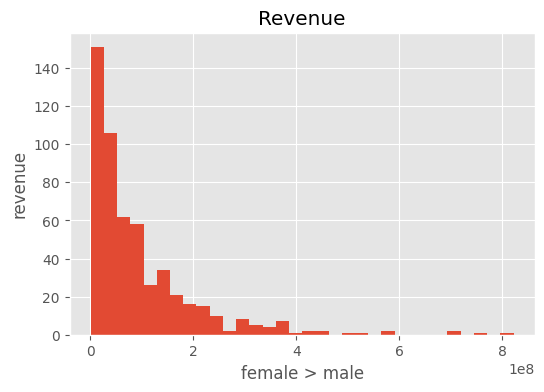


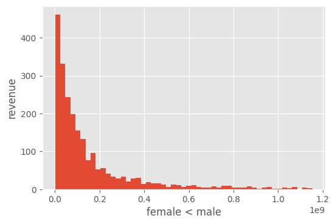


    Sample 1:
    ShapiroResult(statistic=0.7325308918952942, pvalue=1.691291852961973e-28)
    Sample 2:
    ShapiroResult(statistic=0.6975903511047363, pvalue=0.0)


根據上方的直方圖和 Shapiro 檢定結果 ($p$-value $< 0.05$，拒絕虛無假設），我們可以推測資料不是常態分佈。

因此，我們改使用 Wilcoxon Rank Sum test.

+ $H_0$: The two population locations are the same
+ $H_1$: The location of the population 1 is to the right of the location of population 2.

Populations:

+ population 1: average revenue that female cast count is greater than male cast count
+ population 2: average revenue that female cast count is smaller than male cast count


```python
stats.ranksums(positive['revenue'], negative['revenue'])
```


    RanksumsResult(statistic=-5.26309699662061, pvalue=1.4164879821151155e-07)


由上述檢定結果（p-vlaue < 0.05)，我們可以拒絕虛無假設，可以推論當女性演員數量大於男性演員數量時，票房較高。

### 四、評分網站的差異：

#### 1. 影評人與大眾評分差異比較：

電影評分網站Rotten Tomato有許多評分機制，其中最受到矚目的兩個分別是「影評人的評分」與「大眾的評分」。以此為發想，我們比較Rotten Tomato上影評人與大眾的評分是否存在差異。 


```python
df_compare_rating_1 = u_movie_df[['rotten_score', 'rotten_aud_score']].copy()
df_compare_rating_1 = df_compare_rating_1.dropna().reset_index()
print('Head of dataset:')
display(df_compare_rating_1.head())
print("Tail of dataset:")
display(df_compare_rating_1.tail())
```

    Head of dataset:


<div>
<style scoped>
    .dataframe tbody tr th:only-of-type {
        vertical-align: middle;
    }

    .dataframe tbody tr th {
        vertical-align: top;
    }

    .dataframe thead th {
        text-align: right;
    }
</style>
<table border="1" class="dataframe">
  <thead>
    <tr style="text-align: right;">
      <th></th>
      <th>index</th>
      <th>rotten_score</th>
      <th>rotten_aud_score</th>
    </tr>
  </thead>
  <tbody>
    <tr>
      <th>0</th>
      <td>0</td>
      <td>40.0</td>
      <td>37.0</td>
    </tr>
    <tr>
      <th>1</th>
      <td>1</td>
      <td>20.0</td>
      <td>57.0</td>
    </tr>
    <tr>
      <th>2</th>
      <td>2</td>
      <td>62.0</td>
      <td>62.0</td>
    </tr>
    <tr>
      <th>3</th>
      <td>3</td>
      <td>66.0</td>
      <td>78.0</td>
    </tr>
    <tr>
      <th>4</th>
      <td>4</td>
      <td>44.0</td>
      <td>64.0</td>
    </tr>
  </tbody>
</table>
</div>


    Tail of dataset:


<div>
<style scoped>
    .dataframe tbody tr th:only-of-type {
        vertical-align: middle;
    }

    .dataframe tbody tr th {
        vertical-align: top;
    }

    .dataframe thead th {
        text-align: right;
    }
</style>
<table border="1" class="dataframe">
  <thead>
    <tr style="text-align: right;">
      <th></th>
      <th>index</th>
      <th>rotten_score</th>
      <th>rotten_aud_score</th>
    </tr>
  </thead>
  <tbody>
    <tr>
      <th>2405</th>
      <td>2783</td>
      <td>83.0</td>
      <td>94.0</td>
    </tr>
    <tr>
      <th>2406</th>
      <td>2784</td>
      <td>29.0</td>
      <td>57.0</td>
    </tr>
    <tr>
      <th>2407</th>
      <td>2785</td>
      <td>55.0</td>
      <td>86.0</td>
    </tr>
    <tr>
      <th>2408</th>
      <td>2786</td>
      <td>66.0</td>
      <td>91.0</td>
    </tr>
    <tr>
      <th>2409</th>
      <td>2787</td>
      <td>74.0</td>
      <td>97.0</td>
    </tr>
  </tbody>
</table>
</div>


**檢查資料是否為常態分佈**


```python
_ = plt.hist(df_compare_rating_1['rotten_score'], bins = 'auto', alpha=0.5)
plt.title('Bar chart of rotten_score')
plt.show()

_ = plt.hist(df_compare_rating_1['rotten_aud_score'], bins = 'auto', alpha=0.5)
plt.title('Bar chart of rotten_aud_score')
plt.show()
```


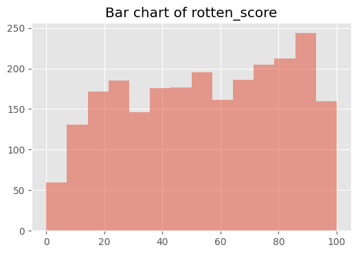


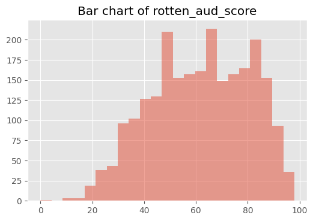


```python
fig = sm.qqplot(df_compare_rating_1['rotten_score'], stats.norm, fit=True, line='45')
fig = sm.qqplot(df_compare_rating_1['rotten_aud_score'], stats.norm, fit=True, line='45')
```


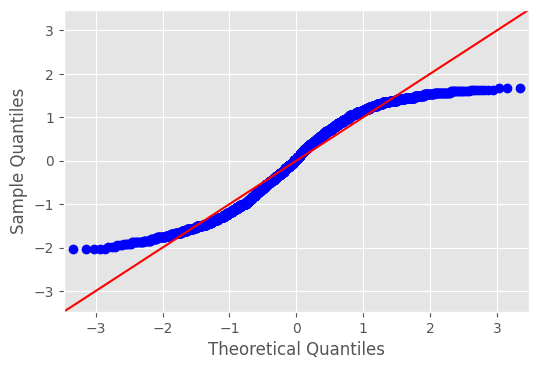


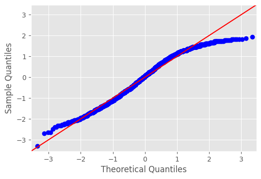


從直方圖和 Shapiro test 之後，我們認定 rotten_score 為非常態分佈，rotten_aud_score 為常態分佈，因此採用 Wilcoxon Signed Rank Sum Test.

+ $H_0:$ The two population locations are the same
+ $H_1:$ The two population locations are NOT the same


```python
stats.wilcoxon(df_compare_rating_1['rotten_score'], df_compare_rating_1['rotten_aud_score'], alternative='two-sided')
```


    WilcoxonResult(statistic=875752.5, pvalue=1.4523706162642633e-55)


由檢定結果發現 p-value < 0.05，因此我們可以拒絕虛無假設，推論專業影評人與觀眾評分不盡相同。

#### 2.不同平台間觀眾評分比較: TMDb vs Rotten Tomato

我們好奇針對同一部電影在不同平台上的觀眾評分是否有差異，因此比較爛番茄觀眾評分及TMDb上的觀眾評分結果是否相同。


```python
df_compare_rating_2 = u_movie_df[['TMDB_score','rotten_aud_score']].copy()
df_compare_rating_2 = df_compare_rating_2.dropna().reset_index()
df_compare_rating_2['TMDB_score'] = df_compare_rating_2['TMDB_score']*10 
print('Head of dataset:')
display(df_compare_rating_2.head())
print("Tail of dataset:")
display(df_compare_rating_2.tail())
```

    Head of dataset:


<div>
<style scoped>
    .dataframe tbody tr th:only-of-type {
        vertical-align: middle;
    }

    .dataframe tbody tr th {
        vertical-align: top;
    }

    .dataframe thead th {
        text-align: right;
    }
</style>
<table border="1" class="dataframe">
  <thead>
    <tr style="text-align: right;">
      <th></th>
      <th>index</th>
      <th>TMDB_score</th>
      <th>rotten_aud_score</th>
    </tr>
  </thead>
  <tbody>
    <tr>
      <th>0</th>
      <td>0</td>
      <td>59.0</td>
      <td>37.0</td>
    </tr>
    <tr>
      <th>1</th>
      <td>1</td>
      <td>64.0</td>
      <td>57.0</td>
    </tr>
    <tr>
      <th>2</th>
      <td>2</td>
      <td>65.0</td>
      <td>62.0</td>
    </tr>
    <tr>
      <th>3</th>
      <td>3</td>
      <td>67.0</td>
      <td>78.0</td>
    </tr>
    <tr>
      <th>4</th>
      <td>4</td>
      <td>64.0</td>
      <td>64.0</td>
    </tr>
  </tbody>
</table>
</div>


    Tail of dataset:


<div>
<style scoped>
    .dataframe tbody tr th:only-of-type {
        vertical-align: middle;
    }

    .dataframe tbody tr th {
        vertical-align: top;
    }

    .dataframe thead th {
        text-align: right;
    }
</style>
<table border="1" class="dataframe">
  <thead>
    <tr style="text-align: right;">
      <th></th>
      <th>index</th>
      <th>TMDB_score</th>
      <th>rotten_aud_score</th>
    </tr>
  </thead>
  <tbody>
    <tr>
      <th>2405</th>
      <td>2783</td>
      <td>85.0</td>
      <td>94.0</td>
    </tr>
    <tr>
      <th>2406</th>
      <td>2784</td>
      <td>71.0</td>
      <td>57.0</td>
    </tr>
    <tr>
      <th>2407</th>
      <td>2785</td>
      <td>76.0</td>
      <td>86.0</td>
    </tr>
    <tr>
      <th>2408</th>
      <td>2786</td>
      <td>79.0</td>
      <td>91.0</td>
    </tr>
    <tr>
      <th>2409</th>
      <td>2787</td>
      <td>88.0</td>
      <td>97.0</td>
    </tr>
  </tbody>
</table>
</div>


```python
_ = plt.hist(df_compare_rating_2['TMDB_score'], bins = 'auto', alpha=0.5)
plt.title('Bar chart of TMDB_score')
plt.show()

_ = plt.hist(df_compare_rating_2['rotten_aud_score'], bins = 'auto', alpha=0.5)
plt.title('Bar chart of rotten_aud_score')
plt.show()
```


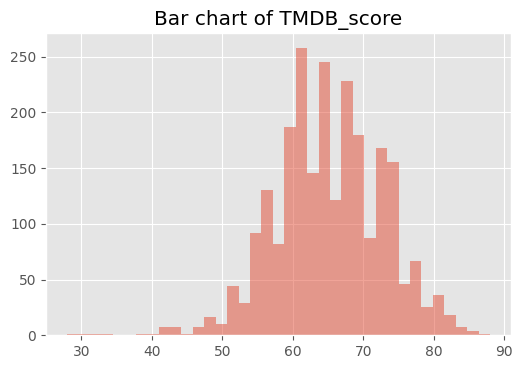


從長條圖我們認定兩組資料為常態分佈。

Let 'TMDB_score' be $\mu_1$, 'rotten_aud_score' be $\mu_2$, and $\mu_D = \mu_1 - \mu_2$.

+ $H_0$: $\mu_D = 0$
+ $H_1$: $\mu_D \ne 0$


```python
alpha = 0.05
# use matched-pair experiment
# t-test & estimator of mu_D
rotten = df_compare_rating_2['TMDB_score'].values
aud = df_compare_rating_2['rotten_aud_score'].values

diff = rotten - aud
nobs = diff.shape[0]
df = nobs - 1
print("degree of freedom = ", df)

diff_desc = stats.describe(diff)
t_value = (diff_desc.mean - 0) / (diff_desc.variance ** 0.5) * (nobs ** 0.5)
print(f"t-value = {t_value:.4f}")

#p-values
ptmp = stats.t.cdf(t_value, df)
p_value = 2 * (1 - ptmp)
print(f"p_value (two tail) = {p_value:.4f}")
```

    degree of freedom =  2409
    t-value = 13.2406
    p_value (two tail) = 0.0000


由檢定結果發現 $p$-value < 0.05，因此我們可以拒絕虛無假設，推論 TMDb 和 Rotten Tomatoes 兩者評分不盡相同。

#### 3. 觀眾評分與電影類別的關係

我們認為觀眾評分時，不只會考量電影作品本身的內容，也有可能因為電影類別而有所偏頗，導致特定類別的電影評分較高或較低。


```python
movie_gen_dummy = pd.read_csv('../data/movie_gen_dummy.csv', index_col=0)
movie_gen_dummy.dropna(inplace=True)

rev_outlier = mgt2001.des.outlier(movie_gen_dummy['revenue'].dropna(), show=False)[0][:20]
rot_outlier = mgt2001.des.outlier(movie_gen_dummy['rotten_aud_score'].dropna(), show=False)[0]

def filter_rows_by_values(df, col, values):
    return df[df[col].isin(values) == False]

movie_gen_dummy = movie_gen_dummy[movie_gen_dummy['revenue'] >= 1e5*9] 
movie_gen_dummy = filter_rows_by_values(movie_gen_dummy, 'revenue', rev_outlier).reset_index(drop=True)
movie_gen_dummy = filter_rows_by_values(movie_gen_dummy, 'rotten_aud_score', rot_outlier).reset_index(drop=True)
print(movie_gen_dummy.shape)

movie_gen_df = movie_gen_dummy.copy()
movie_gen_df = movie_gen_df.loc[:, 'Action':]
movie_gen_df['rotten_aud_score'] = movie_gen_dummy['rotten_aud_score']
movie_gen_df['revenue'] = movie_gen_dummy['revenue']
movie_gen_df['release_date'] = movie_gen_dummy['release_date']
movie_gen_df['t'] = movie_gen_df.index
movie_gen_df.head()
```

    (2416, 28)


<div>
<style scoped>
    .dataframe tbody tr th:only-of-type {
        vertical-align: middle;
    }

    .dataframe tbody tr th {
        vertical-align: top;
    }

    .dataframe thead th {
        text-align: right;
    }
</style>
<table border="1" class="dataframe">
  <thead>
    <tr style="text-align: right;">
      <th></th>
      <th>Action</th>
      <th>Adventure</th>
      <th>Animation</th>
      <th>Comedy</th>
      <th>Crime</th>
      <th>Documentary</th>
      <th>Drama</th>
      <th>Family</th>
      <th>Fantasy</th>
      <th>History</th>
      <th>...</th>
      <th>Romance</th>
      <th>Science Fiction</th>
      <th>TV Movie</th>
      <th>Thriller</th>
      <th>War</th>
      <th>Western</th>
      <th>rotten_aud_score</th>
      <th>revenue</th>
      <th>release_date</th>
      <th>t</th>
    </tr>
  </thead>
  <tbody>
    <tr>
      <th>0</th>
      <td>0</td>
      <td>0</td>
      <td>0</td>
      <td>0</td>
      <td>0</td>
      <td>0</td>
      <td>0</td>
      <td>0</td>
      <td>0</td>
      <td>0</td>
      <td>...</td>
      <td>0</td>
      <td>0</td>
      <td>0</td>
      <td>0</td>
      <td>0</td>
      <td>0</td>
      <td>37.0</td>
      <td>161834276</td>
      <td>2000-02-03</td>
      <td>0</td>
    </tr>
    <tr>
      <th>1</th>
      <td>0</td>
      <td>1</td>
      <td>0</td>
      <td>0</td>
      <td>0</td>
      <td>0</td>
      <td>1</td>
      <td>0</td>
      <td>0</td>
      <td>0</td>
      <td>...</td>
      <td>1</td>
      <td>0</td>
      <td>0</td>
      <td>1</td>
      <td>0</td>
      <td>0</td>
      <td>57.0</td>
      <td>144056873</td>
      <td>2000-02-03</td>
      <td>1</td>
    </tr>
    <tr>
      <th>2</th>
      <td>0</td>
      <td>0</td>
      <td>1</td>
      <td>1</td>
      <td>0</td>
      <td>0</td>
      <td>0</td>
      <td>1</td>
      <td>0</td>
      <td>0</td>
      <td>...</td>
      <td>0</td>
      <td>0</td>
      <td>0</td>
      <td>0</td>
      <td>0</td>
      <td>0</td>
      <td>62.0</td>
      <td>45554533</td>
      <td>2000-02-11</td>
      <td>2</td>
    </tr>
    <tr>
      <th>3</th>
      <td>0</td>
      <td>0</td>
      <td>0</td>
      <td>0</td>
      <td>1</td>
      <td>0</td>
      <td>1</td>
      <td>0</td>
      <td>0</td>
      <td>0</td>
      <td>...</td>
      <td>0</td>
      <td>0</td>
      <td>0</td>
      <td>1</td>
      <td>0</td>
      <td>0</td>
      <td>78.0</td>
      <td>28780255</td>
      <td>2000-02-18</td>
      <td>3</td>
    </tr>
    <tr>
      <th>4</th>
      <td>0</td>
      <td>0</td>
      <td>0</td>
      <td>1</td>
      <td>1</td>
      <td>0</td>
      <td>0</td>
      <td>0</td>
      <td>0</td>
      <td>0</td>
      <td>...</td>
      <td>0</td>
      <td>0</td>
      <td>0</td>
      <td>0</td>
      <td>0</td>
      <td>0</td>
      <td>64.0</td>
      <td>106371651</td>
      <td>2000-02-18</td>
      <td>4</td>
    </tr>
  </tbody>
</table>
<p>5 rows × 23 columns</p>
</div>


```python
x_names = list(movie_gen_df.columns[:-4])
y_name = 'rotten_aud_score'
```


```python
mgt2001.model.multi_variable_plot(x_name='t', y_name=y_name, df=movie_gen_df, x_names=x_names)
```


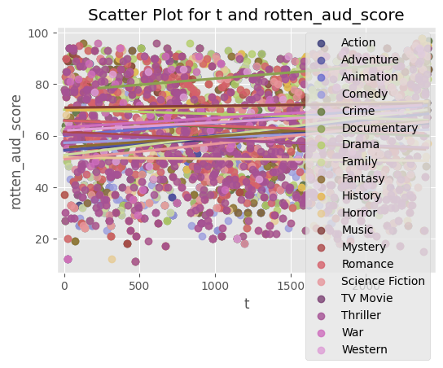


```python
np.sum(movie_gen_df)
```


    Action                                                            742
    Adventure                                                         548
    Animation                                                         187
    Comedy                                                            883
    Crime                                                             389
    Documentary                                                        11
    Drama                                                            1028
    Family                                                            322
    Fantasy                                                           309
    History                                                           111
    Horror                                                            288
    Music                                                              63
    Mystery                                                           234
    Romance                                                           399
    Science Fiction                                                   324
    TV Movie                                                            0
    Thriller                                                          732
    War                                                                67
    Western                                                            26
    rotten_aud_score                                               149300
    revenue                                                  389947703586
    release_date        2000-02-032000-02-032000-02-112000-02-182000-0...
    t                                                             2917320
    dtype: object


我們可以發現去掉 outliers 之後，TV Movie 變得都沒有值，於是我們先將 TV Movie 從我們的 $x$ 變數去除。


```python
x_names.remove('TV Movie')
```


```python
mgt2001.model.multicollinearity(movie_gen_df, x_names, y_name)
```


<style  type="text/css" >
#T_09663d94_d655_11eb_ace9_acde48001122row0_col0,#T_09663d94_d655_11eb_ace9_acde48001122row0_col1,#T_09663d94_d655_11eb_ace9_acde48001122row0_col2,#T_09663d94_d655_11eb_ace9_acde48001122row0_col3,#T_09663d94_d655_11eb_ace9_acde48001122row0_col4,#T_09663d94_d655_11eb_ace9_acde48001122row0_col5,#T_09663d94_d655_11eb_ace9_acde48001122row0_col6,#T_09663d94_d655_11eb_ace9_acde48001122row0_col7,#T_09663d94_d655_11eb_ace9_acde48001122row0_col8,#T_09663d94_d655_11eb_ace9_acde48001122row0_col9,#T_09663d94_d655_11eb_ace9_acde48001122row0_col10,#T_09663d94_d655_11eb_ace9_acde48001122row0_col11,#T_09663d94_d655_11eb_ace9_acde48001122row0_col12,#T_09663d94_d655_11eb_ace9_acde48001122row0_col13,#T_09663d94_d655_11eb_ace9_acde48001122row0_col14,#T_09663d94_d655_11eb_ace9_acde48001122row0_col15,#T_09663d94_d655_11eb_ace9_acde48001122row0_col16,#T_09663d94_d655_11eb_ace9_acde48001122row0_col17,#T_09663d94_d655_11eb_ace9_acde48001122row0_col18,#T_09663d94_d655_11eb_ace9_acde48001122row1_col0,#T_09663d94_d655_11eb_ace9_acde48001122row1_col1,#T_09663d94_d655_11eb_ace9_acde48001122row1_col2,#T_09663d94_d655_11eb_ace9_acde48001122row1_col3,#T_09663d94_d655_11eb_ace9_acde48001122row1_col4,#T_09663d94_d655_11eb_ace9_acde48001122row1_col5,#T_09663d94_d655_11eb_ace9_acde48001122row1_col6,#T_09663d94_d655_11eb_ace9_acde48001122row1_col7,#T_09663d94_d655_11eb_ace9_acde48001122row1_col8,#T_09663d94_d655_11eb_ace9_acde48001122row1_col9,#T_09663d94_d655_11eb_ace9_acde48001122row1_col10,#T_09663d94_d655_11eb_ace9_acde48001122row1_col11,#T_09663d94_d655_11eb_ace9_acde48001122row1_col12,#T_09663d94_d655_11eb_ace9_acde48001122row1_col13,#T_09663d94_d655_11eb_ace9_acde48001122row1_col14,#T_09663d94_d655_11eb_ace9_acde48001122row1_col15,#T_09663d94_d655_11eb_ace9_acde48001122row1_col16,#T_09663d94_d655_11eb_ace9_acde48001122row1_col17,#T_09663d94_d655_11eb_ace9_acde48001122row1_col18,#T_09663d94_d655_11eb_ace9_acde48001122row2_col0,#T_09663d94_d655_11eb_ace9_acde48001122row2_col1,#T_09663d94_d655_11eb_ace9_acde48001122row2_col2,#T_09663d94_d655_11eb_ace9_acde48001122row2_col3,#T_09663d94_d655_11eb_ace9_acde48001122row2_col4,#T_09663d94_d655_11eb_ace9_acde48001122row2_col5,#T_09663d94_d655_11eb_ace9_acde48001122row2_col6,#T_09663d94_d655_11eb_ace9_acde48001122row2_col7,#T_09663d94_d655_11eb_ace9_acde48001122row2_col8,#T_09663d94_d655_11eb_ace9_acde48001122row2_col9,#T_09663d94_d655_11eb_ace9_acde48001122row2_col10,#T_09663d94_d655_11eb_ace9_acde48001122row2_col11,#T_09663d94_d655_11eb_ace9_acde48001122row2_col12,#T_09663d94_d655_11eb_ace9_acde48001122row2_col13,#T_09663d94_d655_11eb_ace9_acde48001122row2_col14,#T_09663d94_d655_11eb_ace9_acde48001122row2_col15,#T_09663d94_d655_11eb_ace9_acde48001122row2_col16,#T_09663d94_d655_11eb_ace9_acde48001122row2_col17,#T_09663d94_d655_11eb_ace9_acde48001122row2_col18,#T_09663d94_d655_11eb_ace9_acde48001122row3_col0,#T_09663d94_d655_11eb_ace9_acde48001122row3_col1,#T_09663d94_d655_11eb_ace9_acde48001122row3_col2,#T_09663d94_d655_11eb_ace9_acde48001122row3_col3,#T_09663d94_d655_11eb_ace9_acde48001122row3_col4,#T_09663d94_d655_11eb_ace9_acde48001122row3_col5,#T_09663d94_d655_11eb_ace9_acde48001122row3_col6,#T_09663d94_d655_11eb_ace9_acde48001122row3_col7,#T_09663d94_d655_11eb_ace9_acde48001122row3_col8,#T_09663d94_d655_11eb_ace9_acde48001122row3_col9,#T_09663d94_d655_11eb_ace9_acde48001122row3_col10,#T_09663d94_d655_11eb_ace9_acde48001122row3_col11,#T_09663d94_d655_11eb_ace9_acde48001122row3_col12,#T_09663d94_d655_11eb_ace9_acde48001122row3_col13,#T_09663d94_d655_11eb_ace9_acde48001122row3_col14,#T_09663d94_d655_11eb_ace9_acde48001122row3_col15,#T_09663d94_d655_11eb_ace9_acde48001122row3_col16,#T_09663d94_d655_11eb_ace9_acde48001122row3_col17,#T_09663d94_d655_11eb_ace9_acde48001122row3_col18,#T_09663d94_d655_11eb_ace9_acde48001122row4_col0,#T_09663d94_d655_11eb_ace9_acde48001122row4_col1,#T_09663d94_d655_11eb_ace9_acde48001122row4_col2,#T_09663d94_d655_11eb_ace9_acde48001122row4_col3,#T_09663d94_d655_11eb_ace9_acde48001122row4_col4,#T_09663d94_d655_11eb_ace9_acde48001122row4_col5,#T_09663d94_d655_11eb_ace9_acde48001122row4_col6,#T_09663d94_d655_11eb_ace9_acde48001122row4_col7,#T_09663d94_d655_11eb_ace9_acde48001122row4_col8,#T_09663d94_d655_11eb_ace9_acde48001122row4_col9,#T_09663d94_d655_11eb_ace9_acde48001122row4_col10,#T_09663d94_d655_11eb_ace9_acde48001122row4_col11,#T_09663d94_d655_11eb_ace9_acde48001122row4_col12,#T_09663d94_d655_11eb_ace9_acde48001122row4_col13,#T_09663d94_d655_11eb_ace9_acde48001122row4_col14,#T_09663d94_d655_11eb_ace9_acde48001122row4_col15,#T_09663d94_d655_11eb_ace9_acde48001122row4_col16,#T_09663d94_d655_11eb_ace9_acde48001122row4_col17,#T_09663d94_d655_11eb_ace9_acde48001122row4_col18,#T_09663d94_d655_11eb_ace9_acde48001122row5_col0,#T_09663d94_d655_11eb_ace9_acde48001122row5_col1,#T_09663d94_d655_11eb_ace9_acde48001122row5_col2,#T_09663d94_d655_11eb_ace9_acde48001122row5_col3,#T_09663d94_d655_11eb_ace9_acde48001122row5_col4,#T_09663d94_d655_11eb_ace9_acde48001122row5_col5,#T_09663d94_d655_11eb_ace9_acde48001122row5_col6,#T_09663d94_d655_11eb_ace9_acde48001122row5_col7,#T_09663d94_d655_11eb_ace9_acde48001122row5_col8,#T_09663d94_d655_11eb_ace9_acde48001122row5_col9,#T_09663d94_d655_11eb_ace9_acde48001122row5_col10,#T_09663d94_d655_11eb_ace9_acde48001122row5_col11,#T_09663d94_d655_11eb_ace9_acde48001122row5_col12,#T_09663d94_d655_11eb_ace9_acde48001122row5_col13,#T_09663d94_d655_11eb_ace9_acde48001122row5_col14,#T_09663d94_d655_11eb_ace9_acde48001122row5_col15,#T_09663d94_d655_11eb_ace9_acde48001122row5_col16,#T_09663d94_d655_11eb_ace9_acde48001122row5_col17,#T_09663d94_d655_11eb_ace9_acde48001122row5_col18,#T_09663d94_d655_11eb_ace9_acde48001122row6_col0,#T_09663d94_d655_11eb_ace9_acde48001122row6_col1,#T_09663d94_d655_11eb_ace9_acde48001122row6_col2,#T_09663d94_d655_11eb_ace9_acde48001122row6_col3,#T_09663d94_d655_11eb_ace9_acde48001122row6_col4,#T_09663d94_d655_11eb_ace9_acde48001122row6_col5,#T_09663d94_d655_11eb_ace9_acde48001122row6_col6,#T_09663d94_d655_11eb_ace9_acde48001122row6_col7,#T_09663d94_d655_11eb_ace9_acde48001122row6_col8,#T_09663d94_d655_11eb_ace9_acde48001122row6_col9,#T_09663d94_d655_11eb_ace9_acde48001122row6_col10,#T_09663d94_d655_11eb_ace9_acde48001122row6_col11,#T_09663d94_d655_11eb_ace9_acde48001122row6_col12,#T_09663d94_d655_11eb_ace9_acde48001122row6_col13,#T_09663d94_d655_11eb_ace9_acde48001122row6_col14,#T_09663d94_d655_11eb_ace9_acde48001122row6_col15,#T_09663d94_d655_11eb_ace9_acde48001122row6_col16,#T_09663d94_d655_11eb_ace9_acde48001122row6_col17,#T_09663d94_d655_11eb_ace9_acde48001122row6_col18,#T_09663d94_d655_11eb_ace9_acde48001122row7_col0,#T_09663d94_d655_11eb_ace9_acde48001122row7_col1,#T_09663d94_d655_11eb_ace9_acde48001122row7_col2,#T_09663d94_d655_11eb_ace9_acde48001122row7_col3,#T_09663d94_d655_11eb_ace9_acde48001122row7_col4,#T_09663d94_d655_11eb_ace9_acde48001122row7_col5,#T_09663d94_d655_11eb_ace9_acde48001122row7_col6,#T_09663d94_d655_11eb_ace9_acde48001122row7_col7,#T_09663d94_d655_11eb_ace9_acde48001122row7_col8,#T_09663d94_d655_11eb_ace9_acde48001122row7_col9,#T_09663d94_d655_11eb_ace9_acde48001122row7_col10,#T_09663d94_d655_11eb_ace9_acde48001122row7_col11,#T_09663d94_d655_11eb_ace9_acde48001122row7_col12,#T_09663d94_d655_11eb_ace9_acde48001122row7_col13,#T_09663d94_d655_11eb_ace9_acde48001122row7_col14,#T_09663d94_d655_11eb_ace9_acde48001122row7_col15,#T_09663d94_d655_11eb_ace9_acde48001122row7_col16,#T_09663d94_d655_11eb_ace9_acde48001122row7_col17,#T_09663d94_d655_11eb_ace9_acde48001122row7_col18,#T_09663d94_d655_11eb_ace9_acde48001122row8_col0,#T_09663d94_d655_11eb_ace9_acde48001122row8_col1,#T_09663d94_d655_11eb_ace9_acde48001122row8_col2,#T_09663d94_d655_11eb_ace9_acde48001122row8_col3,#T_09663d94_d655_11eb_ace9_acde48001122row8_col4,#T_09663d94_d655_11eb_ace9_acde48001122row8_col5,#T_09663d94_d655_11eb_ace9_acde48001122row8_col6,#T_09663d94_d655_11eb_ace9_acde48001122row8_col7,#T_09663d94_d655_11eb_ace9_acde48001122row8_col8,#T_09663d94_d655_11eb_ace9_acde48001122row8_col9,#T_09663d94_d655_11eb_ace9_acde48001122row8_col10,#T_09663d94_d655_11eb_ace9_acde48001122row8_col11,#T_09663d94_d655_11eb_ace9_acde48001122row8_col12,#T_09663d94_d655_11eb_ace9_acde48001122row8_col13,#T_09663d94_d655_11eb_ace9_acde48001122row8_col14,#T_09663d94_d655_11eb_ace9_acde48001122row8_col15,#T_09663d94_d655_11eb_ace9_acde48001122row8_col16,#T_09663d94_d655_11eb_ace9_acde48001122row8_col17,#T_09663d94_d655_11eb_ace9_acde48001122row8_col18,#T_09663d94_d655_11eb_ace9_acde48001122row9_col0,#T_09663d94_d655_11eb_ace9_acde48001122row9_col1,#T_09663d94_d655_11eb_ace9_acde48001122row9_col2,#T_09663d94_d655_11eb_ace9_acde48001122row9_col3,#T_09663d94_d655_11eb_ace9_acde48001122row9_col4,#T_09663d94_d655_11eb_ace9_acde48001122row9_col5,#T_09663d94_d655_11eb_ace9_acde48001122row9_col6,#T_09663d94_d655_11eb_ace9_acde48001122row9_col7,#T_09663d94_d655_11eb_ace9_acde48001122row9_col8,#T_09663d94_d655_11eb_ace9_acde48001122row9_col9,#T_09663d94_d655_11eb_ace9_acde48001122row9_col10,#T_09663d94_d655_11eb_ace9_acde48001122row9_col11,#T_09663d94_d655_11eb_ace9_acde48001122row9_col12,#T_09663d94_d655_11eb_ace9_acde48001122row9_col13,#T_09663d94_d655_11eb_ace9_acde48001122row9_col14,#T_09663d94_d655_11eb_ace9_acde48001122row9_col15,#T_09663d94_d655_11eb_ace9_acde48001122row9_col16,#T_09663d94_d655_11eb_ace9_acde48001122row9_col17,#T_09663d94_d655_11eb_ace9_acde48001122row9_col18,#T_09663d94_d655_11eb_ace9_acde48001122row10_col0,#T_09663d94_d655_11eb_ace9_acde48001122row10_col1,#T_09663d94_d655_11eb_ace9_acde48001122row10_col2,#T_09663d94_d655_11eb_ace9_acde48001122row10_col3,#T_09663d94_d655_11eb_ace9_acde48001122row10_col4,#T_09663d94_d655_11eb_ace9_acde48001122row10_col5,#T_09663d94_d655_11eb_ace9_acde48001122row10_col6,#T_09663d94_d655_11eb_ace9_acde48001122row10_col7,#T_09663d94_d655_11eb_ace9_acde48001122row10_col8,#T_09663d94_d655_11eb_ace9_acde48001122row10_col9,#T_09663d94_d655_11eb_ace9_acde48001122row10_col10,#T_09663d94_d655_11eb_ace9_acde48001122row10_col11,#T_09663d94_d655_11eb_ace9_acde48001122row10_col12,#T_09663d94_d655_11eb_ace9_acde48001122row10_col13,#T_09663d94_d655_11eb_ace9_acde48001122row10_col14,#T_09663d94_d655_11eb_ace9_acde48001122row10_col15,#T_09663d94_d655_11eb_ace9_acde48001122row10_col16,#T_09663d94_d655_11eb_ace9_acde48001122row10_col17,#T_09663d94_d655_11eb_ace9_acde48001122row10_col18,#T_09663d94_d655_11eb_ace9_acde48001122row11_col0,#T_09663d94_d655_11eb_ace9_acde48001122row11_col1,#T_09663d94_d655_11eb_ace9_acde48001122row11_col2,#T_09663d94_d655_11eb_ace9_acde48001122row11_col3,#T_09663d94_d655_11eb_ace9_acde48001122row11_col4,#T_09663d94_d655_11eb_ace9_acde48001122row11_col5,#T_09663d94_d655_11eb_ace9_acde48001122row11_col6,#T_09663d94_d655_11eb_ace9_acde48001122row11_col7,#T_09663d94_d655_11eb_ace9_acde48001122row11_col8,#T_09663d94_d655_11eb_ace9_acde48001122row11_col9,#T_09663d94_d655_11eb_ace9_acde48001122row11_col10,#T_09663d94_d655_11eb_ace9_acde48001122row11_col11,#T_09663d94_d655_11eb_ace9_acde48001122row11_col12,#T_09663d94_d655_11eb_ace9_acde48001122row11_col13,#T_09663d94_d655_11eb_ace9_acde48001122row11_col14,#T_09663d94_d655_11eb_ace9_acde48001122row11_col15,#T_09663d94_d655_11eb_ace9_acde48001122row11_col16,#T_09663d94_d655_11eb_ace9_acde48001122row11_col17,#T_09663d94_d655_11eb_ace9_acde48001122row11_col18,#T_09663d94_d655_11eb_ace9_acde48001122row12_col0,#T_09663d94_d655_11eb_ace9_acde48001122row12_col1,#T_09663d94_d655_11eb_ace9_acde48001122row12_col2,#T_09663d94_d655_11eb_ace9_acde48001122row12_col3,#T_09663d94_d655_11eb_ace9_acde48001122row12_col4,#T_09663d94_d655_11eb_ace9_acde48001122row12_col5,#T_09663d94_d655_11eb_ace9_acde48001122row12_col6,#T_09663d94_d655_11eb_ace9_acde48001122row12_col7,#T_09663d94_d655_11eb_ace9_acde48001122row12_col8,#T_09663d94_d655_11eb_ace9_acde48001122row12_col9,#T_09663d94_d655_11eb_ace9_acde48001122row12_col10,#T_09663d94_d655_11eb_ace9_acde48001122row12_col11,#T_09663d94_d655_11eb_ace9_acde48001122row12_col12,#T_09663d94_d655_11eb_ace9_acde48001122row12_col13,#T_09663d94_d655_11eb_ace9_acde48001122row12_col14,#T_09663d94_d655_11eb_ace9_acde48001122row12_col15,#T_09663d94_d655_11eb_ace9_acde48001122row12_col16,#T_09663d94_d655_11eb_ace9_acde48001122row12_col17,#T_09663d94_d655_11eb_ace9_acde48001122row12_col18,#T_09663d94_d655_11eb_ace9_acde48001122row13_col0,#T_09663d94_d655_11eb_ace9_acde48001122row13_col1,#T_09663d94_d655_11eb_ace9_acde48001122row13_col2,#T_09663d94_d655_11eb_ace9_acde48001122row13_col3,#T_09663d94_d655_11eb_ace9_acde48001122row13_col4,#T_09663d94_d655_11eb_ace9_acde48001122row13_col5,#T_09663d94_d655_11eb_ace9_acde48001122row13_col6,#T_09663d94_d655_11eb_ace9_acde48001122row13_col7,#T_09663d94_d655_11eb_ace9_acde48001122row13_col8,#T_09663d94_d655_11eb_ace9_acde48001122row13_col9,#T_09663d94_d655_11eb_ace9_acde48001122row13_col10,#T_09663d94_d655_11eb_ace9_acde48001122row13_col11,#T_09663d94_d655_11eb_ace9_acde48001122row13_col12,#T_09663d94_d655_11eb_ace9_acde48001122row13_col13,#T_09663d94_d655_11eb_ace9_acde48001122row13_col14,#T_09663d94_d655_11eb_ace9_acde48001122row13_col15,#T_09663d94_d655_11eb_ace9_acde48001122row13_col16,#T_09663d94_d655_11eb_ace9_acde48001122row13_col17,#T_09663d94_d655_11eb_ace9_acde48001122row13_col18,#T_09663d94_d655_11eb_ace9_acde48001122row14_col0,#T_09663d94_d655_11eb_ace9_acde48001122row14_col1,#T_09663d94_d655_11eb_ace9_acde48001122row14_col2,#T_09663d94_d655_11eb_ace9_acde48001122row14_col3,#T_09663d94_d655_11eb_ace9_acde48001122row14_col4,#T_09663d94_d655_11eb_ace9_acde48001122row14_col5,#T_09663d94_d655_11eb_ace9_acde48001122row14_col6,#T_09663d94_d655_11eb_ace9_acde48001122row14_col7,#T_09663d94_d655_11eb_ace9_acde48001122row14_col8,#T_09663d94_d655_11eb_ace9_acde48001122row14_col9,#T_09663d94_d655_11eb_ace9_acde48001122row14_col10,#T_09663d94_d655_11eb_ace9_acde48001122row14_col11,#T_09663d94_d655_11eb_ace9_acde48001122row14_col12,#T_09663d94_d655_11eb_ace9_acde48001122row14_col13,#T_09663d94_d655_11eb_ace9_acde48001122row14_col14,#T_09663d94_d655_11eb_ace9_acde48001122row14_col15,#T_09663d94_d655_11eb_ace9_acde48001122row14_col16,#T_09663d94_d655_11eb_ace9_acde48001122row14_col17,#T_09663d94_d655_11eb_ace9_acde48001122row14_col18,#T_09663d94_d655_11eb_ace9_acde48001122row15_col0,#T_09663d94_d655_11eb_ace9_acde48001122row15_col1,#T_09663d94_d655_11eb_ace9_acde48001122row15_col2,#T_09663d94_d655_11eb_ace9_acde48001122row15_col3,#T_09663d94_d655_11eb_ace9_acde48001122row15_col4,#T_09663d94_d655_11eb_ace9_acde48001122row15_col5,#T_09663d94_d655_11eb_ace9_acde48001122row15_col6,#T_09663d94_d655_11eb_ace9_acde48001122row15_col7,#T_09663d94_d655_11eb_ace9_acde48001122row15_col8,#T_09663d94_d655_11eb_ace9_acde48001122row15_col9,#T_09663d94_d655_11eb_ace9_acde48001122row15_col10,#T_09663d94_d655_11eb_ace9_acde48001122row15_col11,#T_09663d94_d655_11eb_ace9_acde48001122row15_col12,#T_09663d94_d655_11eb_ace9_acde48001122row15_col13,#T_09663d94_d655_11eb_ace9_acde48001122row15_col14,#T_09663d94_d655_11eb_ace9_acde48001122row15_col15,#T_09663d94_d655_11eb_ace9_acde48001122row15_col16,#T_09663d94_d655_11eb_ace9_acde48001122row15_col17,#T_09663d94_d655_11eb_ace9_acde48001122row15_col18,#T_09663d94_d655_11eb_ace9_acde48001122row16_col0,#T_09663d94_d655_11eb_ace9_acde48001122row16_col1,#T_09663d94_d655_11eb_ace9_acde48001122row16_col2,#T_09663d94_d655_11eb_ace9_acde48001122row16_col3,#T_09663d94_d655_11eb_ace9_acde48001122row16_col4,#T_09663d94_d655_11eb_ace9_acde48001122row16_col5,#T_09663d94_d655_11eb_ace9_acde48001122row16_col6,#T_09663d94_d655_11eb_ace9_acde48001122row16_col7,#T_09663d94_d655_11eb_ace9_acde48001122row16_col8,#T_09663d94_d655_11eb_ace9_acde48001122row16_col9,#T_09663d94_d655_11eb_ace9_acde48001122row16_col10,#T_09663d94_d655_11eb_ace9_acde48001122row16_col11,#T_09663d94_d655_11eb_ace9_acde48001122row16_col12,#T_09663d94_d655_11eb_ace9_acde48001122row16_col13,#T_09663d94_d655_11eb_ace9_acde48001122row16_col14,#T_09663d94_d655_11eb_ace9_acde48001122row16_col15,#T_09663d94_d655_11eb_ace9_acde48001122row16_col16,#T_09663d94_d655_11eb_ace9_acde48001122row16_col17,#T_09663d94_d655_11eb_ace9_acde48001122row16_col18,#T_09663d94_d655_11eb_ace9_acde48001122row17_col0,#T_09663d94_d655_11eb_ace9_acde48001122row17_col1,#T_09663d94_d655_11eb_ace9_acde48001122row17_col2,#T_09663d94_d655_11eb_ace9_acde48001122row17_col3,#T_09663d94_d655_11eb_ace9_acde48001122row17_col4,#T_09663d94_d655_11eb_ace9_acde48001122row17_col5,#T_09663d94_d655_11eb_ace9_acde48001122row17_col6,#T_09663d94_d655_11eb_ace9_acde48001122row17_col7,#T_09663d94_d655_11eb_ace9_acde48001122row17_col8,#T_09663d94_d655_11eb_ace9_acde48001122row17_col9,#T_09663d94_d655_11eb_ace9_acde48001122row17_col10,#T_09663d94_d655_11eb_ace9_acde48001122row17_col11,#T_09663d94_d655_11eb_ace9_acde48001122row17_col12,#T_09663d94_d655_11eb_ace9_acde48001122row17_col13,#T_09663d94_d655_11eb_ace9_acde48001122row17_col14,#T_09663d94_d655_11eb_ace9_acde48001122row17_col15,#T_09663d94_d655_11eb_ace9_acde48001122row17_col16,#T_09663d94_d655_11eb_ace9_acde48001122row17_col17,#T_09663d94_d655_11eb_ace9_acde48001122row17_col18,#T_09663d94_d655_11eb_ace9_acde48001122row18_col0,#T_09663d94_d655_11eb_ace9_acde48001122row18_col1,#T_09663d94_d655_11eb_ace9_acde48001122row18_col2,#T_09663d94_d655_11eb_ace9_acde48001122row18_col3,#T_09663d94_d655_11eb_ace9_acde48001122row18_col4,#T_09663d94_d655_11eb_ace9_acde48001122row18_col5,#T_09663d94_d655_11eb_ace9_acde48001122row18_col6,#T_09663d94_d655_11eb_ace9_acde48001122row18_col7,#T_09663d94_d655_11eb_ace9_acde48001122row18_col8,#T_09663d94_d655_11eb_ace9_acde48001122row18_col9,#T_09663d94_d655_11eb_ace9_acde48001122row18_col10,#T_09663d94_d655_11eb_ace9_acde48001122row18_col11,#T_09663d94_d655_11eb_ace9_acde48001122row18_col12,#T_09663d94_d655_11eb_ace9_acde48001122row18_col13,#T_09663d94_d655_11eb_ace9_acde48001122row18_col14,#T_09663d94_d655_11eb_ace9_acde48001122row18_col15,#T_09663d94_d655_11eb_ace9_acde48001122row18_col16,#T_09663d94_d655_11eb_ace9_acde48001122row18_col17,#T_09663d94_d655_11eb_ace9_acde48001122row18_col18{
            background-color:  default;
        }</style><table id="T_09663d94_d655_11eb_ace9_acde48001122" ><thead>    <tr>        <th class="blank level0" ></th>        <th class="col_heading level0 col0" >rotten_aud_score</th>        <th class="col_heading level0 col1" >Action</th>        <th class="col_heading level0 col2" >Adventure</th>        <th class="col_heading level0 col3" >Animation</th>        <th class="col_heading level0 col4" >Comedy</th>        <th class="col_heading level0 col5" >Crime</th>        <th class="col_heading level0 col6" >Documentary</th>        <th class="col_heading level0 col7" >Drama</th>        <th class="col_heading level0 col8" >Family</th>        <th class="col_heading level0 col9" >Fantasy</th>        <th class="col_heading level0 col10" >History</th>        <th class="col_heading level0 col11" >Horror</th>        <th class="col_heading level0 col12" >Music</th>        <th class="col_heading level0 col13" >Mystery</th>        <th class="col_heading level0 col14" >Romance</th>        <th class="col_heading level0 col15" >Science Fiction</th>        <th class="col_heading level0 col16" >Thriller</th>        <th class="col_heading level0 col17" >War</th>        <th class="col_heading level0 col18" >Western</th>    </tr></thead><tbody>
                <tr>
                        <th id="T_09663d94_d655_11eb_ace9_acde48001122level0_row0" class="row_heading level0 row0" >rotten_aud_score</th>
                        <td id="T_09663d94_d655_11eb_ace9_acde48001122row0_col0" class="data row0 col0" >1.000000</td>
                        <td id="T_09663d94_d655_11eb_ace9_acde48001122row0_col1" class="data row0 col1" >-0.072546</td>
                        <td id="T_09663d94_d655_11eb_ace9_acde48001122row0_col2" class="data row0 col2" >-0.003180</td>
                        <td id="T_09663d94_d655_11eb_ace9_acde48001122row0_col3" class="data row0 col3" >0.070878</td>
                        <td id="T_09663d94_d655_11eb_ace9_acde48001122row0_col4" class="data row0 col4" >-0.086904</td>
                        <td id="T_09663d94_d655_11eb_ace9_acde48001122row0_col5" class="data row0 col5" >0.029406</td>
                        <td id="T_09663d94_d655_11eb_ace9_acde48001122row0_col6" class="data row0 col6" >0.068851</td>
                        <td id="T_09663d94_d655_11eb_ace9_acde48001122row0_col7" class="data row0 col7" >0.287235</td>
                        <td id="T_09663d94_d655_11eb_ace9_acde48001122row0_col8" class="data row0 col8" >-0.014623</td>
                        <td id="T_09663d94_d655_11eb_ace9_acde48001122row0_col9" class="data row0 col9" >-0.021130</td>
                        <td id="T_09663d94_d655_11eb_ace9_acde48001122row0_col10" class="data row0 col10" >0.117586</td>
                        <td id="T_09663d94_d655_11eb_ace9_acde48001122row0_col11" class="data row0 col11" >-0.214965</td>
                        <td id="T_09663d94_d655_11eb_ace9_acde48001122row0_col12" class="data row0 col12" >0.086443</td>
                        <td id="T_09663d94_d655_11eb_ace9_acde48001122row0_col13" class="data row0 col13" >-0.062718</td>
                        <td id="T_09663d94_d655_11eb_ace9_acde48001122row0_col14" class="data row0 col14" >0.045913</td>
                        <td id="T_09663d94_d655_11eb_ace9_acde48001122row0_col15" class="data row0 col15" >-0.065541</td>
                        <td id="T_09663d94_d655_11eb_ace9_acde48001122row0_col16" class="data row0 col16" >-0.134282</td>
                        <td id="T_09663d94_d655_11eb_ace9_acde48001122row0_col17" class="data row0 col17" >0.050437</td>
                        <td id="T_09663d94_d655_11eb_ace9_acde48001122row0_col18" class="data row0 col18" >0.020149</td>
            </tr>
            <tr>
                        <th id="T_09663d94_d655_11eb_ace9_acde48001122level0_row1" class="row_heading level0 row1" >Action</th>
                        <td id="T_09663d94_d655_11eb_ace9_acde48001122row1_col0" class="data row1 col0" >-0.072546</td>
                        <td id="T_09663d94_d655_11eb_ace9_acde48001122row1_col1" class="data row1 col1" >1.000000</td>
                        <td id="T_09663d94_d655_11eb_ace9_acde48001122row1_col2" class="data row1 col2" >0.303602</td>
                        <td id="T_09663d94_d655_11eb_ace9_acde48001122row1_col3" class="data row1 col3" >-0.071960</td>
                        <td id="T_09663d94_d655_11eb_ace9_acde48001122row1_col4" class="data row1 col4" >-0.212755</td>
                        <td id="T_09663d94_d655_11eb_ace9_acde48001122row1_col5" class="data row1 col5" >0.157537</td>
                        <td id="T_09663d94_d655_11eb_ace9_acde48001122row1_col6" class="data row1 col6" >-0.018370</td>
                        <td id="T_09663d94_d655_11eb_ace9_acde48001122row1_col7" class="data row1 col7" >-0.269893</td>
                        <td id="T_09663d94_d655_11eb_ace9_acde48001122row1_col8" class="data row1 col8" >-0.129075</td>
                        <td id="T_09663d94_d655_11eb_ace9_acde48001122row1_col9" class="data row1 col9" >0.078181</td>
                        <td id="T_09663d94_d655_11eb_ace9_acde48001122row1_col10" class="data row1 col10" >-0.004672</td>
                        <td id="T_09663d94_d655_11eb_ace9_acde48001122row1_col11" class="data row1 col11" >-0.123086</td>
                        <td id="T_09663d94_d655_11eb_ace9_acde48001122row1_col12" class="data row1 col12" >-0.103309</td>
                        <td id="T_09663d94_d655_11eb_ace9_acde48001122row1_col13" class="data row1 col13" >-0.072404</td>
                        <td id="T_09663d94_d655_11eb_ace9_acde48001122row1_col14" class="data row1 col14" >-0.250201</td>
                        <td id="T_09663d94_d655_11eb_ace9_acde48001122row1_col15" class="data row1 col15" >0.288305</td>
                        <td id="T_09663d94_d655_11eb_ace9_acde48001122row1_col16" class="data row1 col16" >0.201476</td>
                        <td id="T_09663d94_d655_11eb_ace9_acde48001122row1_col17" class="data row1 col17" >0.073348</td>
                        <td id="T_09663d94_d655_11eb_ace9_acde48001122row1_col18" class="data row1 col18" >0.026218</td>
            </tr>
            <tr>
                        <th id="T_09663d94_d655_11eb_ace9_acde48001122level0_row2" class="row_heading level0 row2" >Adventure</th>
                        <td id="T_09663d94_d655_11eb_ace9_acde48001122row2_col0" class="data row2 col0" >-0.003180</td>
                        <td id="T_09663d94_d655_11eb_ace9_acde48001122row2_col1" class="data row2 col1" >0.303602</td>
                        <td id="T_09663d94_d655_11eb_ace9_acde48001122row2_col2" class="data row2 col2" >1.000000</td>
                        <td id="T_09663d94_d655_11eb_ace9_acde48001122row2_col3" class="data row2 col3" >0.283258</td>
                        <td id="T_09663d94_d655_11eb_ace9_acde48001122row2_col4" class="data row2 col4" >-0.021105</td>
                        <td id="T_09663d94_d655_11eb_ace9_acde48001122row2_col5" class="data row2 col5" >-0.172734</td>
                        <td id="T_09663d94_d655_11eb_ace9_acde48001122row2_col6" class="data row2 col6" >-0.036630</td>
                        <td id="T_09663d94_d655_11eb_ace9_acde48001122row2_col7" class="data row2 col7" >-0.268219</td>
                        <td id="T_09663d94_d655_11eb_ace9_acde48001122row2_col8" class="data row2 col8" >0.331412</td>
                        <td id="T_09663d94_d655_11eb_ace9_acde48001122row2_col9" class="data row2 col9" >0.301601</td>
                        <td id="T_09663d94_d655_11eb_ace9_acde48001122row2_col10" class="data row2 col10" >-0.033882</td>
                        <td id="T_09663d94_d655_11eb_ace9_acde48001122row2_col11" class="data row2 col11" >-0.162653</td>
                        <td id="T_09663d94_d655_11eb_ace9_acde48001122row2_col12" class="data row2 col12" >-0.070020</td>
                        <td id="T_09663d94_d655_11eb_ace9_acde48001122row2_col13" class="data row2 col13" >-0.087142</td>
                        <td id="T_09663d94_d655_11eb_ace9_acde48001122row2_col14" class="data row2 col14" >-0.147735</td>
                        <td id="T_09663d94_d655_11eb_ace9_acde48001122row2_col15" class="data row2 col15" >0.216112</td>
                        <td id="T_09663d94_d655_11eb_ace9_acde48001122row2_col16" class="data row2 col16" >-0.159227</td>
                        <td id="T_09663d94_d655_11eb_ace9_acde48001122row2_col17" class="data row2 col17" >-0.007205</td>
                        <td id="T_09663d94_d655_11eb_ace9_acde48001122row2_col18" class="data row2 col18" >0.068038</td>
            </tr>
            <tr>
                        <th id="T_09663d94_d655_11eb_ace9_acde48001122level0_row3" class="row_heading level0 row3" >Animation</th>
                        <td id="T_09663d94_d655_11eb_ace9_acde48001122row3_col0" class="data row3 col0" >0.070878</td>
                        <td id="T_09663d94_d655_11eb_ace9_acde48001122row3_col1" class="data row3 col1" >-0.071960</td>
                        <td id="T_09663d94_d655_11eb_ace9_acde48001122row3_col2" class="data row3 col2" >0.283258</td>
                        <td id="T_09663d94_d655_11eb_ace9_acde48001122row3_col3" class="data row3 col3" >1.000000</td>
                        <td id="T_09663d94_d655_11eb_ace9_acde48001122row3_col4" class="data row3 col4" >0.207957</td>
                        <td id="T_09663d94_d655_11eb_ace9_acde48001122row3_col5" class="data row3 col5" >-0.122672</td>
                        <td id="T_09663d94_d655_11eb_ace9_acde48001122row3_col6" class="data row3 col6" >0.003419</td>
                        <td id="T_09663d94_d655_11eb_ace9_acde48001122row3_col7" class="data row3 col7" >-0.214808</td>
                        <td id="T_09663d94_d655_11eb_ace9_acde48001122row3_col8" class="data row3 col8" >0.629254</td>
                        <td id="T_09663d94_d655_11eb_ace9_acde48001122row3_col9" class="data row3 col9" >0.134881</td>
                        <td id="T_09663d94_d655_11eb_ace9_acde48001122row3_col10" class="data row3 col10" >-0.063561</td>
                        <td id="T_09663d94_d655_11eb_ace9_acde48001122row3_col11" class="data row3 col11" >-0.106556</td>
                        <td id="T_09663d94_d655_11eb_ace9_acde48001122row3_col12" class="data row3 col12" >0.010922</td>
                        <td id="T_09663d94_d655_11eb_ace9_acde48001122row3_col13" class="data row3 col13" >-0.079141</td>
                        <td id="T_09663d94_d655_11eb_ace9_acde48001122row3_col14" class="data row3 col14" >-0.107968</td>
                        <td id="T_09663d94_d655_11eb_ace9_acde48001122row3_col15" class="data row3 col15" >-0.023080</td>
                        <td id="T_09663d94_d655_11eb_ace9_acde48001122row3_col16" class="data row3 col16" >-0.177481</td>
                        <td id="T_09663d94_d655_11eb_ace9_acde48001122row3_col17" class="data row3 col17" >-0.030052</td>
                        <td id="T_09663d94_d655_11eb_ace9_acde48001122row3_col18" class="data row3 col18" >-0.000186</td>
            </tr>
            <tr>
                        <th id="T_09663d94_d655_11eb_ace9_acde48001122level0_row4" class="row_heading level0 row4" >Comedy</th>
                        <td id="T_09663d94_d655_11eb_ace9_acde48001122row4_col0" class="data row4 col0" >-0.086904</td>
                        <td id="T_09663d94_d655_11eb_ace9_acde48001122row4_col1" class="data row4 col1" >-0.212755</td>
                        <td id="T_09663d94_d655_11eb_ace9_acde48001122row4_col2" class="data row4 col2" >-0.021105</td>
                        <td id="T_09663d94_d655_11eb_ace9_acde48001122row4_col3" class="data row4 col3" >0.207957</td>
                        <td id="T_09663d94_d655_11eb_ace9_acde48001122row4_col4" class="data row4 col4" >1.000000</td>
                        <td id="T_09663d94_d655_11eb_ace9_acde48001122row4_col5" class="data row4 col5" >-0.114990</td>
                        <td id="T_09663d94_d655_11eb_ace9_acde48001122row4_col6" class="data row4 col6" >-0.013026</td>
                        <td id="T_09663d94_d655_11eb_ace9_acde48001122row4_col7" class="data row4 col7" >-0.230712</td>
                        <td id="T_09663d94_d655_11eb_ace9_acde48001122row4_col8" class="data row4 col8" >0.289091</td>
                        <td id="T_09663d94_d655_11eb_ace9_acde48001122row4_col9" class="data row4 col9" >0.015613</td>
                        <td id="T_09663d94_d655_11eb_ace9_acde48001122row4_col10" class="data row4 col10" >-0.137809</td>
                        <td id="T_09663d94_d655_11eb_ace9_acde48001122row4_col11" class="data row4 col11" >-0.202279</td>
                        <td id="T_09663d94_d655_11eb_ace9_acde48001122row4_col12" class="data row4 col12" >0.043011</td>
                        <td id="T_09663d94_d655_11eb_ace9_acde48001122row4_col13" class="data row4 col13" >-0.184602</td>
                        <td id="T_09663d94_d655_11eb_ace9_acde48001122row4_col14" class="data row4 col14" >0.206415</td>
                        <td id="T_09663d94_d655_11eb_ace9_acde48001122row4_col15" class="data row4 col15" >-0.187696</td>
                        <td id="T_09663d94_d655_11eb_ace9_acde48001122row4_col16" class="data row4 col16" >-0.419949</td>
                        <td id="T_09663d94_d655_11eb_ace9_acde48001122row4_col17" class="data row4 col17" >-0.102004</td>
                        <td id="T_09663d94_d655_11eb_ace9_acde48001122row4_col18" class="data row4 col18" >-0.029177</td>
            </tr>
            <tr>
                        <th id="T_09663d94_d655_11eb_ace9_acde48001122level0_row5" class="row_heading level0 row5" >Crime</th>
                        <td id="T_09663d94_d655_11eb_ace9_acde48001122row5_col0" class="data row5 col0" >0.029406</td>
                        <td id="T_09663d94_d655_11eb_ace9_acde48001122row5_col1" class="data row5 col1" >0.157537</td>
                        <td id="T_09663d94_d655_11eb_ace9_acde48001122row5_col2" class="data row5 col2" >-0.172734</td>
                        <td id="T_09663d94_d655_11eb_ace9_acde48001122row5_col3" class="data row5 col3" >-0.122672</td>
                        <td id="T_09663d94_d655_11eb_ace9_acde48001122row5_col4" class="data row5 col4" >-0.114990</td>
                        <td id="T_09663d94_d655_11eb_ace9_acde48001122row5_col5" class="data row5 col5" >1.000000</td>
                        <td id="T_09663d94_d655_11eb_ace9_acde48001122row5_col6" class="data row5 col6" >-0.012899</td>
                        <td id="T_09663d94_d655_11eb_ace9_acde48001122row5_col7" class="data row5 col7" >0.058041</td>
                        <td id="T_09663d94_d655_11eb_ace9_acde48001122row5_col8" class="data row5 col8" >-0.161846</td>
                        <td id="T_09663d94_d655_11eb_ace9_acde48001122row5_col9" class="data row5 col9" >-0.147531</td>
                        <td id="T_09663d94_d655_11eb_ace9_acde48001122row5_col10" class="data row5 col10" >-0.026207</td>
                        <td id="T_09663d94_d655_11eb_ace9_acde48001122row5_col11" class="data row5 col11" >-0.091651</td>
                        <td id="T_09663d94_d655_11eb_ace9_acde48001122row5_col12" class="data row5 col12" >-0.064615</td>
                        <td id="T_09663d94_d655_11eb_ace9_acde48001122row5_col13" class="data row5 col13" >0.085001</td>
                        <td id="T_09663d94_d655_11eb_ace9_acde48001122row5_col14" class="data row5 col14" >-0.164513</td>
                        <td id="T_09663d94_d655_11eb_ace9_acde48001122row5_col15" class="data row5 col15" >-0.142658</td>
                        <td id="T_09663d94_d655_11eb_ace9_acde48001122row5_col16" class="data row5 col16" >0.299315</td>
                        <td id="T_09663d94_d655_11eb_ace9_acde48001122row5_col17" class="data row5 col17" >-0.060268</td>
                        <td id="T_09663d94_d655_11eb_ace9_acde48001122row5_col18" class="data row5 col18" >0.019796</td>
            </tr>
            <tr>
                        <th id="T_09663d94_d655_11eb_ace9_acde48001122level0_row6" class="row_heading level0 row6" >Documentary</th>
                        <td id="T_09663d94_d655_11eb_ace9_acde48001122row6_col0" class="data row6 col0" >0.068851</td>
                        <td id="T_09663d94_d655_11eb_ace9_acde48001122row6_col1" class="data row6 col1" >-0.018370</td>
                        <td id="T_09663d94_d655_11eb_ace9_acde48001122row6_col2" class="data row6 col2" >-0.036630</td>
                        <td id="T_09663d94_d655_11eb_ace9_acde48001122row6_col3" class="data row6 col3" >0.003419</td>
                        <td id="T_09663d94_d655_11eb_ace9_acde48001122row6_col4" class="data row6 col4" >-0.013026</td>
                        <td id="T_09663d94_d655_11eb_ace9_acde48001122row6_col5" class="data row6 col5" >-0.012899</td>
                        <td id="T_09663d94_d655_11eb_ace9_acde48001122row6_col6" class="data row6 col6" >1.000000</td>
                        <td id="T_09663d94_d655_11eb_ace9_acde48001122row6_col7" class="data row6 col7" >-0.020897</td>
                        <td id="T_09663d94_d655_11eb_ace9_acde48001122row6_col8" class="data row6 col8" >-0.008431</td>
                        <td id="T_09663d94_d655_11eb_ace9_acde48001122row6_col9" class="data row6 col9" >-0.025899</td>
                        <td id="T_09663d94_d655_11eb_ace9_acde48001122row6_col10" class="data row6 col10" >-0.014841</td>
                        <td id="T_09663d94_d655_11eb_ace9_acde48001122row6_col11" class="data row6 col11" >-0.024880</td>
                        <td id="T_09663d94_d655_11eb_ace9_acde48001122row6_col12" class="data row6 col12" >-0.011066</td>
                        <td id="T_09663d94_d655_11eb_ace9_acde48001122row6_col13" class="data row6 col13" >-0.022147</td>
                        <td id="T_09663d94_d655_11eb_ace9_acde48001122row6_col14" class="data row6 col14" >-0.030080</td>
                        <td id="T_09663d94_d655_11eb_ace9_acde48001122row6_col15" class="data row6 col15" >-0.026615</td>
                        <td id="T_09663d94_d655_11eb_ace9_acde48001122row6_col16" class="data row6 col16" >-0.044589</td>
                        <td id="T_09663d94_d655_11eb_ace9_acde48001122row6_col17" class="data row6 col17" >0.026021</td>
                        <td id="T_09663d94_d655_11eb_ace9_acde48001122row6_col18" class="data row6 col18" >-0.007054</td>
            </tr>
            <tr>
                        <th id="T_09663d94_d655_11eb_ace9_acde48001122level0_row7" class="row_heading level0 row7" >Drama</th>
                        <td id="T_09663d94_d655_11eb_ace9_acde48001122row7_col0" class="data row7 col0" >0.287235</td>
                        <td id="T_09663d94_d655_11eb_ace9_acde48001122row7_col1" class="data row7 col1" >-0.269893</td>
                        <td id="T_09663d94_d655_11eb_ace9_acde48001122row7_col2" class="data row7 col2" >-0.268219</td>
                        <td id="T_09663d94_d655_11eb_ace9_acde48001122row7_col3" class="data row7 col3" >-0.214808</td>
                        <td id="T_09663d94_d655_11eb_ace9_acde48001122row7_col4" class="data row7 col4" >-0.230712</td>
                        <td id="T_09663d94_d655_11eb_ace9_acde48001122row7_col5" class="data row7 col5" >0.058041</td>
                        <td id="T_09663d94_d655_11eb_ace9_acde48001122row7_col6" class="data row7 col6" >-0.020897</td>
                        <td id="T_09663d94_d655_11eb_ace9_acde48001122row7_col7" class="data row7 col7" >1.000000</td>
                        <td id="T_09663d94_d655_11eb_ace9_acde48001122row7_col8" class="data row7 col8" >-0.238949</td>
                        <td id="T_09663d94_d655_11eb_ace9_acde48001122row7_col9" class="data row7 col9" >-0.179172</td>
                        <td id="T_09663d94_d655_11eb_ace9_acde48001122row7_col10" class="data row7 col10" >0.223002</td>
                        <td id="T_09663d94_d655_11eb_ace9_acde48001122row7_col11" class="data row7 col11" >-0.174504</td>
                        <td id="T_09663d94_d655_11eb_ace9_acde48001122row7_col12" class="data row7 col12" >0.106082</td>
                        <td id="T_09663d94_d655_11eb_ace9_acde48001122row7_col13" class="data row7 col13" >0.023872</td>
                        <td id="T_09663d94_d655_11eb_ace9_acde48001122row7_col14" class="data row7 col14" >0.192151</td>
                        <td id="T_09663d94_d655_11eb_ace9_acde48001122row7_col15" class="data row7 col15" >-0.198651</td>
                        <td id="T_09663d94_d655_11eb_ace9_acde48001122row7_col16" class="data row7 col16" >-0.004488</td>
                        <td id="T_09663d94_d655_11eb_ace9_acde48001122row7_col17" class="data row7 col17" >0.119768</td>
                        <td id="T_09663d94_d655_11eb_ace9_acde48001122row7_col18" class="data row7 col18" >0.007603</td>
            </tr>
            <tr>
                        <th id="T_09663d94_d655_11eb_ace9_acde48001122level0_row8" class="row_heading level0 row8" >Family</th>
                        <td id="T_09663d94_d655_11eb_ace9_acde48001122row8_col0" class="data row8 col0" >-0.014623</td>
                        <td id="T_09663d94_d655_11eb_ace9_acde48001122row8_col1" class="data row8 col1" >-0.129075</td>
                        <td id="T_09663d94_d655_11eb_ace9_acde48001122row8_col2" class="data row8 col2" >0.331412</td>
                        <td id="T_09663d94_d655_11eb_ace9_acde48001122row8_col3" class="data row8 col3" >0.629254</td>
                        <td id="T_09663d94_d655_11eb_ace9_acde48001122row8_col4" class="data row8 col4" >0.289091</td>
                        <td id="T_09663d94_d655_11eb_ace9_acde48001122row8_col5" class="data row8 col5" >-0.161846</td>
                        <td id="T_09663d94_d655_11eb_ace9_acde48001122row8_col6" class="data row8 col6" >-0.008431</td>
                        <td id="T_09663d94_d655_11eb_ace9_acde48001122row8_col7" class="data row8 col7" >-0.238949</td>
                        <td id="T_09663d94_d655_11eb_ace9_acde48001122row8_col8" class="data row8 col8" >1.000000</td>
                        <td id="T_09663d94_d655_11eb_ace9_acde48001122row8_col9" class="data row8 col9" >0.272816</td>
                        <td id="T_09663d94_d655_11eb_ace9_acde48001122row8_col10" class="data row8 col10" >-0.086053</td>
                        <td id="T_09663d94_d655_11eb_ace9_acde48001122row8_col11" class="data row8 col11" >-0.140503</td>
                        <td id="T_09663d94_d655_11eb_ace9_acde48001122row8_col12" class="data row8 col12" >0.035179</td>
                        <td id="T_09663d94_d655_11eb_ace9_acde48001122row8_col13" class="data row8 col13" >-0.107828</td>
                        <td id="T_09663d94_d655_11eb_ace9_acde48001122row8_col14" class="data row8 col14" >-0.085857</td>
                        <td id="T_09663d94_d655_11eb_ace9_acde48001122row8_col15" class="data row8 col15" >-0.057831</td>
                        <td id="T_09663d94_d655_11eb_ace9_acde48001122row8_col16" class="data row8 col16" >-0.253238</td>
                        <td id="T_09663d94_d655_11eb_ace9_acde48001122row8_col17" class="data row8 col17" >-0.058811</td>
                        <td id="T_09663d94_d655_11eb_ace9_acde48001122row8_col18" class="data row8 col18" >-0.017294</td>
            </tr>
            <tr>
                        <th id="T_09663d94_d655_11eb_ace9_acde48001122level0_row9" class="row_heading level0 row9" >Fantasy</th>
                        <td id="T_09663d94_d655_11eb_ace9_acde48001122row9_col0" class="data row9 col0" >-0.021130</td>
                        <td id="T_09663d94_d655_11eb_ace9_acde48001122row9_col1" class="data row9 col1" >0.078181</td>
                        <td id="T_09663d94_d655_11eb_ace9_acde48001122row9_col2" class="data row9 col2" >0.301601</td>
                        <td id="T_09663d94_d655_11eb_ace9_acde48001122row9_col3" class="data row9 col3" >0.134881</td>
                        <td id="T_09663d94_d655_11eb_ace9_acde48001122row9_col4" class="data row9 col4" >0.015613</td>
                        <td id="T_09663d94_d655_11eb_ace9_acde48001122row9_col5" class="data row9 col5" >-0.147531</td>
                        <td id="T_09663d94_d655_11eb_ace9_acde48001122row9_col6" class="data row9 col6" >-0.025899</td>
                        <td id="T_09663d94_d655_11eb_ace9_acde48001122row9_col7" class="data row9 col7" >-0.179172</td>
                        <td id="T_09663d94_d655_11eb_ace9_acde48001122row9_col8" class="data row9 col8" >0.272816</td>
                        <td id="T_09663d94_d655_11eb_ace9_acde48001122row9_col9" class="data row9 col9" >1.000000</td>
                        <td id="T_09663d94_d655_11eb_ace9_acde48001122row9_col10" class="data row9 col10" >-0.084037</td>
                        <td id="T_09663d94_d655_11eb_ace9_acde48001122row9_col11" class="data row9 col11" >-0.045264</td>
                        <td id="T_09663d94_d655_11eb_ace9_acde48001122row9_col12" class="data row9 col12" >-0.008224</td>
                        <td id="T_09663d94_d655_11eb_ace9_acde48001122row9_col13" class="data row9 col13" >-0.066744</td>
                        <td id="T_09663d94_d655_11eb_ace9_acde48001122row9_col14" class="data row9 col14" >0.006572</td>
                        <td id="T_09663d94_d655_11eb_ace9_acde48001122row9_col15" class="data row9 col15" >-0.023417</td>
                        <td id="T_09663d94_d655_11eb_ace9_acde48001122row9_col16" class="data row9 col16" >-0.155396</td>
                        <td id="T_09663d94_d655_11eb_ace9_acde48001122row9_col17" class="data row9 col17" >-0.042033</td>
                        <td id="T_09663d94_d655_11eb_ace9_acde48001122row9_col18" class="data row9 col18" >-0.027931</td>
            </tr>
            <tr>
                        <th id="T_09663d94_d655_11eb_ace9_acde48001122level0_row10" class="row_heading level0 row10" >History</th>
                        <td id="T_09663d94_d655_11eb_ace9_acde48001122row10_col0" class="data row10 col0" >0.117586</td>
                        <td id="T_09663d94_d655_11eb_ace9_acde48001122row10_col1" class="data row10 col1" >-0.004672</td>
                        <td id="T_09663d94_d655_11eb_ace9_acde48001122row10_col2" class="data row10 col2" >-0.033882</td>
                        <td id="T_09663d94_d655_11eb_ace9_acde48001122row10_col3" class="data row10 col3" >-0.063561</td>
                        <td id="T_09663d94_d655_11eb_ace9_acde48001122row10_col4" class="data row10 col4" >-0.137809</td>
                        <td id="T_09663d94_d655_11eb_ace9_acde48001122row10_col5" class="data row10 col5" >-0.026207</td>
                        <td id="T_09663d94_d655_11eb_ace9_acde48001122row10_col6" class="data row10 col6" >-0.014841</td>
                        <td id="T_09663d94_d655_11eb_ace9_acde48001122row10_col7" class="data row10 col7" >0.223002</td>
                        <td id="T_09663d94_d655_11eb_ace9_acde48001122row10_col8" class="data row10 col8" >-0.086053</td>
                        <td id="T_09663d94_d655_11eb_ace9_acde48001122row10_col9" class="data row10 col9" >-0.084037</td>
                        <td id="T_09663d94_d655_11eb_ace9_acde48001122row10_col10" class="data row10 col10" >1.000000</td>
                        <td id="T_09663d94_d655_11eb_ace9_acde48001122row10_col11" class="data row10 col11" >-0.074629</td>
                        <td id="T_09663d94_d655_11eb_ace9_acde48001122row10_col12" class="data row10 col12" >-0.011096</td>
                        <td id="T_09663d94_d655_11eb_ace9_acde48001122row10_col13" class="data row10 col13" >-0.045125</td>
                        <td id="T_09663d94_d655_11eb_ace9_acde48001122row10_col14" class="data row10 col14" >-0.023062</td>
                        <td id="T_09663d94_d655_11eb_ace9_acde48001122row10_col15" class="data row10 col15" >-0.086361</td>
                        <td id="T_09663d94_d655_11eb_ace9_acde48001122row10_col16" class="data row10 col16" >-0.045734</td>
                        <td id="T_09663d94_d655_11eb_ace9_acde48001122row10_col17" class="data row10 col17" >0.300054</td>
                        <td id="T_09663d94_d655_11eb_ace9_acde48001122row10_col18" class="data row10 col18" >-0.022888</td>
            </tr>
            <tr>
                        <th id="T_09663d94_d655_11eb_ace9_acde48001122level0_row11" class="row_heading level0 row11" >Horror</th>
                        <td id="T_09663d94_d655_11eb_ace9_acde48001122row11_col0" class="data row11 col0" >-0.214965</td>
                        <td id="T_09663d94_d655_11eb_ace9_acde48001122row11_col1" class="data row11 col1" >-0.123086</td>
                        <td id="T_09663d94_d655_11eb_ace9_acde48001122row11_col2" class="data row11 col2" >-0.162653</td>
                        <td id="T_09663d94_d655_11eb_ace9_acde48001122row11_col3" class="data row11 col3" >-0.106556</td>
                        <td id="T_09663d94_d655_11eb_ace9_acde48001122row11_col4" class="data row11 col4" >-0.202279</td>
                        <td id="T_09663d94_d655_11eb_ace9_acde48001122row11_col5" class="data row11 col5" >-0.091651</td>
                        <td id="T_09663d94_d655_11eb_ace9_acde48001122row11_col6" class="data row11 col6" >-0.024880</td>
                        <td id="T_09663d94_d655_11eb_ace9_acde48001122row11_col7" class="data row11 col7" >-0.174504</td>
                        <td id="T_09663d94_d655_11eb_ace9_acde48001122row11_col8" class="data row11 col8" >-0.140503</td>
                        <td id="T_09663d94_d655_11eb_ace9_acde48001122row11_col9" class="data row11 col9" >-0.045264</td>
                        <td id="T_09663d94_d655_11eb_ace9_acde48001122row11_col10" class="data row11 col10" >-0.074629</td>
                        <td id="T_09663d94_d655_11eb_ace9_acde48001122row11_col11" class="data row11 col11" >1.000000</td>
                        <td id="T_09663d94_d655_11eb_ace9_acde48001122row11_col12" class="data row11 col12" >-0.060196</td>
                        <td id="T_09663d94_d655_11eb_ace9_acde48001122row11_col13" class="data row11 col13" >0.194811</td>
                        <td id="T_09663d94_d655_11eb_ace9_acde48001122row11_col14" class="data row11 col14" >-0.149862</td>
                        <td id="T_09663d94_d655_11eb_ace9_acde48001122row11_col15" class="data row11 col15" >0.023906</td>
                        <td id="T_09663d94_d655_11eb_ace9_acde48001122row11_col16" class="data row11 col16" >0.241111</td>
                        <td id="T_09663d94_d655_11eb_ace9_acde48001122row11_col17" class="data row11 col17" >-0.046572</td>
                        <td id="T_09663d94_d655_11eb_ace9_acde48001122row11_col18" class="data row11 col18" >-0.038371</td>
            </tr>
            <tr>
                        <th id="T_09663d94_d655_11eb_ace9_acde48001122level0_row12" class="row_heading level0 row12" >Music</th>
                        <td id="T_09663d94_d655_11eb_ace9_acde48001122row12_col0" class="data row12 col0" >0.086443</td>
                        <td id="T_09663d94_d655_11eb_ace9_acde48001122row12_col1" class="data row12 col1" >-0.103309</td>
                        <td id="T_09663d94_d655_11eb_ace9_acde48001122row12_col2" class="data row12 col2" >-0.070020</td>
                        <td id="T_09663d94_d655_11eb_ace9_acde48001122row12_col3" class="data row12 col3" >0.010922</td>
                        <td id="T_09663d94_d655_11eb_ace9_acde48001122row12_col4" class="data row12 col4" >0.043011</td>
                        <td id="T_09663d94_d655_11eb_ace9_acde48001122row12_col5" class="data row12 col5" >-0.064615</td>
                        <td id="T_09663d94_d655_11eb_ace9_acde48001122row12_col6" class="data row12 col6" >-0.011066</td>
                        <td id="T_09663d94_d655_11eb_ace9_acde48001122row12_col7" class="data row12 col7" >0.106082</td>
                        <td id="T_09663d94_d655_11eb_ace9_acde48001122row12_col8" class="data row12 col8" >0.035179</td>
                        <td id="T_09663d94_d655_11eb_ace9_acde48001122row12_col9" class="data row12 col9" >-0.008224</td>
                        <td id="T_09663d94_d655_11eb_ace9_acde48001122row12_col10" class="data row12 col10" >-0.011096</td>
                        <td id="T_09663d94_d655_11eb_ace9_acde48001122row12_col11" class="data row12 col11" >-0.060196</td>
                        <td id="T_09663d94_d655_11eb_ace9_acde48001122row12_col12" class="data row12 col12" >1.000000</td>
                        <td id="T_09663d94_d655_11eb_ace9_acde48001122row12_col13" class="data row12 col13" >-0.053585</td>
                        <td id="T_09663d94_d655_11eb_ace9_acde48001122row12_col14" class="data row12 col14" >0.116083</td>
                        <td id="T_09663d94_d655_11eb_ace9_acde48001122row12_col15" class="data row12 col15" >-0.064395</td>
                        <td id="T_09663d94_d655_11eb_ace9_acde48001122row12_col16" class="data row12 col16" >-0.107881</td>
                        <td id="T_09663d94_d655_11eb_ace9_acde48001122row12_col17" class="data row12 col17" >-0.027635</td>
                        <td id="T_09663d94_d655_11eb_ace9_acde48001122row12_col18" class="data row12 col18" >-0.017067</td>
            </tr>
            <tr>
                        <th id="T_09663d94_d655_11eb_ace9_acde48001122level0_row13" class="row_heading level0 row13" >Mystery</th>
                        <td id="T_09663d94_d655_11eb_ace9_acde48001122row13_col0" class="data row13 col0" >-0.062718</td>
                        <td id="T_09663d94_d655_11eb_ace9_acde48001122row13_col1" class="data row13 col1" >-0.072404</td>
                        <td id="T_09663d94_d655_11eb_ace9_acde48001122row13_col2" class="data row13 col2" >-0.087142</td>
                        <td id="T_09663d94_d655_11eb_ace9_acde48001122row13_col3" class="data row13 col3" >-0.079141</td>
                        <td id="T_09663d94_d655_11eb_ace9_acde48001122row13_col4" class="data row13 col4" >-0.184602</td>
                        <td id="T_09663d94_d655_11eb_ace9_acde48001122row13_col5" class="data row13 col5" >0.085001</td>
                        <td id="T_09663d94_d655_11eb_ace9_acde48001122row13_col6" class="data row13 col6" >-0.022147</td>
                        <td id="T_09663d94_d655_11eb_ace9_acde48001122row13_col7" class="data row13 col7" >0.023872</td>
                        <td id="T_09663d94_d655_11eb_ace9_acde48001122row13_col8" class="data row13 col8" >-0.107828</td>
                        <td id="T_09663d94_d655_11eb_ace9_acde48001122row13_col9" class="data row13 col9" >-0.066744</td>
                        <td id="T_09663d94_d655_11eb_ace9_acde48001122row13_col10" class="data row13 col10" >-0.045125</td>
                        <td id="T_09663d94_d655_11eb_ace9_acde48001122row13_col11" class="data row13 col11" >0.194811</td>
                        <td id="T_09663d94_d655_11eb_ace9_acde48001122row13_col12" class="data row13 col12" >-0.053585</td>
                        <td id="T_09663d94_d655_11eb_ace9_acde48001122row13_col13" class="data row13 col13" >1.000000</td>
                        <td id="T_09663d94_d655_11eb_ace9_acde48001122row13_col14" class="data row13 col14" >-0.107962</td>
                        <td id="T_09663d94_d655_11eb_ace9_acde48001122row13_col15" class="data row13 col15" >-0.009778</td>
                        <td id="T_09663d94_d655_11eb_ace9_acde48001122row13_col16" class="data row13 col16" >0.262211</td>
                        <td id="T_09663d94_d655_11eb_ace9_acde48001122row13_col17" class="data row13 col17" >-0.046784</td>
                        <td id="T_09663d94_d655_11eb_ace9_acde48001122row13_col18" class="data row13 col18" >-0.020592</td>
            </tr>
            <tr>
                        <th id="T_09663d94_d655_11eb_ace9_acde48001122level0_row14" class="row_heading level0 row14" >Romance</th>
                        <td id="T_09663d94_d655_11eb_ace9_acde48001122row14_col0" class="data row14 col0" >0.045913</td>
                        <td id="T_09663d94_d655_11eb_ace9_acde48001122row14_col1" class="data row14 col1" >-0.250201</td>
                        <td id="T_09663d94_d655_11eb_ace9_acde48001122row14_col2" class="data row14 col2" >-0.147735</td>
                        <td id="T_09663d94_d655_11eb_ace9_acde48001122row14_col3" class="data row14 col3" >-0.107968</td>
                        <td id="T_09663d94_d655_11eb_ace9_acde48001122row14_col4" class="data row14 col4" >0.206415</td>
                        <td id="T_09663d94_d655_11eb_ace9_acde48001122row14_col5" class="data row14 col5" >-0.164513</td>
                        <td id="T_09663d94_d655_11eb_ace9_acde48001122row14_col6" class="data row14 col6" >-0.030080</td>
                        <td id="T_09663d94_d655_11eb_ace9_acde48001122row14_col7" class="data row14 col7" >0.192151</td>
                        <td id="T_09663d94_d655_11eb_ace9_acde48001122row14_col8" class="data row14 col8" >-0.085857</td>
                        <td id="T_09663d94_d655_11eb_ace9_acde48001122row14_col9" class="data row14 col9" >0.006572</td>
                        <td id="T_09663d94_d655_11eb_ace9_acde48001122row14_col10" class="data row14 col10" >-0.023062</td>
                        <td id="T_09663d94_d655_11eb_ace9_acde48001122row14_col11" class="data row14 col11" >-0.149862</td>
                        <td id="T_09663d94_d655_11eb_ace9_acde48001122row14_col12" class="data row14 col12" >0.116083</td>
                        <td id="T_09663d94_d655_11eb_ace9_acde48001122row14_col13" class="data row14 col13" >-0.107962</td>
                        <td id="T_09663d94_d655_11eb_ace9_acde48001122row14_col14" class="data row14 col14" >1.000000</td>
                        <td id="T_09663d94_d655_11eb_ace9_acde48001122row14_col15" class="data row14 col15" >-0.125967</td>
                        <td id="T_09663d94_d655_11eb_ace9_acde48001122row14_col16" class="data row14 col16" >-0.235021</td>
                        <td id="T_09663d94_d655_11eb_ace9_acde48001122row14_col17" class="data row14 col17" >-0.034384</td>
                        <td id="T_09663d94_d655_11eb_ace9_acde48001122row14_col18" class="data row14 col18" >-0.046390</td>
            </tr>
            <tr>
                        <th id="T_09663d94_d655_11eb_ace9_acde48001122level0_row15" class="row_heading level0 row15" >Science Fiction</th>
                        <td id="T_09663d94_d655_11eb_ace9_acde48001122row15_col0" class="data row15 col0" >-0.065541</td>
                        <td id="T_09663d94_d655_11eb_ace9_acde48001122row15_col1" class="data row15 col1" >0.288305</td>
                        <td id="T_09663d94_d655_11eb_ace9_acde48001122row15_col2" class="data row15 col2" >0.216112</td>
                        <td id="T_09663d94_d655_11eb_ace9_acde48001122row15_col3" class="data row15 col3" >-0.023080</td>
                        <td id="T_09663d94_d655_11eb_ace9_acde48001122row15_col4" class="data row15 col4" >-0.187696</td>
                        <td id="T_09663d94_d655_11eb_ace9_acde48001122row15_col5" class="data row15 col5" >-0.142658</td>
                        <td id="T_09663d94_d655_11eb_ace9_acde48001122row15_col6" class="data row15 col6" >-0.026615</td>
                        <td id="T_09663d94_d655_11eb_ace9_acde48001122row15_col7" class="data row15 col7" >-0.198651</td>
                        <td id="T_09663d94_d655_11eb_ace9_acde48001122row15_col8" class="data row15 col8" >-0.057831</td>
                        <td id="T_09663d94_d655_11eb_ace9_acde48001122row15_col9" class="data row15 col9" >-0.023417</td>
                        <td id="T_09663d94_d655_11eb_ace9_acde48001122row15_col10" class="data row15 col10" >-0.086361</td>
                        <td id="T_09663d94_d655_11eb_ace9_acde48001122row15_col11" class="data row15 col11" >0.023906</td>
                        <td id="T_09663d94_d655_11eb_ace9_acde48001122row15_col12" class="data row15 col12" >-0.064395</td>
                        <td id="T_09663d94_d655_11eb_ace9_acde48001122row15_col13" class="data row15 col13" >-0.009778</td>
                        <td id="T_09663d94_d655_11eb_ace9_acde48001122row15_col14" class="data row15 col14" >-0.125967</td>
                        <td id="T_09663d94_d655_11eb_ace9_acde48001122row15_col15" class="data row15 col15" >1.000000</td>
                        <td id="T_09663d94_d655_11eb_ace9_acde48001122row15_col16" class="data row15 col16" >0.076213</td>
                        <td id="T_09663d94_d655_11eb_ace9_acde48001122row15_col17" class="data row15 col17" >-0.036876</td>
                        <td id="T_09663d94_d655_11eb_ace9_acde48001122row15_col18" class="data row15 col18" >-0.029275</td>
            </tr>
            <tr>
                        <th id="T_09663d94_d655_11eb_ace9_acde48001122level0_row16" class="row_heading level0 row16" >Thriller</th>
                        <td id="T_09663d94_d655_11eb_ace9_acde48001122row16_col0" class="data row16 col0" >-0.134282</td>
                        <td id="T_09663d94_d655_11eb_ace9_acde48001122row16_col1" class="data row16 col1" >0.201476</td>
                        <td id="T_09663d94_d655_11eb_ace9_acde48001122row16_col2" class="data row16 col2" >-0.159227</td>
                        <td id="T_09663d94_d655_11eb_ace9_acde48001122row16_col3" class="data row16 col3" >-0.177481</td>
                        <td id="T_09663d94_d655_11eb_ace9_acde48001122row16_col4" class="data row16 col4" >-0.419949</td>
                        <td id="T_09663d94_d655_11eb_ace9_acde48001122row16_col5" class="data row16 col5" >0.299315</td>
                        <td id="T_09663d94_d655_11eb_ace9_acde48001122row16_col6" class="data row16 col6" >-0.044589</td>
                        <td id="T_09663d94_d655_11eb_ace9_acde48001122row16_col7" class="data row16 col7" >-0.004488</td>
                        <td id="T_09663d94_d655_11eb_ace9_acde48001122row16_col8" class="data row16 col8" >-0.253238</td>
                        <td id="T_09663d94_d655_11eb_ace9_acde48001122row16_col9" class="data row16 col9" >-0.155396</td>
                        <td id="T_09663d94_d655_11eb_ace9_acde48001122row16_col10" class="data row16 col10" >-0.045734</td>
                        <td id="T_09663d94_d655_11eb_ace9_acde48001122row16_col11" class="data row16 col11" >0.241111</td>
                        <td id="T_09663d94_d655_11eb_ace9_acde48001122row16_col12" class="data row16 col12" >-0.107881</td>
                        <td id="T_09663d94_d655_11eb_ace9_acde48001122row16_col13" class="data row16 col13" >0.262211</td>
                        <td id="T_09663d94_d655_11eb_ace9_acde48001122row16_col14" class="data row16 col14" >-0.235021</td>
                        <td id="T_09663d94_d655_11eb_ace9_acde48001122row16_col15" class="data row16 col15" >0.076213</td>
                        <td id="T_09663d94_d655_11eb_ace9_acde48001122row16_col16" class="data row16 col16" >1.000000</td>
                        <td id="T_09663d94_d655_11eb_ace9_acde48001122row16_col17" class="data row16 col17" >-0.029070</td>
                        <td id="T_09663d94_d655_11eb_ace9_acde48001122row16_col18" class="data row16 col18" >-0.033848</td>
            </tr>
            <tr>
                        <th id="T_09663d94_d655_11eb_ace9_acde48001122level0_row17" class="row_heading level0 row17" >War</th>
                        <td id="T_09663d94_d655_11eb_ace9_acde48001122row17_col0" class="data row17 col0" >0.050437</td>
                        <td id="T_09663d94_d655_11eb_ace9_acde48001122row17_col1" class="data row17 col1" >0.073348</td>
                        <td id="T_09663d94_d655_11eb_ace9_acde48001122row17_col2" class="data row17 col2" >-0.007205</td>
                        <td id="T_09663d94_d655_11eb_ace9_acde48001122row17_col3" class="data row17 col3" >-0.030052</td>
                        <td id="T_09663d94_d655_11eb_ace9_acde48001122row17_col4" class="data row17 col4" >-0.102004</td>
                        <td id="T_09663d94_d655_11eb_ace9_acde48001122row17_col5" class="data row17 col5" >-0.060268</td>
                        <td id="T_09663d94_d655_11eb_ace9_acde48001122row17_col6" class="data row17 col6" >0.026021</td>
                        <td id="T_09663d94_d655_11eb_ace9_acde48001122row17_col7" class="data row17 col7" >0.119768</td>
                        <td id="T_09663d94_d655_11eb_ace9_acde48001122row17_col8" class="data row17 col8" >-0.058811</td>
                        <td id="T_09663d94_d655_11eb_ace9_acde48001122row17_col9" class="data row17 col9" >-0.042033</td>
                        <td id="T_09663d94_d655_11eb_ace9_acde48001122row17_col10" class="data row17 col10" >0.300054</td>
                        <td id="T_09663d94_d655_11eb_ace9_acde48001122row17_col11" class="data row17 col11" >-0.046572</td>
                        <td id="T_09663d94_d655_11eb_ace9_acde48001122row17_col12" class="data row17 col12" >-0.027635</td>
                        <td id="T_09663d94_d655_11eb_ace9_acde48001122row17_col13" class="data row17 col13" >-0.046784</td>
                        <td id="T_09663d94_d655_11eb_ace9_acde48001122row17_col14" class="data row17 col14" >-0.034384</td>
                        <td id="T_09663d94_d655_11eb_ace9_acde48001122row17_col15" class="data row17 col15" >-0.036876</td>
                        <td id="T_09663d94_d655_11eb_ace9_acde48001122row17_col16" class="data row17 col16" >-0.029070</td>
                        <td id="T_09663d94_d655_11eb_ace9_acde48001122row17_col17" class="data row17 col17" >1.000000</td>
                        <td id="T_09663d94_d655_11eb_ace9_acde48001122row17_col18" class="data row17 col18" >-0.017615</td>
            </tr>
            <tr>
                        <th id="T_09663d94_d655_11eb_ace9_acde48001122level0_row18" class="row_heading level0 row18" >Western</th>
                        <td id="T_09663d94_d655_11eb_ace9_acde48001122row18_col0" class="data row18 col0" >0.020149</td>
                        <td id="T_09663d94_d655_11eb_ace9_acde48001122row18_col1" class="data row18 col1" >0.026218</td>
                        <td id="T_09663d94_d655_11eb_ace9_acde48001122row18_col2" class="data row18 col2" >0.068038</td>
                        <td id="T_09663d94_d655_11eb_ace9_acde48001122row18_col3" class="data row18 col3" >-0.000186</td>
                        <td id="T_09663d94_d655_11eb_ace9_acde48001122row18_col4" class="data row18 col4" >-0.029177</td>
                        <td id="T_09663d94_d655_11eb_ace9_acde48001122row18_col5" class="data row18 col5" >0.019796</td>
                        <td id="T_09663d94_d655_11eb_ace9_acde48001122row18_col6" class="data row18 col6" >-0.007054</td>
                        <td id="T_09663d94_d655_11eb_ace9_acde48001122row18_col7" class="data row18 col7" >0.007603</td>
                        <td id="T_09663d94_d655_11eb_ace9_acde48001122row18_col8" class="data row18 col8" >-0.017294</td>
                        <td id="T_09663d94_d655_11eb_ace9_acde48001122row18_col9" class="data row18 col9" >-0.027931</td>
                        <td id="T_09663d94_d655_11eb_ace9_acde48001122row18_col10" class="data row18 col10" >-0.022888</td>
                        <td id="T_09663d94_d655_11eb_ace9_acde48001122row18_col11" class="data row18 col11" >-0.038371</td>
                        <td id="T_09663d94_d655_11eb_ace9_acde48001122row18_col12" class="data row18 col12" >-0.017067</td>
                        <td id="T_09663d94_d655_11eb_ace9_acde48001122row18_col13" class="data row18 col13" >-0.020592</td>
                        <td id="T_09663d94_d655_11eb_ace9_acde48001122row18_col14" class="data row18 col14" >-0.046390</td>
                        <td id="T_09663d94_d655_11eb_ace9_acde48001122row18_col15" class="data row18 col15" >-0.029275</td>
                        <td id="T_09663d94_d655_11eb_ace9_acde48001122row18_col16" class="data row18 col16" >-0.033848</td>
                        <td id="T_09663d94_d655_11eb_ace9_acde48001122row18_col17" class="data row18 col17" >-0.017615</td>
                        <td id="T_09663d94_d655_11eb_ace9_acde48001122row18_col18" class="data row18 col18" >1.000000</td>
            </tr>
    </tbody></table>


```python
res_dict, assessment = mgt2001.model.MultipleRegression(x_names=x_names, y_name=y_name, df=movie_gen_df, assessment=False, t_test_c=0, t_test_option='two-tail')
```

                                OLS Regression Results                            
    ==============================================================================
    Dep. Variable:       rotten_aud_score   R-squared:                       0.158
    Model:                            OLS   Adj. R-squared:                  0.151
    Method:                 Least Squares   F-statistic:                     24.90
    Date:                Sat, 26 Jun 2021   Prob (F-statistic):           2.62e-76
    Time:                        16:03:48   Log-Likelihood:                -10306.
    No. Observations:                2416   AIC:                         2.065e+04
    Df Residuals:                    2397   BIC:                         2.076e+04
    Df Model:                          18                                         
    Covariance Type:            nonrobust                                         
    ===================================================================================
                          coef    std err          t      P>|t|      [0.025      0.975]
    -----------------------------------------------------------------------------------
    const              62.7840      1.139     55.125      0.000      60.551      65.017
    Action             -1.6337      0.963     -1.697      0.090      -3.521       0.254
    Adventure           0.6033      1.045      0.577      0.564      -1.446       2.653
    Animation          10.7059      1.721      6.220      0.000       7.331      14.081
    Comedy             -5.2774      0.943     -5.594      0.000      -7.127      -3.428
    Crime               2.1580      1.088      1.983      0.047       0.024       4.292
    Documentary        16.8908      5.273      3.203      0.001       6.550      27.231
    Drama               8.4950      0.901      9.432      0.000       6.729      10.261
    Family             -4.5443      1.471     -3.088      0.002      -7.430      -1.659
    Fantasy             0.1508      1.163      0.130      0.897      -2.130       2.432
    History             3.2958      1.829      1.802      0.072      -0.291       6.883
    Horror             -9.0302      1.273     -7.091      0.000     -11.527      -6.533
    Music               5.4705      2.255      2.425      0.015       1.048       9.893
    Mystery            -1.6795      1.266     -1.327      0.185      -4.161       0.802
    Romance            -1.2162      1.069     -1.137      0.255      -3.313       0.880
    Science Fiction    -0.8083      1.160     -0.697      0.486      -3.083       1.466
    Thriller           -5.5874      0.956     -5.845      0.000      -7.462      -3.713
    War                -1.1270      2.281     -0.494      0.621      -5.601       3.347
    Western             0.3033      3.448      0.088      0.930      -6.457       7.064
    ==============================================================================
    Omnibus:                       78.740   Durbin-Watson:                   1.893
    Prob(Omnibus):                  0.000   Jarque-Bera (JB):               46.942
    Skew:                          -0.192   Prob(JB):                     6.41e-11
    Kurtosis:                       2.436   Cond. No.                         19.7
    ==============================================================================
    
    Notes:
    [1] Standard Errors assume that the covariance matrix of the errors is correctly specified.
    
    ======= Multiple Regression Results =======
    Dep. Variable: rotten_aud_score
    No. of Observations (n): 2416
    No. of Ind. Vairable (k): 18
    Mean of Dep. Variable: 61.7964
    Standard Deviation of Dep. Variable: 18.7775
    Standard Error: 17.2999 (ȳ = 61.7964)
    SSR: 717392.3126
    
    R-square: 0.1575
    Adjusted R-square: 0.1512
    Difference (≤ 0.06 True): 0.006326557430486268
    
    Estimated model: ŷ = 62.7840 + -1.6337 x1 + 0.6033 x2 + 10.7059 x3 + -5.2774 x4 + 2.1580 x5 + 16.8908 x6 + 8.4950 x7 + -4.5443 x8 + 0.1508 x9 + 3.2958 x10 + -9.0302 x11 + 5.4705 x12 + -1.6795 x13 + -1.2162 x14 + -0.8083 x15 + -5.5874 x16 + -1.1270 x17 + 0.3033 x18
    
    <F-test>
    F(observed value):  24.8972
    p-value:  0.0000 (Overwhelming Evidence)
    Reject H_0 (The model is valid: at least one beta_i ≠ 0) → True
    


Romance 和 War 在這裏發生了多元共線性的問題，所以我們將它們去除。


```python
x_names.remove('Romance')
x_names.remove('War')
```


```python
res_dict, assessment = mgt2001.model.MultipleRegression(x_names=x_names, 
                                                        y_name=y_name, 
                                                        df=movie_gen_df, 
                                                        assessment=False, 
                                                        t_test_c=0, 
                                                        t_test_option='two-tail')
```

                                OLS Regression Results                            
    ==============================================================================
    Dep. Variable:       rotten_aud_score   R-squared:                       0.157
    Model:                            OLS   Adj. R-squared:                  0.151
    Method:                 Least Squares   F-statistic:                     27.92
    Date:                Sat, 26 Jun 2021   Prob (F-statistic):           1.92e-77
    Time:                        16:03:48   Log-Likelihood:                -10307.
    No. Observations:                2416   AIC:                         2.065e+04
    Df Residuals:                    2399   BIC:                         2.075e+04
    Df Model:                          16                                         
    Covariance Type:            nonrobust                                         
    ===================================================================================
                          coef    std err          t      P>|t|      [0.025      0.975]
    -----------------------------------------------------------------------------------
    const              62.4301      1.101     56.728      0.000      60.272      64.588
    Action             -1.5223      0.948     -1.606      0.108      -3.381       0.337
    Adventure           0.6919      1.042      0.664      0.507      -1.352       2.736
    Animation          10.8297      1.716      6.309      0.000       7.464      14.196
    Comedy             -5.3694      0.936     -5.737      0.000      -7.205      -3.534
    Crime               2.3880      1.071      2.229      0.026       0.287       4.489
    Documentary        17.1275      5.264      3.253      0.001       6.804      27.451
    Drama               8.3806      0.896      9.357      0.000       6.624      10.137
    Family             -4.3403      1.461     -2.971      0.003      -7.205      -1.476
    Fantasy             0.1014      1.161      0.087      0.930      -2.175       2.378
    History             3.2204      1.764      1.826      0.068      -0.239       6.679
    Horror             -8.8169      1.260     -6.995      0.000     -11.288      -6.345
    Music               5.3782      2.251      2.389      0.017       0.964       9.792
    Mystery            -1.5750      1.263     -1.247      0.212      -4.051       0.901
    Science Fiction    -0.7173      1.157     -0.620      0.535      -2.986       1.551
    Thriller           -5.4658      0.951     -5.749      0.000      -7.330      -3.602
    Western             0.5371      3.442      0.156      0.876      -6.212       7.287
    ==============================================================================
    Omnibus:                       78.789   Durbin-Watson:                   1.892
    Prob(Omnibus):                  0.000   Jarque-Bera (JB):               46.675
    Skew:                          -0.190   Prob(JB):                     7.32e-11
    Kurtosis:                       2.434   Cond. No.                         19.5
    ==============================================================================
    
    Notes:
    [1] Standard Errors assume that the covariance matrix of the errors is correctly specified.
    
    ======= Multiple Regression Results =======
    Dep. Variable: rotten_aud_score
    No. of Observations (n): 2416
    No. of Ind. Vairable (k): 16
    Mean of Dep. Variable: 61.7964
    Standard Deviation of Dep. Variable: 18.7775
    Standard Error: 17.2981 (ȳ = 61.7964)
    SSR: 717840.6456
    
    R-square: 0.1570
    Adjusted R-square: 0.1514
    Difference (≤ 0.06 True): 0.005622429844834853
    
    Estimated model: ŷ = 62.4301 + -1.5223 x1 + 0.6919 x2 + 10.8297 x3 + -5.3694 x4 + 2.3880 x5 + 17.1275 x6 + 8.3806 x7 + -4.3403 x8 + 0.1014 x9 + 3.2204 x10 + -8.8169 x11 + 5.3782 x12 + -1.5750 x13 + -0.7173 x14 + -5.4658 x15 + 0.5371 x16
    
    <F-test>
    F(observed value):  27.9215
    p-value:  0.0000 (Overwhelming Evidence)
    Reject H_0 (The model is valid: at least one beta_i ≠ 0) → True
    


由上述結果可知，在 2416 筆資料當中，Documentary 僅有 11 筆、Music 僅有 56 筆，若排除此二資料筆數較少之類別，可從我們所得到的 model 中的係數結果得知，若電影類別為 Drama 或 Animation，整體而言可獲得較高觀眾評分。

### 五、票房與原始語言的關係

一部電影之原始語言通常會進而影響其風格以及目標客群，希望可以透過此分析探討若該電影之原始語言為世界上較多人口使用之語言，像是英文，會不會因為較多人聽得懂原版而廣泛流傳、進而提升票房。抑或是有特定語言之電影之票房特別突出。


```python
language_df = u_movie_df[['original_language', 'revenue']].copy()
print("Head of data set:\n")
display(language_df.head())
print("Tail of data set:\n")
display(language_df.tail())
```

    Head of data set:
    


<div>
<style scoped>
    .dataframe tbody tr th:only-of-type {
        vertical-align: middle;
    }

    .dataframe tbody tr th {
        vertical-align: top;
    }

    .dataframe thead th {
        text-align: right;
    }
</style>
<table border="1" class="dataframe">
  <thead>
    <tr style="text-align: right;">
      <th></th>
      <th>original_language</th>
      <th>revenue</th>
    </tr>
  </thead>
  <tbody>
    <tr>
      <th>0</th>
      <td>en</td>
      <td>161834276</td>
    </tr>
    <tr>
      <th>1</th>
      <td>en</td>
      <td>144056873</td>
    </tr>
    <tr>
      <th>2</th>
      <td>en</td>
      <td>45554533</td>
    </tr>
    <tr>
      <th>3</th>
      <td>en</td>
      <td>28780255</td>
    </tr>
    <tr>
      <th>4</th>
      <td>en</td>
      <td>106371651</td>
    </tr>
  </tbody>
</table>
</div>


    Tail of data set:
    


<div>
<style scoped>
    .dataframe tbody tr th:only-of-type {
        vertical-align: middle;
    }

    .dataframe tbody tr th {
        vertical-align: top;
    }

    .dataframe thead th {
        text-align: right;
    }
</style>
<table border="1" class="dataframe">
  <thead>
    <tr style="text-align: right;">
      <th></th>
      <th>original_language</th>
      <th>revenue</th>
    </tr>
  </thead>
  <tbody>
    <tr>
      <th>2783</th>
      <td>en</td>
      <td>47019435</td>
    </tr>
    <tr>
      <th>2784</th>
      <td>en</td>
      <td>30763855</td>
    </tr>
    <tr>
      <th>2785</th>
      <td>en</td>
      <td>76706000</td>
    </tr>
    <tr>
      <th>2786</th>
      <td>en</td>
      <td>80648577</td>
    </tr>
    <tr>
      <th>2787</th>
      <td>en</td>
      <td>46586903</td>
    </tr>
  </tbody>
</table>
</div>


```python
plt.scatter(language_df['original_language'], language_df['revenue'])
plt.title('Scatter Plot for Movie Revenue and Original Language')
plt.xlabel('Original Language')
plt.ylabel('Revenue')
plt.xticks(language_df['original_language'])
plt.show()
```


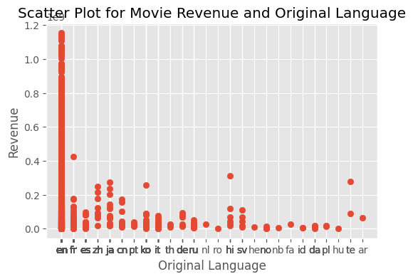


**檢查資料是否為常態分佈**

考量到部分語言電影之資料筆數 < 3 、無法進行 Shapiro Wilk's Test，且資料筆數少較難真實呈現該語言電影的真實票房，故先將其予以排除


```python
three_bound_index = list(language_df.groupby('original_language').count()[language_df.groupby('original_language').count()['revenue'] >= 3].index)
proper_lang_df = language_df[language_df['original_language'].apply(lambda x: x in three_bound_index)]
proper_lang_df
```


<div>
<style scoped>
    .dataframe tbody tr th:only-of-type {
        vertical-align: middle;
    }

    .dataframe tbody tr th {
        vertical-align: top;
    }

    .dataframe thead th {
        text-align: right;
    }
</style>
<table border="1" class="dataframe">
  <thead>
    <tr style="text-align: right;">
      <th></th>
      <th>original_language</th>
      <th>revenue</th>
    </tr>
  </thead>
  <tbody>
    <tr>
      <th>0</th>
      <td>en</td>
      <td>161834276</td>
    </tr>
    <tr>
      <th>1</th>
      <td>en</td>
      <td>144056873</td>
    </tr>
    <tr>
      <th>2</th>
      <td>en</td>
      <td>45554533</td>
    </tr>
    <tr>
      <th>3</th>
      <td>en</td>
      <td>28780255</td>
    </tr>
    <tr>
      <th>4</th>
      <td>en</td>
      <td>106371651</td>
    </tr>
    <tr>
      <th>...</th>
      <td>...</td>
      <td>...</td>
    </tr>
    <tr>
      <th>2783</th>
      <td>en</td>
      <td>47019435</td>
    </tr>
    <tr>
      <th>2784</th>
      <td>en</td>
      <td>30763855</td>
    </tr>
    <tr>
      <th>2785</th>
      <td>en</td>
      <td>76706000</td>
    </tr>
    <tr>
      <th>2786</th>
      <td>en</td>
      <td>80648577</td>
    </tr>
    <tr>
      <th>2787</th>
      <td>en</td>
      <td>46586903</td>
    </tr>
  </tbody>
</table>
<p>2775 rows × 2 columns</p>
</div>


+ $H_0$: The population is normally distributed
+ $H_1$: The population is not normally distributed


```python
treatment_name_list = proper_lang_df['original_language'].unique()
print(treatment_name_list)
anova.shapiro(proper_lang_df, treatment_name_list, 'original_language', 'revenue')
# anova.qq_plot(4, 4, proper_lang_df, treatment_name_list, 'original_language', 'revenue', figsize=(16, 16))
```

    ['en' 'fr' 'es' 'zh' 'ja' 'cn' 'pt' 'ko' 'it' 'th' 'de' 'ru' 'hi' 'sv'
     'no' 'da']
    1: Statistics=0.6985, p=0.0000
    2: Statistics=0.5459, p=0.0000
    3: Statistics=0.8304, p=0.0002
    4: Statistics=0.9592, p=0.8025
    5: Statistics=0.8486, p=0.0102
    6: Statistics=0.8343, p=0.0658
    7: Statistics=0.9684, p=0.8313
    8: Statistics=0.7001, p=0.0001
    9: Statistics=0.7924, p=0.0012
    10: Statistics=0.9832, p=0.7520
    11: Statistics=0.8692, p=0.2231
    12: Statistics=0.9471, p=0.7028
    13: Statistics=0.7717, p=0.0322
    14: Statistics=0.9276, p=0.5803
    15: Statistics=0.7951, p=0.1030
    16: Statistics=0.9850, p=0.9307


雖然沒有符合 Required Conditions，因為難以比較，所以仍透過 One Way ANOVA 來幫助我們釐清關係。

+ $H_0$: All population means are equal<br>
+ $H_1$: Not all population means are equal


```python
results, aov_table, render_table, f_stat, p_value = anova.f_oneway(proper_lang_df, 'original_language', 'revenue')
display(aov_table)
print(f"p-value = {p_value:.4f}")
```

    p-value: 1.866833379796334e-07


<div>
<style scoped>
    .dataframe tbody tr th:only-of-type {
        vertical-align: middle;
    }

    .dataframe tbody tr th {
        vertical-align: top;
    }

    .dataframe thead th {
        text-align: right;
    }
</style>
<table border="1" class="dataframe">
  <thead>
    <tr style="text-align: right;">
      <th></th>
      <th>sum_sq</th>
      <th>df</th>
      <th>F</th>
      <th>PR(&gt;F)</th>
    </tr>
  </thead>
  <tbody>
    <tr>
      <th>C(original_language)</th>
      <td>2.167251e+18</td>
      <td>15.0</td>
      <td>4.085807</td>
      <td>1.866833e-07</td>
    </tr>
    <tr>
      <th>Residual</th>
      <td>9.756450e+19</td>
      <td>2759.0</td>
      <td>NaN</td>
      <td>NaN</td>
    </tr>
  </tbody>
</table>
</div>


    p-value = 0.0000


```python
mc = smm.MultiComparison(proper_lang_df['revenue'], proper_lang_df['original_language'])
print(mc.tukeyhsd().summary())
```

               Multiple Comparison of Means - Tukey HSD, FWER=0.05            
    ==========================================================================
    group1 group2     meandiff    p-adj       lower          upper      reject
    --------------------------------------------------------------------------
        cn     da     -58777230.5    0.9 -453692911.9816 336138450.9816  False
        cn     de  -19386488.1667    0.9   -367669382.18 328896405.8467  False
        cn     en   80979545.5313    0.9 -147379587.0194  309338678.082  False
        cn     es  -38049257.6667    0.9 -294660053.0628 218561537.7294  False
        cn     fr  -29759843.6912    0.9 -270803713.8388 211284026.4564  False
        cn     hi      28994122.0    0.9 -319288772.0133 377277016.0133  False
        cn     it  -48362190.1111    0.9 -322389705.7099 225665325.4877  False
        cn     ja   24160919.0588    0.9 -252335362.7657 300657200.8834  False
        cn     ko  -17565548.1765    0.9  -294061830.001 258930733.6481  False
        cn     no  -63470572.6667    0.9 -500066285.7674  373125140.434  False
        cn     pt     -43055653.0    0.9 -437971334.4816 351860028.4816  False
        cn     ru  -44173588.5714    0.9 -377938257.0346 289591079.8918  False
        cn     sv     -19510355.0    0.9 -387156846.5505 348136136.5505  False
        cn     th     -50270048.0    0.9 -486865761.1007 386325665.1007  False
        cn     zh     58465853.25    0.9 -263981450.4345 380913156.9345  False
        da     de   39390742.3333    0.9 -376886936.7332 455668421.3999  False
        da     en  139756776.0313    0.9 -182941264.3191 462454816.3818  False
        da     es   20727972.8333    0.9 -322543395.2423  363999340.909  False
        da     fr   29017386.8088    0.9 -302778151.3806 360812924.9983  False
        da     hi      87771352.5    0.9 -328506326.5665 504049031.5665  False
        da     it   10415040.3889    0.9 -346063866.6055 366893947.3833  False
        da     ja   82938149.5588    0.9 -275441991.7569 441318290.8746  False
        da     ko   41211682.3235    0.9 -317168458.9922 399591823.6393  False
        da     no   -4693342.1667    0.9 -497239734.4229 487853050.0895  False
        da     pt      15721577.5    0.9 -440287772.5213 471730927.5213  False
        da     ru   14603641.9286    0.9 -389605444.7346 418812728.5917  False
        da     sv      39266875.5    0.9   -393341578.62   471875329.62  False
        da     th       8507182.5    0.9 -484039209.7562 501053574.7562  False
        da     zh    117243083.75    0.9 -277672597.7316 512158765.2316  False
        de     en   100366033.698    0.9 -163218116.1066 363950183.5026  False
        de     es     -18662769.5    0.9   -307068405.58   269742866.58  False
        de     fr  -10373355.5245    0.9 -285020143.1348 264273432.0857  False
        de     hi   48380610.1667    0.9 -323949464.9968 420710685.3301  False
        de     it  -28975701.9444    0.9  -332981935.292 275030531.4031  False
        de     ja   43547407.2255    0.9 -262686007.7894 349780822.2404  False
        de     ko    1820939.9902    0.9 -304412475.0247 308054355.0051  False
        de     no     -44084084.5    0.9 -500093434.5213 411925265.5213  False
        de     pt  -23669164.8333    0.9 -439946843.8999 392608514.2332  False
        de     ru  -24787100.4048    0.9 -383573338.3282 333999137.5187  False
        de     sv    -123866.8333    0.9 -390626944.1046 390379210.4379  False
        de     th  -30883559.8333    0.9 -486892909.8546 425125790.1879  False
        de     zh   77852341.4167    0.9 -270430552.5967   426135235.43  False
        en     es  -119028803.198 0.0473 -237454856.4115   -602749.9844   True
        en     fr -110739389.2225  0.001 -189971813.7824 -31506964.6626   True
        en     hi  -51985423.5313    0.9 -315569573.3359 211598726.2733  False
        en     it -129341735.6424 0.2117 -281876023.8243  23192552.5394  False
        en     ja  -56818626.4725    0.9 -213744799.0146 100107546.0696  False
        en     ko  -98545093.7078 0.7001 -255471266.2499  58381078.8343  False
        en     no  -144450118.198    0.9  -516997358.778 228097122.3821  False
        en     pt -124035198.5313    0.9 -446733238.8818 198662841.8191  False
        en     ru -125153134.1027    0.9 -369231981.3638 118925713.1583  False
        en     sv -100489900.5313    0.9 -389175841.5041 188196040.4415  False
        en     th -131249593.5313    0.9 -503796834.1114 241297647.0488  False
        en     zh  -22513692.2813    0.9  -250872824.832 205845440.2694  False
        es     fr    8289413.9755    0.9  -133057619.938  149636447.889  False
        es     hi   67043379.6667    0.9 -221362256.4134 355449015.7467  False
        es     it  -10312932.4444    0.9 -202583356.4978 181957491.6089  False
        es     ja   62210176.7255    0.9 -133562728.7625 257983082.2135  False
        es     ko   20483709.4902    0.9 -175289195.9978 216256614.9782  False
        es     no     -25421315.0    0.9 -415924392.2713 365081762.2713  False
        es     pt   -5006395.3333    0.9  -348277763.409 338264972.7423  False
        es     ru   -6124330.9048    0.9 -276819160.1402 264570498.3306  False
        es     sv   18538902.6667    0.9  -292974787.899 330052593.2323  False
        es     th  -12220790.3333    0.9 -402723867.6046 378282286.9379  False
        es     zh   96515110.9167    0.9 -160095684.4794 353125906.3128  False
        fr     hi   58753965.6912    0.9 -215892821.9191 333400753.3014  False
        fr     it  -18602346.4199    0.9 -189543748.6242 152339055.7843  False
        fr     ja     53920762.75    0.9 -120950840.2767 228792365.7767  False
        fr     ko   12194295.5147    0.9  -162677307.512 187065898.5414  False
        fr     no  -33710728.9755    0.9 -414165325.9779 346743868.0269  False
        fr     pt  -13295809.3088    0.9 -345091347.4983 318499728.8806  False
        fr     ru  -14413744.8803    0.9 -270399560.1058 241572070.3453  False
        fr     sv   10249488.6912    0.9 -288571237.5507 309070214.9331  False
        fr     th  -20510204.3088    0.9 -400964801.3112 359944392.6935  False
        fr     zh   88225696.9412    0.9 -152818173.2064 329269567.0888  False
        hi     it  -77356312.1111    0.9 -381362545.4586 226649921.2364  False
        hi     ja   -4833202.9412    0.9 -311066617.9561 301400212.0737  False
        hi     ko  -46559670.1765    0.9 -352793085.1914 259673744.8384  False
        hi     no  -92464694.6667    0.9 -548474044.6879 363544655.3546  False
        hi     pt     -72049775.0    0.9 -488327454.0665 344227904.0665  False
        hi     ru  -73167710.5714    0.9 -431953948.4949  285618527.352  False
        hi     sv     -48504477.0    0.9 -439007554.2713 341998600.2713  False
        hi     th     -79264170.0    0.9 -535273520.0213 376745180.0213  False
        hi     zh     29471731.25    0.9 -318811162.7633 377754625.2633  False
        it     ja   72523109.1699    0.9 -145580099.2307 290626317.5705  False
        it     ko   30796641.9346    0.9 -187306566.4659 248899850.3352  False
        it     no  -15108382.5556    0.9  -417270827.781 387054062.6699  False
        it     pt    5306537.1111    0.9 -351172369.8833 361785444.1055  False
        it     ru    4188601.5397    0.9 -283070287.9071 291447490.9865  False
        it     sv   28851835.1111    0.9 -297158530.3702 354862200.5924  False
        it     th   -1907857.8889    0.9 -404070303.1144 400254587.3366  False
        it     zh  106828043.3611    0.9 -167199472.2377 380855558.9599  False
        ja     ko  -41726467.2353    0.9 -262923492.6949 179470558.2243  False
        ja     no  -87631491.7255    0.9 -491480160.0498 316217176.5988  False
        ja     pt  -67216572.0588    0.9 -425596713.3746 291163569.2569  False
        ja     ru  -68334507.6303    0.9 -357949396.9639 221280381.7034  False
        ja     sv  -43671274.0588    0.9 -371759483.1716 284416935.0539  False
        ja     th  -74430967.0588    0.9 -478279635.3831 329417701.2655  False
        ja     zh   34304934.1912    0.9 -242191347.6334 310801216.0157  False
        ko     no  -45905024.4902    0.9 -449753692.8145 357943643.8341  False
        ko     pt  -25490104.8235    0.9 -383870246.1393 332890036.4922  False
        ko     ru   -26608040.395    0.9 -316222929.7286 263006848.9387  False
        ko     sv   -1944806.8235    0.9 -330033015.9363 326143402.2892  False
        ko     th  -32704499.8235    0.9 -436553168.1478 371144168.5008  False
        ko     zh   76031401.4265    0.9 -200464880.3981  352527683.251  False
        no     pt   20414919.6667    0.9 -472131472.5895 512961311.9229  False
        no     ru   19296984.0952    0.9 -425722573.8557 464316542.0462  False
        no     sv   43960217.6667    0.9 -427004213.8926 514924649.2259  False
        no     th   13200524.6667    0.9 -513353717.3089 539754766.6422  False
        no     zh  121936425.9167    0.9  -314659287.184 558532139.0174  False
        pt     ru   -1117935.5714    0.9 -405327022.2346 403091151.0917  False
        pt     sv      23545298.0    0.9   -409063156.12   456153752.12  False
        pt     th      -7214395.0    0.9 -499760787.2562 485331997.2562  False
        pt     zh    101521506.25    0.9 -293394175.2316 496437187.7316  False
        ru     sv   24663233.5714    0.9 -352948383.0539 402274850.1967  False
        ru     th   -6096459.4286    0.9 -451116017.3795 438923098.5224  False
        ru     zh  102639441.8214    0.9 -231125226.6418 436404110.2846  False
        sv     th     -30759693.0    0.9 -501724124.5593 440204738.5593  False
        sv     zh     77976208.25    0.9 -289670283.3005 445622699.8005  False
        th     zh    108735901.25    0.9 -327859811.8507 545331614.3507  False
    --------------------------------------------------------------------------


```python
_ = mc.tukeyhsd().plot_simultaneous(comparison_name = "en")
_ = mc.tukeyhsd().plot_simultaneous(comparison_name = "zh")
```


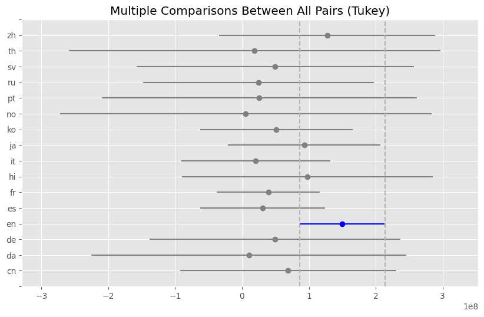


Pairs `en` and `es`, `en` and `fr`, `en` and `it` can reject the null hypothesis under 5% confidence level. Moreover, by observing the graph above, we can know that the mean of `en` is larger than the mean of `es`, `fr`, `it`.

結果顯示原始語言為英文的電影票房較西班牙語、法語、義大利語電影好的狀況，不過因為整體資料筆數太懸殊、幾乎都是英文片所以意義不大。

為更了解各原始語言電影之票房分佈，繪製以下 Box Plot。


```python
lan_list = proper_lang_df['original_language'].unique()
```


```python
fig = plt.figure(figsize=(15, 6))
ax = sns.boxplot(x='original_language', y="revenue", data=proper_lang_df)
plt.show()
```


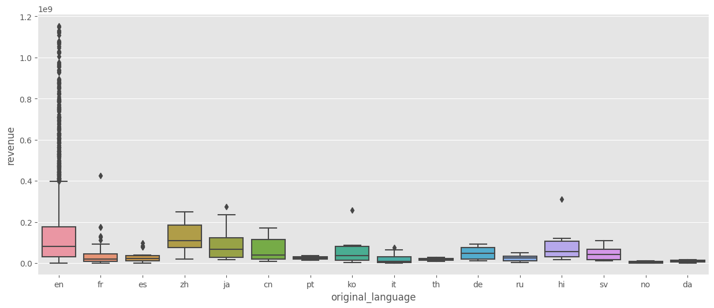


在這裏我們也可以看到，中文電影的平均票房表現其實也不差。甚至高於英文電影的平均票房。

### 六、票房與電影級數的關係

因不同電影分級也代表該電影的客群範圍大小不盡相同，因此我們想探討電影分級是否會影響票房。


```python
data7 = u_movie_df[['revenue', 'rating']]
print('Head of dataset:')
display(data7.head())

print("Tail of dataset:")
display(data7.tail())

print(data7.shape)
```

    Head of dataset:


<div>
<style scoped>
    .dataframe tbody tr th:only-of-type {
        vertical-align: middle;
    }

    .dataframe tbody tr th {
        vertical-align: top;
    }

    .dataframe thead th {
        text-align: right;
    }
</style>
<table border="1" class="dataframe">
  <thead>
    <tr style="text-align: right;">
      <th></th>
      <th>revenue</th>
      <th>rating</th>
    </tr>
  </thead>
  <tbody>
    <tr>
      <th>0</th>
      <td>161834276</td>
      <td>R</td>
    </tr>
    <tr>
      <th>1</th>
      <td>144056873</td>
      <td>R</td>
    </tr>
    <tr>
      <th>2</th>
      <td>45554533</td>
      <td>G</td>
    </tr>
    <tr>
      <th>3</th>
      <td>28780255</td>
      <td>R</td>
    </tr>
    <tr>
      <th>4</th>
      <td>106371651</td>
      <td>R</td>
    </tr>
  </tbody>
</table>
</div>


    Tail of dataset:


<div>
<style scoped>
    .dataframe tbody tr th:only-of-type {
        vertical-align: middle;
    }

    .dataframe tbody tr th {
        vertical-align: top;
    }

    .dataframe thead th {
        text-align: right;
    }
</style>
<table border="1" class="dataframe">
  <thead>
    <tr style="text-align: right;">
      <th></th>
      <th>revenue</th>
      <th>rating</th>
    </tr>
  </thead>
  <tbody>
    <tr>
      <th>2783</th>
      <td>47019435</td>
      <td>R</td>
    </tr>
    <tr>
      <th>2784</th>
      <td>30763855</td>
      <td>PG-13</td>
    </tr>
    <tr>
      <th>2785</th>
      <td>76706000</td>
      <td>R</td>
    </tr>
    <tr>
      <th>2786</th>
      <td>80648577</td>
      <td>R</td>
    </tr>
    <tr>
      <th>2787</th>
      <td>46586903</td>
      <td>PG-13</td>
    </tr>
  </tbody>
</table>
</div>


    (2788, 2)


去除NaN值：


```python
data7 = data7[~pd.isnull(data7['rating'])].reset_index(drop=True)
print(data7.shape)
```

    (2361, 2)


```python
rating = data7['rating'].unique()
n = len(rating)
print(n, rating)
```

    7 ['R' 'G' 'PG-13' 'PG' 'TVG' 'NC-17' 'TVMA']


分級共有7種，將其編號 1~7

**Scatter Plot**


```python
plt.scatter(data7['rating'], data7['revenue'])
plt.title('Scatter Plot for Movie Revenue and Rating')
plt.xlabel('Rating')
plt.ylabel('Revenue')
plt.xticks(data7['rating'])
plt.show()
```


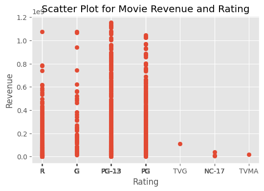


可以看到NC-17、TVG、TVMA的資料筆數很少。

**用各分級平均票房畫 Bar Chart**


```python
rate_ave = []

for i in range(n):
    rate_ave.append(data7['revenue'][data7['rating'] == rating[i]].mean())
    
print(rate_ave)
```

    [87707908.30050762, 288900688.45652175, 189863192.0979592, 231950381.4115942, 110230332.0, 18113892.666666668, 15600000.0]


```python
fig, ax = plt.subplots()
rects1 = ax.bar(rating, rate_ave, width=0.8, bottom=None, align='center')
plt.ylabel('Average Revenue')
plt.xlabel('Rating')
plt.title('Average Revenue for Different Rating')
plt.xticks(rating)

def autolabel(rects):
    """Attach a text label above each bar in *rects*, displaying its height."""
    for rect in rects:
        height = (rect.get_height())
        plt.annotate('{:.2f}'.format(height / 1e8),
                    xy = (rect.get_x() + rect.get_width() / 2, height),
                    xytext = (0, 3),  # 3 points vertical offset
                    textcoords = "offset points",
                    ha = 'center', va = 'bottom')

autolabel(rects1)
plt.show()
```


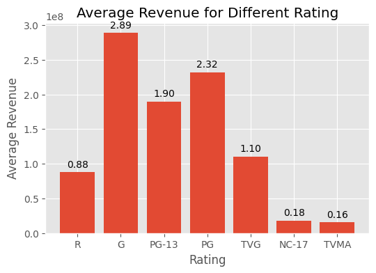


```python
data7.groupby(['rating']).describe()
```


<div>
<style scoped>
    .dataframe tbody tr th:only-of-type {
        vertical-align: middle;
    }

    .dataframe tbody tr th {
        vertical-align: top;
    }

    .dataframe thead tr th {
        text-align: left;
    }

    .dataframe thead tr:last-of-type th {
        text-align: right;
    }
</style>
<table border="1" class="dataframe">
  <thead>
    <tr>
      <th></th>
      <th colspan="8" halign="left">revenue</th>
    </tr>
    <tr>
      <th></th>
      <th>count</th>
      <th>mean</th>
      <th>std</th>
      <th>min</th>
      <th>25%</th>
      <th>50%</th>
      <th>75%</th>
      <th>max</th>
    </tr>
    <tr>
      <th>rating</th>
      <th></th>
      <th></th>
      <th></th>
      <th></th>
      <th></th>
      <th></th>
      <th></th>
      <th></th>
    </tr>
  </thead>
  <tbody>
    <tr>
      <th>G</th>
      <td>46.0</td>
      <td>2.889007e+08</td>
      <td>2.658467e+08</td>
      <td>14460000.0</td>
      <td>1.130379e+08</td>
      <td>186662101.5</td>
      <td>378496892.0</td>
      <td>1.073395e+09</td>
    </tr>
    <tr>
      <th>NC-17</th>
      <td>3.0</td>
      <td>1.811389e+07</td>
      <td>1.943852e+07</td>
      <td>3909002.0</td>
      <td>7.037348e+06</td>
      <td>10165694.0</td>
      <td>25216338.0</td>
      <td>4.026698e+07</td>
    </tr>
    <tr>
      <th>PG</th>
      <td>345.0</td>
      <td>2.319504e+08</td>
      <td>2.325721e+08</td>
      <td>1117920.0</td>
      <td>7.202875e+07</td>
      <td>141702264.0</td>
      <td>321885765.0</td>
      <td>1.047612e+09</td>
    </tr>
    <tr>
      <th>PG-13</th>
      <td>980.0</td>
      <td>1.898632e+08</td>
      <td>2.263727e+08</td>
      <td>970816.0</td>
      <td>4.568520e+07</td>
      <td>99743505.0</td>
      <td>228840672.0</td>
      <td>1.153296e+09</td>
    </tr>
    <tr>
      <th>R</th>
      <td>985.0</td>
      <td>8.770791e+07</td>
      <td>1.069241e+08</td>
      <td>924793.0</td>
      <td>2.115026e+07</td>
      <td>54700105.0</td>
      <td>109502303.0</td>
      <td>1.074251e+09</td>
    </tr>
    <tr>
      <th>TVG</th>
      <td>1.0</td>
      <td>1.102303e+08</td>
      <td>NaN</td>
      <td>110230332.0</td>
      <td>1.102303e+08</td>
      <td>110230332.0</td>
      <td>110230332.0</td>
      <td>1.102303e+08</td>
    </tr>
    <tr>
      <th>TVMA</th>
      <td>1.0</td>
      <td>1.560000e+07</td>
      <td>NaN</td>
      <td>15600000.0</td>
      <td>1.560000e+07</td>
      <td>15600000.0</td>
      <td>15600000.0</td>
      <td>1.560000e+07</td>
    </tr>
  </tbody>
</table>
</div>


※資料筆數差異很大，不考慮NC-17、TVG、TVMA  


G 的票房看起來最高，R 的票房看起來最低，進一步檢定是否如此。


```python
rating = np.delete(rating, [4, 5, 6])
n = len(rating)
print(n, rating)
```

    4 ['R' 'G' 'PG-13' 'PG']


將分級編號為1~4。


```python
data7 = data7[data7['rating'] != 'NC-17'].reset_index(drop=True)
data7 = data7[data7['rating'] != 'TVG'].reset_index(drop=True)
data7 = data7[data7['rating'] != 'TVMA'].reset_index(drop=True)
print(data7.shape)
```

    (2356, 2)


**Check Normality**


```python
fig = plt.figure(figsize = (9, 6))
row, col = 2, 2
fig.subplots_adjust(hspace = 0.5, wspace = 0.5)

for i in range(n):
    ax = fig.add_subplot(row, col, i + 1)
    ax = data7['revenue'][data7['rating'] == rating[i]].hist(bins = 'auto')
    plt.title('Revenue of Rating ' + rating[i])
    plt.ylabel('Frequency')
    plt.xlabel('Revenue')
    
plt.show()
```


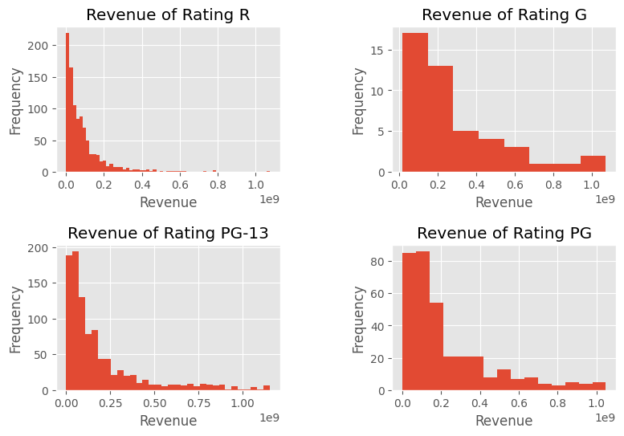


明顯看得出來資料不是常態分佈，因此使用無母數檢定的Kruskal-Wallis Test。

**Kruskal-Wallis Test**
+ $H_0:$ The locations of all the 4 populations are the same.  
+ $H_1:$ At least two population locations differ.  

Significance level $\alpha = 0.05$.


```python
stats.kruskal(data7['revenue'][data7['rating'] == 'PG-13'], data7['revenue'][data7['rating'] == 'R'], 
              data7['revenue'][data7['rating'] == 'G'], data7['revenue'][data7['rating'] == 'PG'])
```


    KruskalResult(statistic=283.22241140429986, pvalue=4.2517137942222856e-61)


p-value < 0.05，有足夠的證據以拒絕虛無假設，也就是不同電影分級的票房有差異，進一步將電影分級兩兩分組，以Mann–Whitney U Test檢定其之間的關係。

**Mann–Whitney U Test**


```python
rate_comb = list(itertools.combinations(rating, 2))
print(rate_comb)
```

    [('R', 'G'), ('R', 'PG-13'), ('R', 'PG'), ('G', 'PG-13'), ('G', 'PG'), ('PG-13', 'PG')]


用來儲存結果的二維陣列


```python
rate_comb_result = []

for m1 in range(n):
    rate_comb_result.append([])
    for m2 in range(n):
        rate_comb_result[m1].append([])
```

+ $H_0:$ The two population locations are the same in terms of revenue.  
+ $H_1:$ The two population locations are not the same in terms of revenue.

只印出可以拒絕虛無假設（也就是票房有所差異）的月份組合


```python
diff_rate = [] #r1 != r2
for (r1, r2) in rate_comb:
    #print('(', r1, ', ', r2, ')')
    try:
        result = stats.mannwhitneyu(data7['revenue'][data7['rating'] == r1], data7['revenue'][data7['rating'] == r2], alternative = 'two-sided')
        if result.pvalue < 0.05:
            print('(', r1, ' != ', r2, '): ', result, sep = '')
            diff_rate.append((r1, r2))
            rate_comb_result[np.where(rating == r1)[0][0]][np.where(rating == r2)[0][0]] = '!='
            rate_comb_result[np.where(rating == r2)[0][0]][np.where(rating == r1)[0][0]] = '!='
        else:
            rate_comb_result[np.where(rating == r1)[0][0]][np.where(rating == r2)[0][0]] = '='
            rate_comb_result[np.where(rating == r2)[0][0]][np.where(rating == r1)[0][0]] = '='
    except ValueError:
        continue
    
print(diff_rate)
```

    (R != G): MannwhitneyuResult(statistic=8566.0, pvalue=9.535788534005027e-13)
    (R != PG-13): MannwhitneyuResult(statistic=322207.0, pvalue=2.8085095054408475e-37)
    (R != PG): MannwhitneyuResult(statistic=85354.0, pvalue=3.7048787546911424e-43)
    (G != PG-13): MannwhitneyuResult(statistic=29542.0, pvalue=0.0003644829113218024)
    (PG-13 != PG): MannwhitneyuResult(statistic=140824.0, pvalue=3.8777413935328725e-06)
    [('R', 'G'), ('R', 'PG-13'), ('R', 'PG'), ('G', 'PG-13'), ('PG-13', 'PG')]


針對以上這些月份再做left tail和right tail


```python
less_rate = [] #r1 < r2
greater_rate = [] #r1 > r2
for (r1, r2) in diff_rate:
    l_result = stats.mannwhitneyu(data7['revenue'][data7['rating'] == r1], data7['revenue'][data7['rating'] == r2], alternative = 'less')
    r_result = stats.mannwhitneyu(data7['revenue'][data7['rating'] == r1], data7['revenue'][data7['rating'] == r2], alternative = 'greater')
    if l_result.pvalue < 0.05:
        print('(', r1, ' < ', r2, '): ', l_result, sep = '')
        less_rate.append((r1, r2))
        rate_comb_result[np.where(rating == r1)[0][0]][np.where(rating == r2)[0][0]] = '<'
        rate_comb_result[np.where(rating == r2)[0][0]][np.where(rating == r1)[0][0]] = '>'
    elif r_result.pvalue < 0.05:
        print('(', r1, ' > ', r2, '): ', r_result, sep = '')
        greater_rate.append((r1, r2))
        rate_comb_result[np.where(rating == r1)[0][0]][np.where(rating == r2)[0][0]] = '>'
        rate_comb_result[np.where(rating == r2)[0][0]][np.where(rating == r1)[0][0]] = '<'
        
print(less_rate)
print(greater_rate)
```

    (R < G): MannwhitneyuResult(statistic=8566.0, pvalue=4.767894267002514e-13)
    (R < PG-13): MannwhitneyuResult(statistic=322207.0, pvalue=1.4042547527204237e-37)
    (R < PG): MannwhitneyuResult(statistic=85354.0, pvalue=1.8524393773455712e-43)
    (G > PG-13): MannwhitneyuResult(statistic=29542.0, pvalue=0.0001822414556609012)
    (PG-13 < PG): MannwhitneyuResult(statistic=140824.0, pvalue=1.9388706967664363e-06)
    [('R', 'G'), ('R', 'PG-13'), ('R', 'PG'), ('PG-13', 'PG')]
    [('G', 'PG-13')]


```python
for i in range(n):
    print(rating[i], rate_comb_result[i])
```

    R [[], '<', '<', '<']
    G ['>', [], '>', '=']
    PG-13 ['>', '<', [], '<']
    PG ['>', '=', '>', []]


**小結：**  

G 和 PG 的票房大於所有其他電影分級，再來是 PG-13，R的票房最低。  
G 和 PG 兩者彼此差不多，很合理，因為這兩個都算普遍級，但 PG 是建議家長指導。  
而 PG-13 能看的人數比R多，票房較高也合理。

### 七、票房與上映時間的關係

#### 1. 寒暑假比較多電影？


```python
month = 0
vacay = 0

y = np.array([228, 250, 273, 217, 224, 256, 241, 263, 354, 317, 251, 298])
x = np.array(['Jan.', 'Feb.', 'Mar.', 'Apr.', 'May', 'June', 'July', 'Aug.', 'Sep.', 'Oct.', 'Nov.', 'Dec.'])
mylabels = ['Jan.', 'Feb.', 'Mar.', 'Apr.', 'May', 'June', 'July', 'Aug.', 'Sep.', 'Oct.', 'Nov.', 'Dec.']

plt.pie(y, labels = mylabels)
plt.title("New Movies from 2000 - 2021")
plt.show() 

plt.barh(x, y, color=(0.2, 0.4, 0.6, 0.6))
plt.title("New Movies from 2000 - 2021")
plt.show()
```


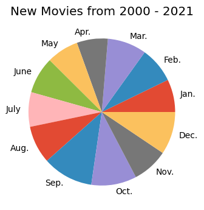


```python
y = np.array([[2000, 0, 8, 10, 8, 8, 9, 8, 9, 6, 6, 8, 13], [2001, 7, 4, 5, 9, 6, 11, 16, 9, 4, 12, 9, 13], [2002,8, 12, 11, 8, 7, 9, 10, 7, 5, 12, 5, 15], \
             [2003, 9, 8, 11, 8, 13, 7, 9, 11, 13, 8, 11, 11], [2004, 7, 11, 10, 13, 9, 12, 9, 7, 14, 14, 10, 11], [2005, 12, 8, 9, 10, 7, 12, 9, 11, 25, 16, 12, 12], \
             [2006, 12, 11, 20, 7, 9, 13, 14, 14, 20, 12, 10, 19], [2007, 5, 13, 14, 9, 8, 17, 8, 14, 20, 15, 16, 14], [2008, 15, 16, 6, 11, 9, 9, 15, 15, 18, 17, 10, 16], \
             [2009, 11, 14, 18, 12, 11, 18, 11, 12, 24, 22, 15, 12], [2010, 10, 14, 18, 12, 10, 18, 13, 14, 23, 17, 15, 12],  [2011, 9, 15, 15, 13, 13, 10, 14, 17, 27, 18, 15, 13], \
             [2012, 15, 9, 20, 13, 12, 13, 7, 19, 24, 10, 10, 10], [2013, 17, 10, 15, 15, 15, 12, 20, 15, 23, 21, 12, 17], [2014, 15, 15, 16, 16, 19, 10, 11, 16, 17, 25, 11, 24], \
             [2015, 15, 10, 11, 12, 14, 14, 17, 13, 18, 22, 15, 16], [2016,14, 20, 15, 15, 14, 19, 15, 12, 20, 14, 25, 20], [2017, 13, 16, 20, 7, 11, 18, 11, 14, 19, 20, 10, 15], \
             [2018, 11, 15, 11, 9, 13, 12, 12, 16, 17, 17, 15, 17], [2019, 10, 8, 11, 7, 13, 10, 6, 13, 13, 15, 13, 13], [2020, 10, 7, 2, 1, 0, 3, 6, 5, 4, 4, 4, 5], [2021, 3, 6, 5, 2, 3, None, None, None, None, None, None, None]])
month_df = pd.DataFrame(y, columns = ["Years",'Jan.', 'Feb.', 'Mar.', 'Apr.', 'May', 'June', 'July', 'Aug.', 'Sep.', 'Oct.', 'Nov.', 'Dec.'])
display(month_df)
y_2 = np.array([[2000, 30, 63], [2001, 38, 67], [2002, 32, 77], [2003, 31, 88], [2004, 27, 100], [2005, 32, 111], [2006, 47, 114],\
       [2007, 36, 117], [2008, 51, 106], [2009, 35, 145], [2010, 39, 137], [2011, 44, 135], [2012, 36, 126], [2013, 52, 140],\
       [2014, 51, 144], [2015, 46, 131], [2016, 47, 156], [2017, 40, 134], [2018, 45, 120], [2019, 32, 100]])#, [2020, 16, 35]])
vacay_df = pd.DataFrame(y_2, columns = ['Years', '12, 7, 8', 'rest'])

vacay_df['sum'] = vacay_df['12, 7, 8'] + vacay_df['rest']
display(vacay_df)
```


<div>
<style scoped>
    .dataframe tbody tr th:only-of-type {
        vertical-align: middle;
    }

    .dataframe tbody tr th {
        vertical-align: top;
    }

    .dataframe thead th {
        text-align: right;
    }
</style>
<table border="1" class="dataframe">
  <thead>
    <tr style="text-align: right;">
      <th></th>
      <th>Years</th>
      <th>Jan.</th>
      <th>Feb.</th>
      <th>Mar.</th>
      <th>Apr.</th>
      <th>May</th>
      <th>June</th>
      <th>July</th>
      <th>Aug.</th>
      <th>Sep.</th>
      <th>Oct.</th>
      <th>Nov.</th>
      <th>Dec.</th>
    </tr>
  </thead>
  <tbody>
    <tr>
      <th>0</th>
      <td>2000</td>
      <td>0</td>
      <td>8</td>
      <td>10</td>
      <td>8</td>
      <td>8</td>
      <td>9</td>
      <td>8</td>
      <td>9</td>
      <td>6</td>
      <td>6</td>
      <td>8</td>
      <td>13</td>
    </tr>
    <tr>
      <th>1</th>
      <td>2001</td>
      <td>7</td>
      <td>4</td>
      <td>5</td>
      <td>9</td>
      <td>6</td>
      <td>11</td>
      <td>16</td>
      <td>9</td>
      <td>4</td>
      <td>12</td>
      <td>9</td>
      <td>13</td>
    </tr>
    <tr>
      <th>2</th>
      <td>2002</td>
      <td>8</td>
      <td>12</td>
      <td>11</td>
      <td>8</td>
      <td>7</td>
      <td>9</td>
      <td>10</td>
      <td>7</td>
      <td>5</td>
      <td>12</td>
      <td>5</td>
      <td>15</td>
    </tr>
    <tr>
      <th>3</th>
      <td>2003</td>
      <td>9</td>
      <td>8</td>
      <td>11</td>
      <td>8</td>
      <td>13</td>
      <td>7</td>
      <td>9</td>
      <td>11</td>
      <td>13</td>
      <td>8</td>
      <td>11</td>
      <td>11</td>
    </tr>
    <tr>
      <th>4</th>
      <td>2004</td>
      <td>7</td>
      <td>11</td>
      <td>10</td>
      <td>13</td>
      <td>9</td>
      <td>12</td>
      <td>9</td>
      <td>7</td>
      <td>14</td>
      <td>14</td>
      <td>10</td>
      <td>11</td>
    </tr>
    <tr>
      <th>5</th>
      <td>2005</td>
      <td>12</td>
      <td>8</td>
      <td>9</td>
      <td>10</td>
      <td>7</td>
      <td>12</td>
      <td>9</td>
      <td>11</td>
      <td>25</td>
      <td>16</td>
      <td>12</td>
      <td>12</td>
    </tr>
    <tr>
      <th>6</th>
      <td>2006</td>
      <td>12</td>
      <td>11</td>
      <td>20</td>
      <td>7</td>
      <td>9</td>
      <td>13</td>
      <td>14</td>
      <td>14</td>
      <td>20</td>
      <td>12</td>
      <td>10</td>
      <td>19</td>
    </tr>
    <tr>
      <th>7</th>
      <td>2007</td>
      <td>5</td>
      <td>13</td>
      <td>14</td>
      <td>9</td>
      <td>8</td>
      <td>17</td>
      <td>8</td>
      <td>14</td>
      <td>20</td>
      <td>15</td>
      <td>16</td>
      <td>14</td>
    </tr>
    <tr>
      <th>8</th>
      <td>2008</td>
      <td>15</td>
      <td>16</td>
      <td>6</td>
      <td>11</td>
      <td>9</td>
      <td>9</td>
      <td>15</td>
      <td>15</td>
      <td>18</td>
      <td>17</td>
      <td>10</td>
      <td>16</td>
    </tr>
    <tr>
      <th>9</th>
      <td>2009</td>
      <td>11</td>
      <td>14</td>
      <td>18</td>
      <td>12</td>
      <td>11</td>
      <td>18</td>
      <td>11</td>
      <td>12</td>
      <td>24</td>
      <td>22</td>
      <td>15</td>
      <td>12</td>
    </tr>
    <tr>
      <th>10</th>
      <td>2010</td>
      <td>10</td>
      <td>14</td>
      <td>18</td>
      <td>12</td>
      <td>10</td>
      <td>18</td>
      <td>13</td>
      <td>14</td>
      <td>23</td>
      <td>17</td>
      <td>15</td>
      <td>12</td>
    </tr>
    <tr>
      <th>11</th>
      <td>2011</td>
      <td>9</td>
      <td>15</td>
      <td>15</td>
      <td>13</td>
      <td>13</td>
      <td>10</td>
      <td>14</td>
      <td>17</td>
      <td>27</td>
      <td>18</td>
      <td>15</td>
      <td>13</td>
    </tr>
    <tr>
      <th>12</th>
      <td>2012</td>
      <td>15</td>
      <td>9</td>
      <td>20</td>
      <td>13</td>
      <td>12</td>
      <td>13</td>
      <td>7</td>
      <td>19</td>
      <td>24</td>
      <td>10</td>
      <td>10</td>
      <td>10</td>
    </tr>
    <tr>
      <th>13</th>
      <td>2013</td>
      <td>17</td>
      <td>10</td>
      <td>15</td>
      <td>15</td>
      <td>15</td>
      <td>12</td>
      <td>20</td>
      <td>15</td>
      <td>23</td>
      <td>21</td>
      <td>12</td>
      <td>17</td>
    </tr>
    <tr>
      <th>14</th>
      <td>2014</td>
      <td>15</td>
      <td>15</td>
      <td>16</td>
      <td>16</td>
      <td>19</td>
      <td>10</td>
      <td>11</td>
      <td>16</td>
      <td>17</td>
      <td>25</td>
      <td>11</td>
      <td>24</td>
    </tr>
    <tr>
      <th>15</th>
      <td>2015</td>
      <td>15</td>
      <td>10</td>
      <td>11</td>
      <td>12</td>
      <td>14</td>
      <td>14</td>
      <td>17</td>
      <td>13</td>
      <td>18</td>
      <td>22</td>
      <td>15</td>
      <td>16</td>
    </tr>
    <tr>
      <th>16</th>
      <td>2016</td>
      <td>14</td>
      <td>20</td>
      <td>15</td>
      <td>15</td>
      <td>14</td>
      <td>19</td>
      <td>15</td>
      <td>12</td>
      <td>20</td>
      <td>14</td>
      <td>25</td>
      <td>20</td>
    </tr>
    <tr>
      <th>17</th>
      <td>2017</td>
      <td>13</td>
      <td>16</td>
      <td>20</td>
      <td>7</td>
      <td>11</td>
      <td>18</td>
      <td>11</td>
      <td>14</td>
      <td>19</td>
      <td>20</td>
      <td>10</td>
      <td>15</td>
    </tr>
    <tr>
      <th>18</th>
      <td>2018</td>
      <td>11</td>
      <td>15</td>
      <td>11</td>
      <td>9</td>
      <td>13</td>
      <td>12</td>
      <td>12</td>
      <td>16</td>
      <td>17</td>
      <td>17</td>
      <td>15</td>
      <td>17</td>
    </tr>
    <tr>
      <th>19</th>
      <td>2019</td>
      <td>10</td>
      <td>8</td>
      <td>11</td>
      <td>7</td>
      <td>13</td>
      <td>10</td>
      <td>6</td>
      <td>13</td>
      <td>13</td>
      <td>15</td>
      <td>13</td>
      <td>13</td>
    </tr>
    <tr>
      <th>20</th>
      <td>2020</td>
      <td>10</td>
      <td>7</td>
      <td>2</td>
      <td>1</td>
      <td>0</td>
      <td>3</td>
      <td>6</td>
      <td>5</td>
      <td>4</td>
      <td>4</td>
      <td>4</td>
      <td>5</td>
    </tr>
    <tr>
      <th>21</th>
      <td>2021</td>
      <td>3</td>
      <td>6</td>
      <td>5</td>
      <td>2</td>
      <td>3</td>
      <td>None</td>
      <td>None</td>
      <td>None</td>
      <td>None</td>
      <td>None</td>
      <td>None</td>
      <td>None</td>
    </tr>
  </tbody>
</table>
</div>


<div>
<style scoped>
    .dataframe tbody tr th:only-of-type {
        vertical-align: middle;
    }

    .dataframe tbody tr th {
        vertical-align: top;
    }

    .dataframe thead th {
        text-align: right;
    }
</style>
<table border="1" class="dataframe">
  <thead>
    <tr style="text-align: right;">
      <th></th>
      <th>Years</th>
      <th>12, 7, 8</th>
      <th>rest</th>
      <th>sum</th>
    </tr>
  </thead>
  <tbody>
    <tr>
      <th>0</th>
      <td>2000</td>
      <td>30</td>
      <td>63</td>
      <td>93</td>
    </tr>
    <tr>
      <th>1</th>
      <td>2001</td>
      <td>38</td>
      <td>67</td>
      <td>105</td>
    </tr>
    <tr>
      <th>2</th>
      <td>2002</td>
      <td>32</td>
      <td>77</td>
      <td>109</td>
    </tr>
    <tr>
      <th>3</th>
      <td>2003</td>
      <td>31</td>
      <td>88</td>
      <td>119</td>
    </tr>
    <tr>
      <th>4</th>
      <td>2004</td>
      <td>27</td>
      <td>100</td>
      <td>127</td>
    </tr>
    <tr>
      <th>5</th>
      <td>2005</td>
      <td>32</td>
      <td>111</td>
      <td>143</td>
    </tr>
    <tr>
      <th>6</th>
      <td>2006</td>
      <td>47</td>
      <td>114</td>
      <td>161</td>
    </tr>
    <tr>
      <th>7</th>
      <td>2007</td>
      <td>36</td>
      <td>117</td>
      <td>153</td>
    </tr>
    <tr>
      <th>8</th>
      <td>2008</td>
      <td>51</td>
      <td>106</td>
      <td>157</td>
    </tr>
    <tr>
      <th>9</th>
      <td>2009</td>
      <td>35</td>
      <td>145</td>
      <td>180</td>
    </tr>
    <tr>
      <th>10</th>
      <td>2010</td>
      <td>39</td>
      <td>137</td>
      <td>176</td>
    </tr>
    <tr>
      <th>11</th>
      <td>2011</td>
      <td>44</td>
      <td>135</td>
      <td>179</td>
    </tr>
    <tr>
      <th>12</th>
      <td>2012</td>
      <td>36</td>
      <td>126</td>
      <td>162</td>
    </tr>
    <tr>
      <th>13</th>
      <td>2013</td>
      <td>52</td>
      <td>140</td>
      <td>192</td>
    </tr>
    <tr>
      <th>14</th>
      <td>2014</td>
      <td>51</td>
      <td>144</td>
      <td>195</td>
    </tr>
    <tr>
      <th>15</th>
      <td>2015</td>
      <td>46</td>
      <td>131</td>
      <td>177</td>
    </tr>
    <tr>
      <th>16</th>
      <td>2016</td>
      <td>47</td>
      <td>156</td>
      <td>203</td>
    </tr>
    <tr>
      <th>17</th>
      <td>2017</td>
      <td>40</td>
      <td>134</td>
      <td>174</td>
    </tr>
    <tr>
      <th>18</th>
      <td>2018</td>
      <td>45</td>
      <td>120</td>
      <td>165</td>
    </tr>
    <tr>
      <th>19</th>
      <td>2019</td>
      <td>32</td>
      <td>100</td>
      <td>132</td>
    </tr>
  </tbody>
</table>
</div>


因為 2020 年疫情的關係，我們只選擇了 2000 到 2019 年的資料。


```python
df_compare_rating_1 = vacay_df[['12, 7, 8', 'rest']]
df_compare_rating_1 = df_compare_rating_1.dropna().reset_index()
```


```python
df_compare_rating_1['rest'] = df_compare_rating_1['rest'] / 9
df_compare_rating_1['12, 7, 8'] = df_compare_rating_1['12, 7, 8'] / 3
display(df_compare_rating_1)
```


<div>
<style scoped>
    .dataframe tbody tr th:only-of-type {
        vertical-align: middle;
    }

    .dataframe tbody tr th {
        vertical-align: top;
    }

    .dataframe thead th {
        text-align: right;
    }
</style>
<table border="1" class="dataframe">
  <thead>
    <tr style="text-align: right;">
      <th></th>
      <th>index</th>
      <th>12, 7, 8</th>
      <th>rest</th>
    </tr>
  </thead>
  <tbody>
    <tr>
      <th>0</th>
      <td>0</td>
      <td>10.000000</td>
      <td>7.000000</td>
    </tr>
    <tr>
      <th>1</th>
      <td>1</td>
      <td>12.666667</td>
      <td>7.444444</td>
    </tr>
    <tr>
      <th>2</th>
      <td>2</td>
      <td>10.666667</td>
      <td>8.555556</td>
    </tr>
    <tr>
      <th>3</th>
      <td>3</td>
      <td>10.333333</td>
      <td>9.777778</td>
    </tr>
    <tr>
      <th>4</th>
      <td>4</td>
      <td>9.000000</td>
      <td>11.111111</td>
    </tr>
    <tr>
      <th>5</th>
      <td>5</td>
      <td>10.666667</td>
      <td>12.333333</td>
    </tr>
    <tr>
      <th>6</th>
      <td>6</td>
      <td>15.666667</td>
      <td>12.666667</td>
    </tr>
    <tr>
      <th>7</th>
      <td>7</td>
      <td>12.000000</td>
      <td>13.000000</td>
    </tr>
    <tr>
      <th>8</th>
      <td>8</td>
      <td>17.000000</td>
      <td>11.777778</td>
    </tr>
    <tr>
      <th>9</th>
      <td>9</td>
      <td>11.666667</td>
      <td>16.111111</td>
    </tr>
    <tr>
      <th>10</th>
      <td>10</td>
      <td>13.000000</td>
      <td>15.222222</td>
    </tr>
    <tr>
      <th>11</th>
      <td>11</td>
      <td>14.666667</td>
      <td>15.000000</td>
    </tr>
    <tr>
      <th>12</th>
      <td>12</td>
      <td>12.000000</td>
      <td>14.000000</td>
    </tr>
    <tr>
      <th>13</th>
      <td>13</td>
      <td>17.333333</td>
      <td>15.555556</td>
    </tr>
    <tr>
      <th>14</th>
      <td>14</td>
      <td>17.000000</td>
      <td>16.000000</td>
    </tr>
    <tr>
      <th>15</th>
      <td>15</td>
      <td>15.333333</td>
      <td>14.555556</td>
    </tr>
    <tr>
      <th>16</th>
      <td>16</td>
      <td>15.666667</td>
      <td>17.333333</td>
    </tr>
    <tr>
      <th>17</th>
      <td>17</td>
      <td>13.333333</td>
      <td>14.888889</td>
    </tr>
    <tr>
      <th>18</th>
      <td>18</td>
      <td>15.000000</td>
      <td>13.333333</td>
    </tr>
    <tr>
      <th>19</th>
      <td>19</td>
      <td>10.666667</td>
      <td>11.111111</td>
    </tr>
  </tbody>
</table>
</div>


**Check Normality**


```python
_ = plt.hist(df_compare_rating_1['12, 7, 8'], bins = 'auto', alpha=0.5, label='above')
_ = plt.hist(df_compare_rating_1['rest'], bins = 'auto', alpha=0.5, label='below')
plt.legend()
plt.show()
```


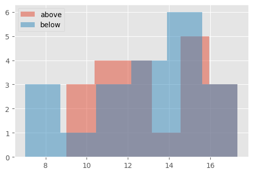


明顯並非常態分佈，故使用 Kruskal-Wallis Test

+ $H_0:$ The two population locations are the same.<br>
+ $H_1:$ The location of population 1 (7,8,12) is to the right of the location of population 2 (rest).


```python
stats.kruskal(df_compare_rating_1['12, 7, 8'], df_compare_rating_1['rest'])
```


    KruskalResult(statistic=0.03095238095238126, pvalue=0.8603466677154216)


$p$-value 大於 0.05，沒有足夠的證據拒絕虛無假設。  
結論：沒有足夠的證據顯示寒暑假上映的電影比較多。

#### 2. 過年大片是不是真的比較夯？

雖然沒有台灣過年發布電影的數據，但我們也可以看看全世界在所謂的**聖誕假期**上映的電影是否有更好的票房。

**Time Series**

先看一下是否每年的這個季節都有一個 seasonal pattern 存在。（不考慮後 COVID 時期）


```python
def get_every_x_mas(min_year, max_year, period=11, start_date=(12, 24)):
    date_lst = []
    for year in range(min_year, max_year):
        date_lst += pd.date_range(datetime(year, *start_date), periods=period).tolist()
    return date_lst
```


```python
rev_ts = u_movie_df[['title', 'release_date', 'revenue', 'budget', 'ROI', 'TW_release_date', 'log_revenue', 'log_budget', 'log_ROI']][u_movie_df['release_date'] < covid_date].sort_values(by='release_date').reset_index(drop=True)
```


```python
rev_ts['Time'] = rev_ts['release_date'].apply(mpl_dates.date2num)

x_name = 'Time'
y_name = 'revenue'

rev_df = rev_ts.set_index('release_date')

min_year = rev_ts.release_date.min().year
max_year = rev_ts.release_date.max().year

greater_x_mas_date = get_every_x_mas(min_year, max_year, period=25, start_date=(12, 10))

rev_ts['is_xmas'] = rev_ts['release_date'].apply(lambda x: 1 if x in greater_x_mas_date else 0)
rev_ts['release_year'] = rev_ts['release_date'].apply(lambda x: x.year)
rev_ts['release_month'] = rev_ts['release_date'].apply(lambda x: x.month)
display(rev_ts.head())
print(np.sum(rev_ts['is_xmas'] == 1))
```


<div>
<style scoped>
    .dataframe tbody tr th:only-of-type {
        vertical-align: middle;
    }

    .dataframe tbody tr th {
        vertical-align: top;
    }

    .dataframe thead th {
        text-align: right;
    }
</style>
<table border="1" class="dataframe">
  <thead>
    <tr style="text-align: right;">
      <th></th>
      <th>title</th>
      <th>release_date</th>
      <th>revenue</th>
      <th>budget</th>
      <th>ROI</th>
      <th>TW_release_date</th>
      <th>log_revenue</th>
      <th>log_budget</th>
      <th>log_ROI</th>
      <th>Time</th>
      <th>is_xmas</th>
      <th>release_year</th>
      <th>release_month</th>
    </tr>
  </thead>
  <tbody>
    <tr>
      <th>0</th>
      <td>Scream 3</td>
      <td>2000-02-03</td>
      <td>161834276</td>
      <td>40000000</td>
      <td>3.045857</td>
      <td>NaN</td>
      <td>18.902083</td>
      <td>17.504390</td>
      <td>1.397693</td>
      <td>10990.0</td>
      <td>0</td>
      <td>2000</td>
      <td>2</td>
    </tr>
    <tr>
      <th>1</th>
      <td>The Beach</td>
      <td>2000-02-03</td>
      <td>144056873</td>
      <td>40000000</td>
      <td>2.601422</td>
      <td>NaN</td>
      <td>18.785719</td>
      <td>17.504390</td>
      <td>1.281329</td>
      <td>10990.0</td>
      <td>0</td>
      <td>2000</td>
      <td>2</td>
    </tr>
    <tr>
      <th>2</th>
      <td>The Tigger Movie</td>
      <td>2000-02-11</td>
      <td>45554533</td>
      <td>30000000</td>
      <td>0.518484</td>
      <td>NaN</td>
      <td>17.634421</td>
      <td>17.216708</td>
      <td>0.417713</td>
      <td>10998.0</td>
      <td>0</td>
      <td>2000</td>
      <td>2</td>
    </tr>
    <tr>
      <th>3</th>
      <td>Boiler Room</td>
      <td>2000-02-18</td>
      <td>28780255</td>
      <td>7000000</td>
      <td>3.111465</td>
      <td>NaN</td>
      <td>17.175200</td>
      <td>15.761421</td>
      <td>1.413779</td>
      <td>11005.0</td>
      <td>0</td>
      <td>2000</td>
      <td>2</td>
    </tr>
    <tr>
      <th>4</th>
      <td>The Whole Nine Yards</td>
      <td>2000-02-18</td>
      <td>106371651</td>
      <td>41300000</td>
      <td>1.575585</td>
      <td>NaN</td>
      <td>18.482450</td>
      <td>17.536373</td>
      <td>0.946077</td>
      <td>11005.0</td>
      <td>0</td>
      <td>2000</td>
      <td>2</td>
    </tr>
  </tbody>
</table>
</div>


    225


從 release_month histogram 來看，我們可以發現，確實在冬天所上映的電影較夏天為多。  
我們將聖誕假期的期限延長一點（從 12/10 到 1/4），這讓我們擁有 225 部在「聖誕季節」上映的電影。


```python
rev_df.resample('M').agg(dict(revenue='mean')).to_period('M')
```


<div>
<style scoped>
    .dataframe tbody tr th:only-of-type {
        vertical-align: middle;
    }

    .dataframe tbody tr th {
        vertical-align: top;
    }

    .dataframe thead th {
        text-align: right;
    }
</style>
<table border="1" class="dataframe">
  <thead>
    <tr style="text-align: right;">
      <th></th>
      <th>revenue</th>
    </tr>
    <tr>
      <th>release_date</th>
      <th></th>
    </tr>
  </thead>
  <tbody>
    <tr>
      <th>2000-02</th>
      <td>8.170775e+07</td>
    </tr>
    <tr>
      <th>2000-03</th>
      <td>1.081047e+08</td>
    </tr>
    <tr>
      <th>2000-04</th>
      <td>5.755547e+07</td>
    </tr>
    <tr>
      <th>2000-05</th>
      <td>2.309155e+08</td>
    </tr>
    <tr>
      <th>2000-06</th>
      <td>1.508056e+08</td>
    </tr>
    <tr>
      <th>...</th>
      <td>...</td>
    </tr>
    <tr>
      <th>2019-10</th>
      <td>2.029394e+08</td>
    </tr>
    <tr>
      <th>2019-11</th>
      <td>9.139465e+07</td>
    </tr>
    <tr>
      <th>2019-12</th>
      <td>2.690879e+08</td>
    </tr>
    <tr>
      <th>2020-01</th>
      <td>9.086521e+07</td>
    </tr>
    <tr>
      <th>2020-02</th>
      <td>1.364924e+08</td>
    </tr>
  </tbody>
</table>
<p>241 rows × 1 columns</p>
</div>


```python
fig, axes = plt.subplots(nrows=1, ncols=3, figsize=(15, 4))
fig.subplots_adjust(hspace=0.3, wspace=0.4)
rev_df.resample('M').agg(dict(revenue='mean')).to_period('M').plot(ax=axes[0])
rev_df.resample('M').agg(dict(ROI='mean')).to_period('M').plot(ax=axes[1])
rev_df.resample('M').agg(dict(budget='mean')).to_period('M').plot(ax=axes[2])
plt.show()
```


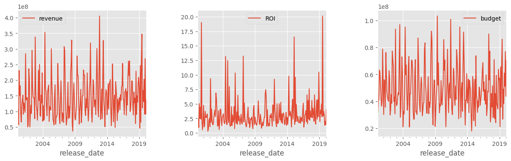


從上面的折線圖，我們可以看到，票房和時間似乎有一定的順序在。  
所以我們使用 Time Series 做一次 regression，分別用 month 和 quarter 來做比較。

**月線**：以月為單位


```python
rev_by_month_df = rev_df.resample('M').agg('mean').to_period('M')
rev_by_month_df.reset_index(inplace=True)
rev_by_month_df['month'] = rev_by_month_df['release_date'].apply(lambda x: x.month)
rev_by_month_df['release_date'] = rev_by_month_df['release_date'].apply(lambda x: datetime.strptime(str(x), '%Y-%m'))
rev_by_month_df['Time'] = np.arange(0, rev_by_month_df.shape[0] + 0)
rev_by_month_df.head()
```


<div>
<style scoped>
    .dataframe tbody tr th:only-of-type {
        vertical-align: middle;
    }

    .dataframe tbody tr th {
        vertical-align: top;
    }

    .dataframe thead th {
        text-align: right;
    }
</style>
<table border="1" class="dataframe">
  <thead>
    <tr style="text-align: right;">
      <th></th>
      <th>release_date</th>
      <th>revenue</th>
      <th>budget</th>
      <th>ROI</th>
      <th>log_revenue</th>
      <th>log_budget</th>
      <th>log_ROI</th>
      <th>Time</th>
      <th>month</th>
    </tr>
  </thead>
  <tbody>
    <tr>
      <th>0</th>
      <td>2000-02-01</td>
      <td>8.170775e+07</td>
      <td>3.190000e+07</td>
      <td>1.704464</td>
      <td>18.007960</td>
      <td>17.146781</td>
      <td>0.861179</td>
      <td>0</td>
      <td>2</td>
    </tr>
    <tr>
      <th>1</th>
      <td>2000-03-01</td>
      <td>1.081047e+08</td>
      <td>4.085000e+07</td>
      <td>2.428687</td>
      <td>18.225011</td>
      <td>17.265964</td>
      <td>0.959047</td>
      <td>1</td>
      <td>3</td>
    </tr>
    <tr>
      <th>2</th>
      <td>2000-04-01</td>
      <td>5.755547e+07</td>
      <td>4.137500e+07</td>
      <td>0.930673</td>
      <td>17.614707</td>
      <td>17.301844</td>
      <td>0.312864</td>
      <td>2</td>
      <td>4</td>
    </tr>
    <tr>
      <th>3</th>
      <td>2000-05-01</td>
      <td>2.309155e+08</td>
      <td>6.318750e+07</td>
      <td>5.041054</td>
      <td>18.822957</td>
      <td>17.551249</td>
      <td>1.271709</td>
      <td>3</td>
      <td>5</td>
    </tr>
    <tr>
      <th>4</th>
      <td>2000-06-01</td>
      <td>1.508056e+08</td>
      <td>6.131111e+07</td>
      <td>2.514755</td>
      <td>18.488506</td>
      <td>17.494954</td>
      <td>0.993552</td>
      <td>4</td>
      <td>6</td>
    </tr>
  </tbody>
</table>
</div>


```python
x_name = 'Time'
y_name = 'revenue'
```


```python
fig, ax = plt.subplots(figsize=(9,6))
plt.plot(rev_by_month_df[x_name], rev_by_month_df[y_name], color="dodgerblue", label=f'{y_name} vs {x_name}')
plt.xticks(rev_by_month_df[x_name], rotation=0, fontsize=8)

# slope, intercept, r_value, p_value, std_err = stats.linregress(rev_by_month_df[x_name], rev_by_month_df[y_name])  # order matters
# ax = sns.regplot(x=x_name, y=y_name, data=rev_by_month_df, ci=None, scatter_kws={'color': 'dodgerblue', 'alpha': 0}, line_kws={
#                 'color': '#ffaa77', 'label': f"$\hat y = {intercept:.4f} + {slope:.4f} x$"}) # 這樣才有 regression model
plt.subplots_adjust(bottom=0.15)
plt.xlabel(x_name)
plt.ylabel(y_name)
plt.title(f'Line Plot for {y_name} against {x_name}')

ax.set_xticks(ax.get_xticks()[::12]) # show the data of the first month for each year
plt.margins(x=.01, tight=False)
plt.legend()
plt.show()
```


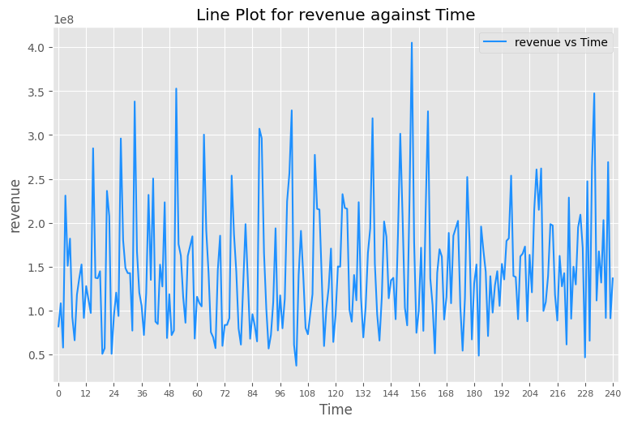


通常五月和十一月附近是高峰期，但這個現象在後期有點被打亂，所以做出來的預測結果不為完全正確。


```python
des_df = mgt2001.ts.smoothing(rev_by_month_df, y_name, x_name, period=12, option='cma')
des_df.head()

des_y_name = f'Des_{y_name}'

fig, ax = plt.subplots(figsize=(9,6))
plt.plot(rev_by_month_df[x_name], rev_by_month_df[y_name], color="dodgerblue", label=f'{y_name} vs {x_name}')
plt.xticks(rev_by_month_df[x_name], rotation=45, fontsize=8)

slope, intercept, r_value, p_value, std_err = stats.linregress(des_df[x_name], des_df[des_y_name])  # order matters
ax = sns.regplot(x=x_name, y=des_y_name, data=des_df, ci=None, scatter_kws={'color': 'dodgerblue', 'alpha': 0}, line_kws={
                'color': '#ffaa77', 'label': f"Regression: $\hat y = {intercept:.4f} + {slope:.4f} x$"}) # 這樣才有 regression model
plt.plot(des_df[des_y_name], label=f'Deasoned {y_name}', color='purple')
plt.subplots_adjust(bottom=0.15)
plt.xlabel(x_name)
plt.ylabel(y_name)
plt.title(f'Line Plot for {y_name} against {x_name}')
ax.set_xticks(ax.get_xticks()[::12]) # show the data of the first month for each year
mgt2001.add_margin(ax, x=0.02)
plt.legend()
plt.show()
```


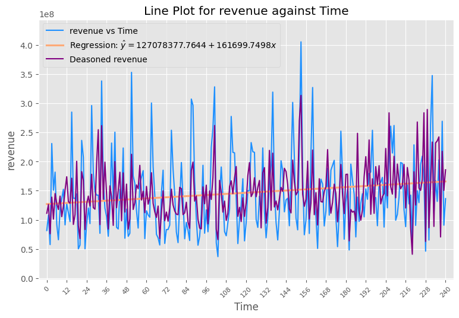


```python
dd = pd.DataFrame(des_df['SeaIdx'][:12])
dd['Month'] = (dd.index) % 12 + 1
dd['Month'] = np.append(dd['Month'].shift(-1).dropna(), 1)
dd
```


<div>
<style scoped>
    .dataframe tbody tr th:only-of-type {
        vertical-align: middle;
    }

    .dataframe tbody tr th {
        vertical-align: top;
    }

    .dataframe thead th {
        text-align: right;
    }
</style>
<table border="1" class="dataframe">
  <thead>
    <tr style="text-align: right;">
      <th></th>
      <th>SeaIdx</th>
      <th>Month</th>
    </tr>
  </thead>
  <tbody>
    <tr>
      <th>0</th>
      <td>0.734253</td>
      <td>2.0</td>
    </tr>
    <tr>
      <th>1</th>
      <td>0.854297</td>
      <td>3.0</td>
    </tr>
    <tr>
      <th>2</th>
      <td>0.756213</td>
      <td>4.0</td>
    </tr>
    <tr>
      <th>3</th>
      <td>1.661689</td>
      <td>5.0</td>
    </tr>
    <tr>
      <th>4</th>
      <td>1.488648</td>
      <td>6.0</td>
    </tr>
    <tr>
      <th>5</th>
      <td>1.253085</td>
      <td>7.0</td>
    </tr>
    <tr>
      <th>6</th>
      <td>0.721391</td>
      <td>8.0</td>
    </tr>
    <tr>
      <th>7</th>
      <td>0.559422</td>
      <td>9.0</td>
    </tr>
    <tr>
      <th>8</th>
      <td>0.837616</td>
      <td>10.0</td>
    </tr>
    <tr>
      <th>9</th>
      <td>1.293132</td>
      <td>11.0</td>
    </tr>
    <tr>
      <th>10</th>
      <td>1.236277</td>
      <td>12.0</td>
    </tr>
    <tr>
      <th>11</th>
      <td>0.603975</td>
      <td>1.0</td>
    </tr>
  </tbody>
</table>
</div>


呈上，確實根據我們所算出的結果，我們可以看出一個 monthly pattern，通常在 5、6、7 月時，票房會呈現一個上升的趨勢；在 11、12 月時，又是另一個高峰期。


```python
x_names = [x_name]
res_dict, assessment = mgt2001.model.MultipleRegression(x_names=x_names, y_name=des_y_name, df=des_df, assessment=False, t_test_c=0, t_test_option='two-tail')
df_result = res_dict['df_result']
```

                                OLS Regression Results                            
    ==============================================================================
    Dep. Variable:            Des_revenue   R-squared:                       0.059
    Model:                            OLS   Adj. R-squared:                  0.055
    Method:                 Least Squares   F-statistic:                     14.88
    Date:                Sat, 26 Jun 2021   Prob (F-statistic):           0.000148
    Time:                        16:04:10   Log-Likelihood:                -4589.4
    No. Observations:                 241   AIC:                             9183.
    Df Residuals:                     239   BIC:                             9190.
    Df Model:                           1                                         
    Covariance Type:            nonrobust                                         
    ==============================================================================
                     coef    std err          t      P>|t|      [0.025      0.975]
    ------------------------------------------------------------------------------
    const       1.271e+08   5.82e+06     21.852      0.000    1.16e+08    1.39e+08
    Time        1.617e+05   4.19e+04      3.857      0.000    7.91e+04    2.44e+05
    ==============================================================================
    Omnibus:                       20.725   Durbin-Watson:                   2.238
    Prob(Omnibus):                  0.000   Jarque-Bera (JB):               24.682
    Skew:                           0.656   Prob(JB):                     4.37e-06
    Kurtosis:                       3.860   Cond. No.                         277.
    ==============================================================================
    
    Notes:
    [1] Standard Errors assume that the covariance matrix of the errors is correctly specified.
    
    ======= Multiple Regression Results =======
    Dep. Variable: Des_revenue
    No. of Observations (n): 241
    No. of Ind. Vairable (k): 1
    Mean of Dep. Variable: 146482347.7432
    Standard Deviation of Dep. Variable: 46570592.4966
    Standard Error: 45280073.8739 (ȳ = 146482347.7432)
    SSR: 490018136517054912.0000
    
    R-square: 0.0586
    Adjusted R-square: 0.0547
    Difference (≤ 0.06 True): 0.0039389410855144025
    
    Estimated model: ŷ = 127078377.7644 + 161699.7498 x1
    
    <F-test>
    F(observed value):  14.8753
    p-value:  0.0001 (Overwhelming Evidence)
    Reject H_0 (The model is valid: at least one beta_i ≠ 0) → True
    


```python
new_t = np.arange(rev_by_month_df.shape[0], rev_by_month_df.shape[0] + 12)
df_result = res_dict['df_result']
pdf = mgt2001.ts.seasonal_prediction(des_df, df_result, y_name, x_name, new_t, period=12, show=False, option='cma') # from smoothing_option
pdf.tail(12)
```


<div>
<style scoped>
    .dataframe tbody tr th:only-of-type {
        vertical-align: middle;
    }

    .dataframe tbody tr th {
        vertical-align: top;
    }

    .dataframe thead th {
        text-align: right;
    }
</style>
<table border="1" class="dataframe">
  <thead>
    <tr style="text-align: right;">
      <th></th>
      <th>release_date</th>
      <th>revenue</th>
      <th>budget</th>
      <th>ROI</th>
      <th>log_revenue</th>
      <th>log_budget</th>
      <th>log_ROI</th>
      <th>Time</th>
      <th>month</th>
      <th>SID</th>
      <th>SeaIdx</th>
      <th>orig</th>
      <th>Des_revenue</th>
      <th>Pre_revenue</th>
    </tr>
  </thead>
  <tbody>
    <tr>
      <th>241</th>
      <td>NaT</td>
      <td>NaN</td>
      <td>NaN</td>
      <td>NaN</td>
      <td>NaN</td>
      <td>NaN</td>
      <td>NaN</td>
      <td>241.0</td>
      <td>NaN</td>
      <td>2.0</td>
      <td>0.854297</td>
      <td>NaN</td>
      <td>NaN</td>
      <td>1.418544e+08</td>
    </tr>
    <tr>
      <th>242</th>
      <td>NaT</td>
      <td>NaN</td>
      <td>NaN</td>
      <td>NaN</td>
      <td>NaN</td>
      <td>NaN</td>
      <td>NaN</td>
      <td>242.0</td>
      <td>NaN</td>
      <td>3.0</td>
      <td>0.756213</td>
      <td>NaN</td>
      <td>NaN</td>
      <td>1.256899e+08</td>
    </tr>
    <tr>
      <th>243</th>
      <td>NaT</td>
      <td>NaN</td>
      <td>NaN</td>
      <td>NaN</td>
      <td>NaN</td>
      <td>NaN</td>
      <td>NaN</td>
      <td>243.0</td>
      <td>NaN</td>
      <td>4.0</td>
      <td>1.661689</td>
      <td>NaN</td>
      <td>NaN</td>
      <td>2.764576e+08</td>
    </tr>
    <tr>
      <th>244</th>
      <td>NaT</td>
      <td>NaN</td>
      <td>NaN</td>
      <td>NaN</td>
      <td>NaN</td>
      <td>NaN</td>
      <td>NaN</td>
      <td>244.0</td>
      <td>NaN</td>
      <td>5.0</td>
      <td>1.488648</td>
      <td>NaN</td>
      <td>NaN</td>
      <td>2.479091e+08</td>
    </tr>
    <tr>
      <th>245</th>
      <td>NaT</td>
      <td>NaN</td>
      <td>NaN</td>
      <td>NaN</td>
      <td>NaN</td>
      <td>NaN</td>
      <td>NaN</td>
      <td>245.0</td>
      <td>NaN</td>
      <td>6.0</td>
      <td>1.253085</td>
      <td>NaN</td>
      <td>NaN</td>
      <td>2.088828e+08</td>
    </tr>
    <tr>
      <th>246</th>
      <td>NaT</td>
      <td>NaN</td>
      <td>NaN</td>
      <td>NaN</td>
      <td>NaN</td>
      <td>NaN</td>
      <td>NaN</td>
      <td>246.0</td>
      <td>NaN</td>
      <td>7.0</td>
      <td>0.721391</td>
      <td>NaN</td>
      <td>NaN</td>
      <td>1.203688e+08</td>
    </tr>
    <tr>
      <th>247</th>
      <td>NaT</td>
      <td>NaN</td>
      <td>NaN</td>
      <td>NaN</td>
      <td>NaN</td>
      <td>NaN</td>
      <td>NaN</td>
      <td>247.0</td>
      <td>NaN</td>
      <td>8.0</td>
      <td>0.559422</td>
      <td>NaN</td>
      <td>NaN</td>
      <td>9.343375e+07</td>
    </tr>
    <tr>
      <th>248</th>
      <td>NaT</td>
      <td>NaN</td>
      <td>NaN</td>
      <td>NaN</td>
      <td>NaN</td>
      <td>NaN</td>
      <td>NaN</td>
      <td>248.0</td>
      <td>NaN</td>
      <td>9.0</td>
      <td>0.837616</td>
      <td>NaN</td>
      <td>NaN</td>
      <td>1.400326e+08</td>
    </tr>
    <tr>
      <th>249</th>
      <td>NaT</td>
      <td>NaN</td>
      <td>NaN</td>
      <td>NaN</td>
      <td>NaN</td>
      <td>NaN</td>
      <td>NaN</td>
      <td>249.0</td>
      <td>NaN</td>
      <td>10.0</td>
      <td>1.293132</td>
      <td>NaN</td>
      <td>NaN</td>
      <td>2.163948e+08</td>
    </tr>
    <tr>
      <th>250</th>
      <td>NaT</td>
      <td>NaN</td>
      <td>NaN</td>
      <td>NaN</td>
      <td>NaN</td>
      <td>NaN</td>
      <td>NaN</td>
      <td>250.0</td>
      <td>NaN</td>
      <td>11.0</td>
      <td>1.236277</td>
      <td>NaN</td>
      <td>NaN</td>
      <td>2.070805e+08</td>
    </tr>
    <tr>
      <th>251</th>
      <td>NaT</td>
      <td>NaN</td>
      <td>NaN</td>
      <td>NaN</td>
      <td>NaN</td>
      <td>NaN</td>
      <td>NaN</td>
      <td>251.0</td>
      <td>NaN</td>
      <td>12.0</td>
      <td>0.603975</td>
      <td>NaN</td>
      <td>NaN</td>
      <td>1.012655e+08</td>
    </tr>
    <tr>
      <th>252</th>
      <td>NaT</td>
      <td>NaN</td>
      <td>NaN</td>
      <td>NaN</td>
      <td>NaN</td>
      <td>NaN</td>
      <td>NaN</td>
      <td>252.0</td>
      <td>NaN</td>
      <td>1.0</td>
      <td>0.734253</td>
      <td>NaN</td>
      <td>NaN</td>
      <td>1.232273e+08</td>
    </tr>
  </tbody>
</table>
</div>


```python
post_rev_ts = u_movie_df[['title', 'release_date', 'revenue', 'budget', 'ROI', 'TW_release_date', 'log_revenue', 'log_budget', 'log_ROI']][u_movie_df['release_date'] >= covid_date].sort_values(by='release_date').reset_index(drop=True)
post_rev_df = post_rev_ts.set_index('release_date')

post_rev_by_month_df = post_rev_df.resample('M').agg('mean').to_period('M')
post_rev_by_month_df.reset_index(inplace=True)
post_rev_by_month_df['month'] = post_rev_by_month_df['release_date'].apply(lambda x: x.month)
post_rev_by_month_df['release_date'] = post_rev_by_month_df['release_date'].apply(lambda x: datetime.strptime(str(x), '%Y-%m'))
post_rev_by_month_df['Time'] = np.arange(0, post_rev_by_month_df.shape[0] + 0)
post_rev_by_month_df.head(12)
post_rev_by_month_df['revenue'].plot()
```


    <AxesSubplot:>


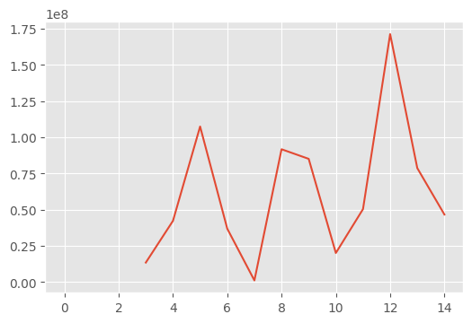


該 model 的解釋力非常差，因此這個標準並不適用於後續的預測上。

**季線**：以季節為單位

在這裏，我們將季節分為春夏秋冬（1, 2, 3, 4）。通常，冬天和夏天是兩大我們較為熟悉的電影季節。除了有暑假與寒假之外，我們也可以透過上面所做過的 visual analysis 看出冬天時節上映的電影較多。但我們真正好奇的是，既然冬天上映較多電影，他的票房有沒有也較平均來的高呢？


```python
rev_by_quarter_df = rev_df.resample('Q-NOV', convention='end').agg('mean')
rev_by_quarter_df.reset_index(inplace=True)
rev_by_quarter_df['month'] = rev_by_quarter_df['release_date'].apply(lambda x: x.month)
rev_by_quarter_df['Time'] = np.arange(0, rev_by_quarter_df.shape[0] + 0)
rev_by_quarter_df['Quarter'] = rev_by_quarter_df['month'].replace({2: 4, 5: 1, 8: 2, 11: 3})
rev_by_quarter_df.head()
```


<div>
<style scoped>
    .dataframe tbody tr th:only-of-type {
        vertical-align: middle;
    }

    .dataframe tbody tr th {
        vertical-align: top;
    }

    .dataframe thead th {
        text-align: right;
    }
</style>
<table border="1" class="dataframe">
  <thead>
    <tr style="text-align: right;">
      <th></th>
      <th>release_date</th>
      <th>revenue</th>
      <th>budget</th>
      <th>ROI</th>
      <th>log_revenue</th>
      <th>log_budget</th>
      <th>log_ROI</th>
      <th>Time</th>
      <th>month</th>
      <th>Quarter</th>
    </tr>
  </thead>
  <tbody>
    <tr>
      <th>0</th>
      <td>2000-02-29</td>
      <td>8.170775e+07</td>
      <td>3.190000e+07</td>
      <td>1.704464</td>
      <td>18.007960</td>
      <td>17.146781</td>
      <td>0.861179</td>
      <td>0</td>
      <td>2</td>
      <td>4</td>
    </tr>
    <tr>
      <th>1</th>
      <td>2000-05-31</td>
      <td>1.303390e+08</td>
      <td>4.788462e+07</td>
      <td>2.771565</td>
      <td>18.221209</td>
      <td>17.364784</td>
      <td>0.856425</td>
      <td>1</td>
      <td>5</td>
      <td>1</td>
    </tr>
    <tr>
      <th>2</th>
      <td>2000-08-31</td>
      <td>1.441638e+08</td>
      <td>5.296250e+07</td>
      <td>3.113528</td>
      <td>18.498805</td>
      <td>17.398395</td>
      <td>1.100411</td>
      <td>2</td>
      <td>8</td>
      <td>2</td>
    </tr>
    <tr>
      <th>3</th>
      <td>2000-11-30</td>
      <td>1.120160e+08</td>
      <td>5.549966e+07</td>
      <td>5.830097</td>
      <td>18.003308</td>
      <td>17.283450</td>
      <td>0.719858</td>
      <td>3</td>
      <td>11</td>
      <td>3</td>
    </tr>
    <tr>
      <th>4</th>
      <td>2001-02-28</td>
      <td>1.302364e+08</td>
      <td>4.708095e+07</td>
      <td>2.696586</td>
      <td>18.218020</td>
      <td>17.332628</td>
      <td>0.885392</td>
      <td>4</td>
      <td>2</td>
      <td>4</td>
    </tr>
  </tbody>
</table>
</div>


```python
rev_by_quarter_df.groupby('Quarter').mean()
```


<div>
<style scoped>
    .dataframe tbody tr th:only-of-type {
        vertical-align: middle;
    }

    .dataframe tbody tr th {
        vertical-align: top;
    }

    .dataframe thead th {
        text-align: right;
    }
</style>
<table border="1" class="dataframe">
  <thead>
    <tr style="text-align: right;">
      <th></th>
      <th>revenue</th>
      <th>budget</th>
      <th>ROI</th>
      <th>log_revenue</th>
      <th>log_budget</th>
      <th>log_ROI</th>
      <th>Time</th>
      <th>month</th>
    </tr>
    <tr>
      <th>Quarter</th>
      <th></th>
      <th></th>
      <th></th>
      <th></th>
      <th></th>
      <th></th>
      <th></th>
      <th></th>
    </tr>
  </thead>
  <tbody>
    <tr>
      <th>1</th>
      <td>1.547893e+08</td>
      <td>5.290951e+07</td>
      <td>2.978619</td>
      <td>18.051562</td>
      <td>17.244645</td>
      <td>0.806917</td>
      <td>39</td>
      <td>5</td>
    </tr>
    <tr>
      <th>2</th>
      <td>1.682057e+08</td>
      <td>5.564069e+07</td>
      <td>3.349218</td>
      <td>18.216457</td>
      <td>17.268858</td>
      <td>0.947599</td>
      <td>40</td>
      <td>8</td>
    </tr>
    <tr>
      <th>3</th>
      <td>1.237739e+08</td>
      <td>4.245522e+07</td>
      <td>3.084763</td>
      <td>17.793384</td>
      <td>17.064763</td>
      <td>0.728621</td>
      <td>41</td>
      <td>11</td>
    </tr>
    <tr>
      <th>4</th>
      <td>1.302427e+08</td>
      <td>4.449312e+07</td>
      <td>3.480518</td>
      <td>18.059940</td>
      <td>17.162876</td>
      <td>0.897064</td>
      <td>40</td>
      <td>2</td>
    </tr>
  </tbody>
</table>
</div>


```python
x_name = 'Time'
y_name = 'revenue'
```


```python
fig, ax = plt.subplots(figsize=(9,6))
plt.plot(rev_by_quarter_df[x_name], rev_by_quarter_df[y_name], color="dodgerblue", label=f'{y_name} vs {x_name}')
plt.xticks(rev_by_quarter_df[x_name], rotation=0, fontsize=8)

plt.subplots_adjust(bottom=0.15)
plt.xlabel(x_name)
plt.ylabel(y_name)
plt.title(f'Line Plot for {y_name} against {x_name}')

ax.set_xticks(ax.get_xticks()[::12]) # show the data of the first month for each year
plt.margins(x=.01, tight=False)
plt.legend()
plt.show()
```


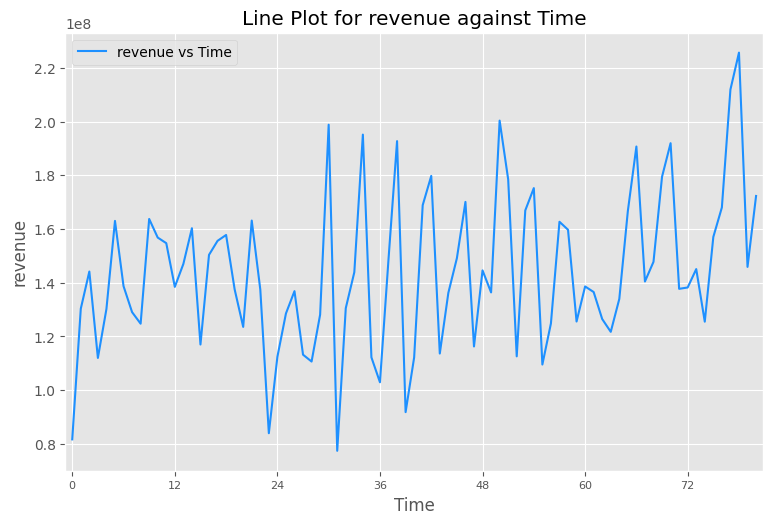


轉換成季節之後，我們可以看到**夏天**通常會是票房的高峰期。


```python
des_df = mgt2001.ts.smoothing(rev_by_quarter_df, y_name, x_name, period=4, option='cma')
des_df.head()

des_y_name = f'Des_{y_name}'

fig, ax = plt.subplots(figsize=(9,6))
plt.plot(rev_by_quarter_df[x_name], rev_by_quarter_df[y_name], color="dodgerblue", label=f'{y_name} vs {x_name}')
plt.xticks(rev_by_quarter_df[x_name], rotation=45, fontsize=8)

slope, intercept, r_value, p_value, std_err = stats.linregress(des_df[x_name], des_df[des_y_name])  # order matters
ax = sns.regplot(x=x_name, y=des_y_name, data=des_df, ci=None, scatter_kws={'color': 'dodgerblue', 'alpha': 0}, line_kws={
                'color': '#ffaa77', 'label': f"Regression: $\hat y = {intercept:.4f} + {slope:.4f} x$"}) # 這樣才有 regression model
plt.plot(des_df[des_y_name], label=f'Deasoned {y_name}', color='purple')
plt.subplots_adjust(bottom=0.15)
plt.xlabel(x_name)
plt.ylabel(y_name)
plt.title(f'Line Plot for {y_name} against {x_name}')
ax.set_xticks(ax.get_xticks()[::12]) # show the data of the first month for each year
mgt2001.add_margin(ax, x=0.02)
plt.legend()
plt.show()
```


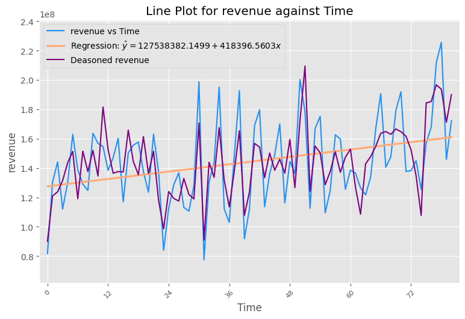


```python
dd = pd.DataFrame(des_df['SeaIdx'][:4])
dd['Quarter'] = (dd.index) % 4 + 1
dd['Quarter'] = np.append(dd['Quarter'].shift(-1).dropna(), 1)
dd
```


<div>
<style scoped>
    .dataframe tbody tr th:only-of-type {
        vertical-align: middle;
    }

    .dataframe tbody tr th {
        vertical-align: top;
    }

    .dataframe thead th {
        text-align: right;
    }
</style>
<table border="1" class="dataframe">
  <thead>
    <tr style="text-align: right;">
      <th></th>
      <th>SeaIdx</th>
      <th>Quarter</th>
    </tr>
  </thead>
  <tbody>
    <tr>
      <th>0</th>
      <td>0.906559</td>
      <td>2.0</td>
    </tr>
    <tr>
      <th>1</th>
      <td>1.076810</td>
      <td>3.0</td>
    </tr>
    <tr>
      <th>2</th>
      <td>1.164830</td>
      <td>4.0</td>
    </tr>
    <tr>
      <th>3</th>
      <td>0.851801</td>
      <td>1.0</td>
    </tr>
  </tbody>
</table>
</div>


根據我們所算出的結果，我們確實可以看出一個 seasonal pattern，秋季和冬季反而變成兩大高峰期。  
從這裡已經沒有必要繼續往下做了，我們可以總結出，雖然乍看之下電影票房有季節性的變化，但仍是難以預測的。


```python
movie_df = pd.read_excel('../data/sorted_all_movie.xlsx', engine='openpyxl', index_col=0)
covid_date = datetime(2020, 3, 1)
movie_df['has_collection'] = movie_df['belongs_to_collection'].isna().replace({True: 0, False: 1})
movie_df['pre_covid'] = (movie_df['release_date'] < covid_date).replace({True: 1, False: 0})
movie_df['post_covid'] = (movie_df['release_date'] >= covid_date).replace({True: 1, False: 0})
movie_df['release_year'] = movie_df['release_date'].apply(lambda x: x.year)
movie_df['release_month'] = movie_df['release_date'].apply(lambda x: x.month)

# Plot
fig = plt.figure(figsize=(20, 8))
row, col = 1, 2
fig.subplots_adjust(hspace=0.2, wspace=0.2)

ax = fig.add_subplot(row, col, 1)
month_movie_df = movie_df.copy()
month_movie_df['release_month'] = month_movie_df['release_date'].apply(lambda x: x.month)
ax = month_movie_df.sort_values(by='revenue', ascending=False).head(100)[['release_date', 'title', 'zh_title', 'revenue', 'release_month']].groupby('release_month').count()['release_date'].plot(kind='bar', legend=None)
plt.title('Before Removing Outliers\nTop 100 Movies (defined by Revenue) by Month')

ax = fig.add_subplot(row, col, 2)
ax = u_movie_df.sort_values(by='revenue', ascending=False).head(100)[['release_date', 'title', 'zh_title', 'revenue', 'release_month']].groupby('release_month').count()['release_date'].plot(kind='bar', legend=None)
plt.title('After Removing Outliers\nTop 100 Movies (defined by Revenue) by Month')

plt.show()
```


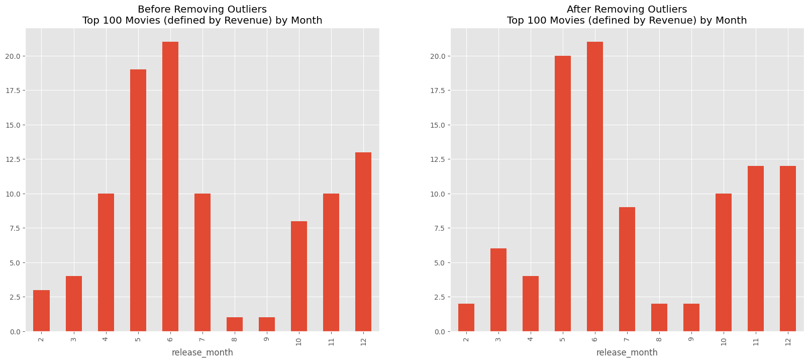


從上面表格我們可以看出，在移除 outlier 前後，排名前 100 的電影，都在 5, 6 月佔了大多數，這點從 monthly trend 中也能看出。  
而另一個高峰期，確實出現在 11 或 12 月。可以看到 1 月上映的電影都不曾出現在百大電影裡面。

因為電影牽涉到太多人為因素，實在不能百分之百肯定地說一定什麼月份票房比較好。

**回到正題，所以過年時真的有因為這歡樂的氣氛導致票房更高嗎？**

我們預期：每年在聖誕假期（12/24 ~ 1/3）的電影票房都會比較好。這裏的資料在上面已經處理完畢。


雖然顯示為沒有，但我們還是做一個更為精準的分析，使用的是 $t$-test and estimator of $\mu_1 - \mu_2$.

**Check Normality**

+ $H_0$: The population is normally distributed.  
+ $H_1$: The population is not normally distributed.


```python
xmas_df = pd.DataFrame({'no': rev_ts[rev_ts.is_xmas == 0]['revenue'].values})
xmas_df['yes'] = rev_ts[rev_ts.is_xmas == 1]['revenue'].reset_index(drop=True)
y_xmas = xmas_df['yes'].dropna()
n_xmas = xmas_df['no'].dropna()
xmas_df.info()
```

    <class 'pandas.core.frame.DataFrame'>
    RangeIndex: 2532 entries, 0 to 2531
    Data columns (total 2 columns):
     #   Column  Non-Null Count  Dtype  
    ---  ------  --------------  -----  
     0   no      2532 non-null   int64  
     1   yes     225 non-null    float64
    dtypes: float64(1), int64(1)
    memory usage: 39.7 KB


```python
_ = plt.hist(y_xmas, bins = 'auto', alpha=0.5)
_ = plt.hist(n_xmas, bins = 'auto', alpha=0.5)
plt.show()
```


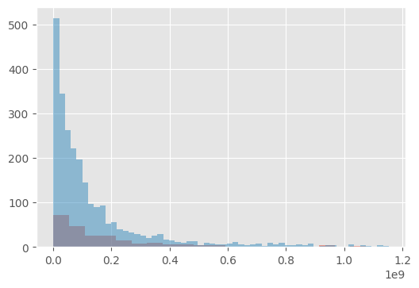


因為資料不是常態分佈，因此我們使用 Wilcoxon Rank Sum Test 來做檢定。

**Wilcoxon Rank Sum Test**

+ $H_0$: The two population locations are the same.  
+ $H_1$: Population 1 (y_xmas) is located to the right (n_xmas) of population 2 (greater).  


```python
n1 = y_xmas.shape[0]
n2 = n_xmas.shape[0]

if np.sum(np.array([n1, n2]) > 10) == 2:
    print('Both datasets have sizes larger than 10.\n')
    updated_df, result_dict = non.ranksum_z_test(df=xmas_df, to_compute='no', alternative='less') 
```

    Both datasets have sizes larger than 10.
    
    ======= z-test =======
    T (sum of ranks) = 3447837.0
    (n1, n2) = (2532, 225)
    mu_t = 3491628.0
    sigma_t = 11442.729132510303
    z statistic value (observed) = -3.8270
    p-value = 0.0001 (Overwhelming Evidence)
    Reject H_0 (less) → True
    


In this case, we can perform the standardized test, since both sample sizes are larger than 10. The $p$-value of the standardized test is $0.0000 < 0.05$, which means that we can reject the null hypothesis.

結論：聖誕節所上映的電影確實較剩餘年度的票房要高。

#### 3. 夏天的電影比較熱門？

因為有南北半球的問題，我們在這邊先行省略南半球的天氣。在此，夏天的意思是指 6、7、8 月。  

透過上面的視覺化分析，我們預期夏天的電影可能會較其他季節來的更夯一些。


```python
cond = np.array(rev_ts['release_month'] == 6) | (rev_ts['release_month'] == 7) | (rev_ts['release_month'] == 8) 
rev_ts['Season'] = rev_ts['release_month'].replace({12: 4, 1: 4, 2: 4, 3: 1, 4: 1, 5: 1, 6: 2, 7: 2, 8: 2, 9: 3, 10: 3, 11: 3})
rev_ts['Summer'] = cond.replace({True: 1, False: 0})
```


```python
rev_ts.head()
```


<div>
<style scoped>
    .dataframe tbody tr th:only-of-type {
        vertical-align: middle;
    }

    .dataframe tbody tr th {
        vertical-align: top;
    }

    .dataframe thead th {
        text-align: right;
    }
</style>
<table border="1" class="dataframe">
  <thead>
    <tr style="text-align: right;">
      <th></th>
      <th>title</th>
      <th>release_date</th>
      <th>revenue</th>
      <th>budget</th>
      <th>ROI</th>
      <th>TW_release_date</th>
      <th>log_revenue</th>
      <th>log_budget</th>
      <th>log_ROI</th>
      <th>Time</th>
      <th>is_xmas</th>
      <th>release_year</th>
      <th>release_month</th>
      <th>Season</th>
      <th>Summer</th>
    </tr>
  </thead>
  <tbody>
    <tr>
      <th>0</th>
      <td>Scream 3</td>
      <td>2000-02-03</td>
      <td>161834276</td>
      <td>40000000</td>
      <td>3.045857</td>
      <td>NaN</td>
      <td>18.902083</td>
      <td>17.504390</td>
      <td>1.397693</td>
      <td>10990.0</td>
      <td>0</td>
      <td>2000</td>
      <td>2</td>
      <td>4</td>
      <td>0</td>
    </tr>
    <tr>
      <th>1</th>
      <td>The Beach</td>
      <td>2000-02-03</td>
      <td>144056873</td>
      <td>40000000</td>
      <td>2.601422</td>
      <td>NaN</td>
      <td>18.785719</td>
      <td>17.504390</td>
      <td>1.281329</td>
      <td>10990.0</td>
      <td>0</td>
      <td>2000</td>
      <td>2</td>
      <td>4</td>
      <td>0</td>
    </tr>
    <tr>
      <th>2</th>
      <td>The Tigger Movie</td>
      <td>2000-02-11</td>
      <td>45554533</td>
      <td>30000000</td>
      <td>0.518484</td>
      <td>NaN</td>
      <td>17.634421</td>
      <td>17.216708</td>
      <td>0.417713</td>
      <td>10998.0</td>
      <td>0</td>
      <td>2000</td>
      <td>2</td>
      <td>4</td>
      <td>0</td>
    </tr>
    <tr>
      <th>3</th>
      <td>Boiler Room</td>
      <td>2000-02-18</td>
      <td>28780255</td>
      <td>7000000</td>
      <td>3.111465</td>
      <td>NaN</td>
      <td>17.175200</td>
      <td>15.761421</td>
      <td>1.413779</td>
      <td>11005.0</td>
      <td>0</td>
      <td>2000</td>
      <td>2</td>
      <td>4</td>
      <td>0</td>
    </tr>
    <tr>
      <th>4</th>
      <td>The Whole Nine Yards</td>
      <td>2000-02-18</td>
      <td>106371651</td>
      <td>41300000</td>
      <td>1.575585</td>
      <td>NaN</td>
      <td>18.482450</td>
      <td>17.536373</td>
      <td>0.946077</td>
      <td>11005.0</td>
      <td>0</td>
      <td>2000</td>
      <td>2</td>
      <td>4</td>
      <td>0</td>
    </tr>
  </tbody>
</table>
</div>


```python
mgt2001.model.multi_variable_plot(x_name=x_name, y_name=y_name, df=rev_ts, indicator='Season', label={1: 'Spring', 2: 'Summer', 3: 'Fall', 4: 'Winter'}, cmap='summer')
```


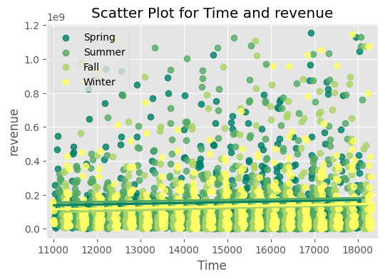


```python
long_df = rev_ts.copy()
long_df = long_df[['Season', 'revenue', 'log_revenue']] # .dropna()
treatment_name_list = long_df['Season'].unique() 
display(long_df.head())
```


<div>
<style scoped>
    .dataframe tbody tr th:only-of-type {
        vertical-align: middle;
    }

    .dataframe tbody tr th {
        vertical-align: top;
    }

    .dataframe thead th {
        text-align: right;
    }
</style>
<table border="1" class="dataframe">
  <thead>
    <tr style="text-align: right;">
      <th></th>
      <th>Season</th>
      <th>revenue</th>
      <th>log_revenue</th>
    </tr>
  </thead>
  <tbody>
    <tr>
      <th>0</th>
      <td>4</td>
      <td>161834276</td>
      <td>18.902083</td>
    </tr>
    <tr>
      <th>1</th>
      <td>4</td>
      <td>144056873</td>
      <td>18.785719</td>
    </tr>
    <tr>
      <th>2</th>
      <td>4</td>
      <td>45554533</td>
      <td>17.634421</td>
    </tr>
    <tr>
      <th>3</th>
      <td>4</td>
      <td>28780255</td>
      <td>17.175200</td>
    </tr>
    <tr>
      <th>4</th>
      <td>4</td>
      <td>106371651</td>
      <td>18.482450</td>
    </tr>
  </tbody>
</table>
</div>


```python
display(long_df.groupby(['Season']).describe())
```


<div>
<style scoped>
    .dataframe tbody tr th:only-of-type {
        vertical-align: middle;
    }

    .dataframe tbody tr th {
        vertical-align: top;
    }

    .dataframe thead tr th {
        text-align: left;
    }

    .dataframe thead tr:last-of-type th {
        text-align: right;
    }
</style>
<table border="1" class="dataframe">
  <thead>
    <tr>
      <th></th>
      <th colspan="8" halign="left">revenue</th>
      <th colspan="8" halign="left">log_revenue</th>
    </tr>
    <tr>
      <th></th>
      <th>count</th>
      <th>mean</th>
      <th>std</th>
      <th>min</th>
      <th>25%</th>
      <th>50%</th>
      <th>75%</th>
      <th>max</th>
      <th>count</th>
      <th>mean</th>
      <th>std</th>
      <th>min</th>
      <th>25%</th>
      <th>50%</th>
      <th>75%</th>
      <th>max</th>
    </tr>
    <tr>
      <th>Season</th>
      <th></th>
      <th></th>
      <th></th>
      <th></th>
      <th></th>
      <th></th>
      <th></th>
      <th></th>
      <th></th>
      <th></th>
      <th></th>
      <th></th>
      <th></th>
      <th></th>
      <th></th>
      <th></th>
    </tr>
  </thead>
  <tbody>
    <tr>
      <th>1</th>
      <td>623.0</td>
      <td>1.545394e+08</td>
      <td>2.061811e+08</td>
      <td>956425.0</td>
      <td>26249744.5</td>
      <td>73983359.0</td>
      <td>1.771306e+08</td>
      <td>1.153296e+09</td>
      <td>623.0</td>
      <td>18.012896</td>
      <td>1.444365</td>
      <td>13.770959</td>
      <td>17.083167</td>
      <td>18.119351</td>
      <td>18.992390</td>
      <td>20.865890</td>
    </tr>
    <tr>
      <th>2</th>
      <td>668.0</td>
      <td>1.680043e+08</td>
      <td>2.089677e+08</td>
      <td>924793.0</td>
      <td>38361373.0</td>
      <td>93183493.0</td>
      <td>2.098657e+08</td>
      <td>1.131928e+09</td>
      <td>668.0</td>
      <td>18.190050</td>
      <td>1.408470</td>
      <td>13.737326</td>
      <td>17.462540</td>
      <td>18.350079</td>
      <td>19.161978</td>
      <td>20.847188</td>
    </tr>
    <tr>
      <th>3</th>
      <td>792.0</td>
      <td>1.217234e+08</td>
      <td>1.754227e+08</td>
      <td>992181.0</td>
      <td>19010562.0</td>
      <td>56759438.5</td>
      <td>1.452186e+08</td>
      <td>1.108561e+09</td>
      <td>792.0</td>
      <td>17.737752</td>
      <td>1.468545</td>
      <td>13.807662</td>
      <td>16.760497</td>
      <td>17.854315</td>
      <td>18.793751</td>
      <td>20.826329</td>
    </tr>
    <tr>
      <th>4</th>
      <td>674.0</td>
      <td>1.315140e+08</td>
      <td>1.662886e+08</td>
      <td>970816.0</td>
      <td>32645332.0</td>
      <td>76735492.5</td>
      <td>1.602227e+08</td>
      <td>1.148462e+09</td>
      <td>674.0</td>
      <td>18.049567</td>
      <td>1.238129</td>
      <td>13.785893</td>
      <td>17.301209</td>
      <td>18.155875</td>
      <td>18.892075</td>
      <td>20.861689</td>
    </tr>
  </tbody>
</table>
</div>


夏天的電影票房確實有略高一點！

**Check Normality**

+ $H_0$: The population is normally distributed.  
+ $H_1$: The population is not normally distributed.


```python
anova.shapiro(long_df, treatment_name_list, 'Season', 'revenue')
```

    1: Statistics=0.6762, p=0.0000
    2: Statistics=0.7036, p=0.0000
    3: Statistics=0.7174, p=0.0000
    4: Statistics=0.6513, p=0.0000


以上四個 $p$-value 都小於 0.05，代表所有資料都不是常態分佈，所以我們使用 Kruskal-Wallis Test。

**Kruskal-Wallis Test**

+ $H_0$: The locations of all the $4$ populations are the same.  
+ $H_1$: Not all $4$ population locations are the same.


```python
long_df.groupby('Season')

short_df = pd.DataFrame([long_df[long_df['Season'] == 3]['revenue'].values, long_df[long_df['Season'] == 4]['revenue'].values, long_df[long_df['Season'] == 2]['revenue'].values, long_df[long_df['Season'] == 1]['revenue'].values]).T.reset_index(drop=True)
short_df.columns = [3, 4, 2, 1]
# short_df[2].dropna().shape
```


```python
_ = non.kruskal_chi2_test(data=short_df)
```

    ======= Kruskal-Wallis Test with Chi-squared Test =======
    (All sample size >= 5)
    
    H statistic value (observed) = 41.4993
    chi2 critical value = 7.8147
    p-value = 0.0000 (Overwhelming Evidence)
    Reject H_0 (Not all 4 population locations are the same) → True
        


上述結果僅能告訴我們，這四個季節的票房變化，確實有所差異。所以我們進一步用 Wilcoxon Rank Sum Test 來應證夏天電影相較於其他季節要高的事實。

**Wilcoxon Rank Sum Test**

+ $H_0$: The two population locations are the same.  
+ $H_1$: Population 2 is located to the right of the other population (greater).

* 夏天 vs. 冬天


```python
n1 = short_df.loc[:, 2].dropna().shape[0]
n2 = short_df.loc[:, 4].dropna().shape[0]

if np.sum(np.array([n1, n2]) > 10) == 2:
    print('Both datasets have sizes larger than 10.\n')
    updated_df, result_dict = non.ranksum_z_test(df=short_df[[2, 4]], to_compute=2, alternative='greater') # 
```

    Both datasets have sizes larger than 10.
    
    ======= z-test =======
    T (sum of ranks) = 467979
    (n1, n2) = (668, 674)
    mu_t = 448562.0
    sigma_t = 7098.483265224105
    z statistic value (observed) = 2.7354
    p-value = 0.0031 (Overwhelming Evidence)
    Reject H_0 (greater) → True
    


* 夏天 vs. 秋天


```python
n1 = short_df.loc[:, 2].dropna().shape[0]
n2 = short_df.loc[:, 3].dropna().shape[0]

if np.sum(np.array([n1, n2]) > 10) == 2:
    print('Both datasets have sizes larger than 10.\n')
    updated_df, result_dict = non.ranksum_z_test(df=short_df[[2, 3]], to_compute=2, alternative='greater') # 
```

    Both datasets have sizes larger than 10.
    
    ======= z-test =======
    T (sum of ranks) = 537890.0
    (n1, n2) = (668, 792)
    mu_t = 487974.0
    sigma_t = 8025.744077654109
    z statistic value (observed) = 6.2195
    p-value = 0.0000 (Overwhelming Evidence)
    Reject H_0 (greater) → True
    


* 夏天 vs. 春天


```python
n1 = short_df.loc[:, 2].dropna().shape[0]
n2 = short_df.loc[:, 1].dropna().shape[0]

if np.sum(np.array([n1, n2]) > 10) == 2:
    print('Both datasets have sizes larger than 10.\n')
    updated_df, result_dict = non.ranksum_z_test(df=short_df[[2, 1]], to_compute=2, alternative='greater') # 
```

    Both datasets have sizes larger than 10.
    
    ======= z-test =======
    T (sum of ranks) = 449577
    (n1, n2) = (668, 623)
    mu_t = 431528.0
    sigma_t = 6693.802407202252
    z statistic value (observed) = 2.6964
    p-value = 0.0035 (Overwhelming Evidence)
    Reject H_0 (greater) → True
    


因為以上 3 個檢定的 $p$-value 都小於 0.05，有足夠的證據顯示夏天的票房高於其他三季。  
此結果與我們預期的相符。有點意外的是，在[2. 過年大片是不是真的比較夯？](#2-過年大片是不是真的比較夯)的分析中，我們可以總結出聖誕季節（包含 1/1 新年）時所上映的電影平均來說真的有較高的趨勢。以季節性來說，卻不是如此。我們可以看到夏天的電影平均來說有較高的票房，其次是春天，冬天與秋天都遠不及夏天所創下的票房。

### 八、票房預測

經過前述各種變數的分析，我們希望可以找出對於票房有影響力的變數組合，並試著預測有哪些特質的電影會有比較好的票房。

我們曾嘗試採用 time-series regression model 但成效並不好，因為期數每年都不太一樣（可以見上面 Time Series 部分），所以最後依舊選擇複迴歸模型進行預測。


```python
regression_df = u_movie_df[(u_movie_df['release_date'] > datetime(2010, 1, 1)) & (u_movie_df['release_date'] < datetime(2019, 12, 31))].copy().reset_index(drop=True)
```


```python
regression_df['cast_popularity_ave'] = regression_df.cast_popularity_ave.fillna(regression_df.cast_popularity_ave.mean())
regression_df['rotten_score'] = regression_df['rotten_score'].fillna(regression_df['rotten_score'].mean())
regression_df['rotten_aud_score'] = regression_df['rotten_aud_score'].fillna(regression_df['rotten_aud_score'].mean())
```


```python
x_names = ['budget', 'runtime', 'cast_cnt', 'crew_cnt', 'female_cast_cnt',
       'male_cast_cnt',  'TMDB_score', 'TMDB_vote_count', 'has_homepage', 'has_collection', 'cast_popularity_ave', 'rotten_score', 'rotten_aud_score']
y_name = 'revenue'
```


```python
regression_df.shape
```


    (1514, 36)


```python
mgt2001.model.multi_scatter_plot(5, 3, regression_df, x_names, y_name, figsize=(15, 15)) # correlation table included
```


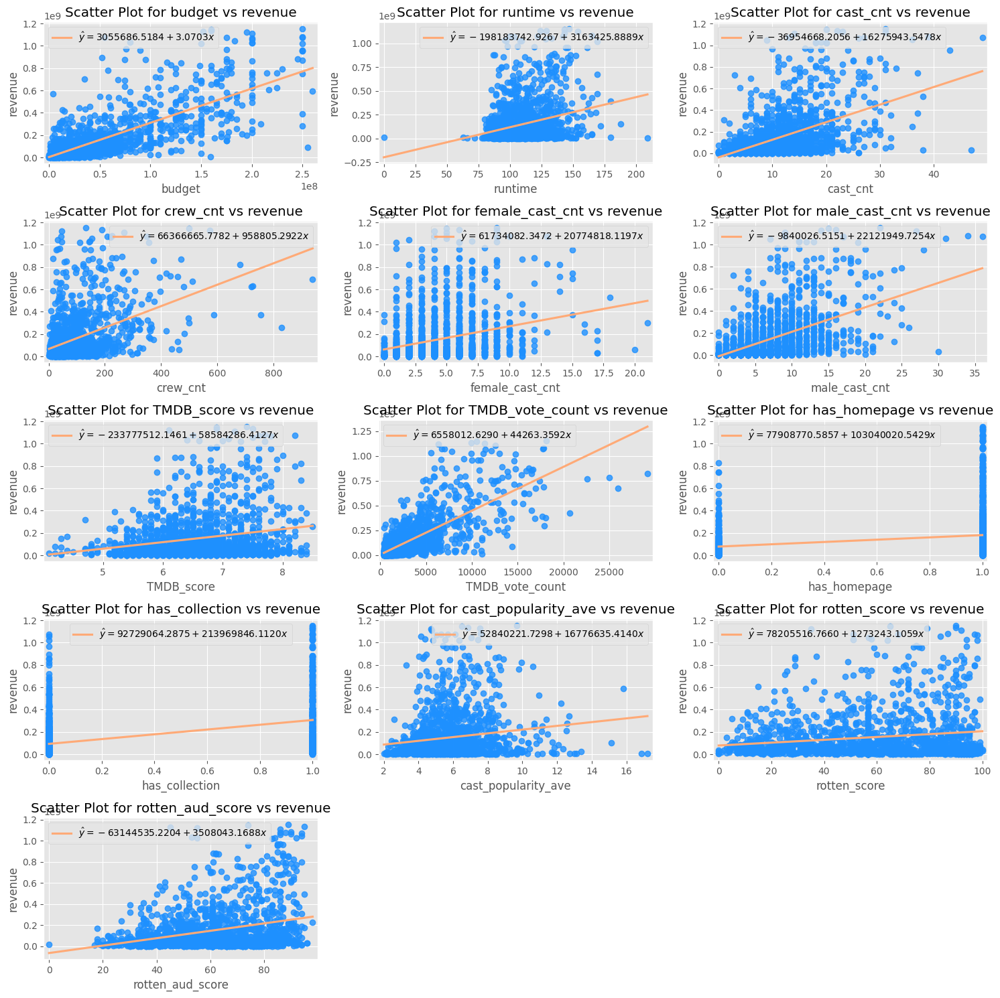


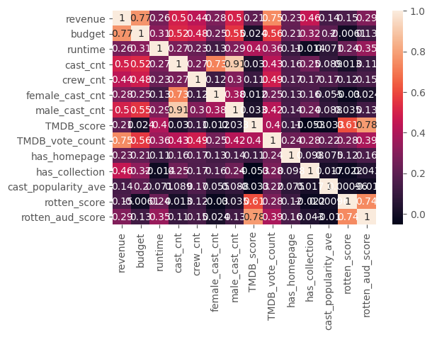


在下方的 DataFrame 我們可以看到 regression 與 ['budget', 'runtime', 'cast_cnt', 'crew_cnt', 'female_cast_cnt', 'male_cast_cnt',  'TMDB_score', 'TMDB_vote_count', 'cast_popularity_ave', 'rotten_score', 'rotten_aud_score'] 這些變數有正向線性關係。


```python
mgt2001.model.multicollinearity(regression_df, x_names, y_name)
```


<style  type="text/css" >
#T_1be7ceba_d655_11eb_ace9_acde48001122row0_col0,#T_1be7ceba_d655_11eb_ace9_acde48001122row0_col1,#T_1be7ceba_d655_11eb_ace9_acde48001122row0_col2,#T_1be7ceba_d655_11eb_ace9_acde48001122row0_col3,#T_1be7ceba_d655_11eb_ace9_acde48001122row0_col4,#T_1be7ceba_d655_11eb_ace9_acde48001122row0_col5,#T_1be7ceba_d655_11eb_ace9_acde48001122row0_col6,#T_1be7ceba_d655_11eb_ace9_acde48001122row0_col7,#T_1be7ceba_d655_11eb_ace9_acde48001122row0_col8,#T_1be7ceba_d655_11eb_ace9_acde48001122row0_col9,#T_1be7ceba_d655_11eb_ace9_acde48001122row0_col10,#T_1be7ceba_d655_11eb_ace9_acde48001122row0_col11,#T_1be7ceba_d655_11eb_ace9_acde48001122row0_col12,#T_1be7ceba_d655_11eb_ace9_acde48001122row0_col13,#T_1be7ceba_d655_11eb_ace9_acde48001122row1_col0,#T_1be7ceba_d655_11eb_ace9_acde48001122row1_col1,#T_1be7ceba_d655_11eb_ace9_acde48001122row1_col2,#T_1be7ceba_d655_11eb_ace9_acde48001122row1_col3,#T_1be7ceba_d655_11eb_ace9_acde48001122row1_col4,#T_1be7ceba_d655_11eb_ace9_acde48001122row1_col5,#T_1be7ceba_d655_11eb_ace9_acde48001122row1_col6,#T_1be7ceba_d655_11eb_ace9_acde48001122row1_col7,#T_1be7ceba_d655_11eb_ace9_acde48001122row1_col8,#T_1be7ceba_d655_11eb_ace9_acde48001122row1_col9,#T_1be7ceba_d655_11eb_ace9_acde48001122row1_col10,#T_1be7ceba_d655_11eb_ace9_acde48001122row1_col11,#T_1be7ceba_d655_11eb_ace9_acde48001122row1_col12,#T_1be7ceba_d655_11eb_ace9_acde48001122row1_col13,#T_1be7ceba_d655_11eb_ace9_acde48001122row2_col0,#T_1be7ceba_d655_11eb_ace9_acde48001122row2_col1,#T_1be7ceba_d655_11eb_ace9_acde48001122row2_col2,#T_1be7ceba_d655_11eb_ace9_acde48001122row2_col3,#T_1be7ceba_d655_11eb_ace9_acde48001122row2_col4,#T_1be7ceba_d655_11eb_ace9_acde48001122row2_col5,#T_1be7ceba_d655_11eb_ace9_acde48001122row2_col6,#T_1be7ceba_d655_11eb_ace9_acde48001122row2_col7,#T_1be7ceba_d655_11eb_ace9_acde48001122row2_col8,#T_1be7ceba_d655_11eb_ace9_acde48001122row2_col9,#T_1be7ceba_d655_11eb_ace9_acde48001122row2_col10,#T_1be7ceba_d655_11eb_ace9_acde48001122row2_col11,#T_1be7ceba_d655_11eb_ace9_acde48001122row2_col12,#T_1be7ceba_d655_11eb_ace9_acde48001122row2_col13,#T_1be7ceba_d655_11eb_ace9_acde48001122row3_col0,#T_1be7ceba_d655_11eb_ace9_acde48001122row3_col1,#T_1be7ceba_d655_11eb_ace9_acde48001122row3_col2,#T_1be7ceba_d655_11eb_ace9_acde48001122row3_col3,#T_1be7ceba_d655_11eb_ace9_acde48001122row3_col4,#T_1be7ceba_d655_11eb_ace9_acde48001122row3_col7,#T_1be7ceba_d655_11eb_ace9_acde48001122row3_col8,#T_1be7ceba_d655_11eb_ace9_acde48001122row3_col9,#T_1be7ceba_d655_11eb_ace9_acde48001122row3_col10,#T_1be7ceba_d655_11eb_ace9_acde48001122row3_col11,#T_1be7ceba_d655_11eb_ace9_acde48001122row3_col12,#T_1be7ceba_d655_11eb_ace9_acde48001122row3_col13,#T_1be7ceba_d655_11eb_ace9_acde48001122row4_col0,#T_1be7ceba_d655_11eb_ace9_acde48001122row4_col1,#T_1be7ceba_d655_11eb_ace9_acde48001122row4_col2,#T_1be7ceba_d655_11eb_ace9_acde48001122row4_col3,#T_1be7ceba_d655_11eb_ace9_acde48001122row4_col4,#T_1be7ceba_d655_11eb_ace9_acde48001122row4_col5,#T_1be7ceba_d655_11eb_ace9_acde48001122row4_col6,#T_1be7ceba_d655_11eb_ace9_acde48001122row4_col7,#T_1be7ceba_d655_11eb_ace9_acde48001122row4_col8,#T_1be7ceba_d655_11eb_ace9_acde48001122row4_col9,#T_1be7ceba_d655_11eb_ace9_acde48001122row4_col10,#T_1be7ceba_d655_11eb_ace9_acde48001122row4_col11,#T_1be7ceba_d655_11eb_ace9_acde48001122row4_col12,#T_1be7ceba_d655_11eb_ace9_acde48001122row4_col13,#T_1be7ceba_d655_11eb_ace9_acde48001122row5_col0,#T_1be7ceba_d655_11eb_ace9_acde48001122row5_col1,#T_1be7ceba_d655_11eb_ace9_acde48001122row5_col2,#T_1be7ceba_d655_11eb_ace9_acde48001122row5_col4,#T_1be7ceba_d655_11eb_ace9_acde48001122row5_col5,#T_1be7ceba_d655_11eb_ace9_acde48001122row5_col6,#T_1be7ceba_d655_11eb_ace9_acde48001122row5_col7,#T_1be7ceba_d655_11eb_ace9_acde48001122row5_col8,#T_1be7ceba_d655_11eb_ace9_acde48001122row5_col9,#T_1be7ceba_d655_11eb_ace9_acde48001122row5_col10,#T_1be7ceba_d655_11eb_ace9_acde48001122row5_col11,#T_1be7ceba_d655_11eb_ace9_acde48001122row5_col12,#T_1be7ceba_d655_11eb_ace9_acde48001122row5_col13,#T_1be7ceba_d655_11eb_ace9_acde48001122row6_col0,#T_1be7ceba_d655_11eb_ace9_acde48001122row6_col1,#T_1be7ceba_d655_11eb_ace9_acde48001122row6_col2,#T_1be7ceba_d655_11eb_ace9_acde48001122row6_col4,#T_1be7ceba_d655_11eb_ace9_acde48001122row6_col5,#T_1be7ceba_d655_11eb_ace9_acde48001122row6_col6,#T_1be7ceba_d655_11eb_ace9_acde48001122row6_col7,#T_1be7ceba_d655_11eb_ace9_acde48001122row6_col8,#T_1be7ceba_d655_11eb_ace9_acde48001122row6_col9,#T_1be7ceba_d655_11eb_ace9_acde48001122row6_col10,#T_1be7ceba_d655_11eb_ace9_acde48001122row6_col11,#T_1be7ceba_d655_11eb_ace9_acde48001122row6_col12,#T_1be7ceba_d655_11eb_ace9_acde48001122row6_col13,#T_1be7ceba_d655_11eb_ace9_acde48001122row7_col0,#T_1be7ceba_d655_11eb_ace9_acde48001122row7_col1,#T_1be7ceba_d655_11eb_ace9_acde48001122row7_col2,#T_1be7ceba_d655_11eb_ace9_acde48001122row7_col3,#T_1be7ceba_d655_11eb_ace9_acde48001122row7_col4,#T_1be7ceba_d655_11eb_ace9_acde48001122row7_col5,#T_1be7ceba_d655_11eb_ace9_acde48001122row7_col6,#T_1be7ceba_d655_11eb_ace9_acde48001122row7_col7,#T_1be7ceba_d655_11eb_ace9_acde48001122row7_col8,#T_1be7ceba_d655_11eb_ace9_acde48001122row7_col9,#T_1be7ceba_d655_11eb_ace9_acde48001122row7_col10,#T_1be7ceba_d655_11eb_ace9_acde48001122row7_col11,#T_1be7ceba_d655_11eb_ace9_acde48001122row7_col12,#T_1be7ceba_d655_11eb_ace9_acde48001122row8_col0,#T_1be7ceba_d655_11eb_ace9_acde48001122row8_col1,#T_1be7ceba_d655_11eb_ace9_acde48001122row8_col2,#T_1be7ceba_d655_11eb_ace9_acde48001122row8_col3,#T_1be7ceba_d655_11eb_ace9_acde48001122row8_col4,#T_1be7ceba_d655_11eb_ace9_acde48001122row8_col5,#T_1be7ceba_d655_11eb_ace9_acde48001122row8_col6,#T_1be7ceba_d655_11eb_ace9_acde48001122row8_col7,#T_1be7ceba_d655_11eb_ace9_acde48001122row8_col8,#T_1be7ceba_d655_11eb_ace9_acde48001122row8_col9,#T_1be7ceba_d655_11eb_ace9_acde48001122row8_col10,#T_1be7ceba_d655_11eb_ace9_acde48001122row8_col11,#T_1be7ceba_d655_11eb_ace9_acde48001122row8_col12,#T_1be7ceba_d655_11eb_ace9_acde48001122row8_col13,#T_1be7ceba_d655_11eb_ace9_acde48001122row9_col0,#T_1be7ceba_d655_11eb_ace9_acde48001122row9_col1,#T_1be7ceba_d655_11eb_ace9_acde48001122row9_col2,#T_1be7ceba_d655_11eb_ace9_acde48001122row9_col3,#T_1be7ceba_d655_11eb_ace9_acde48001122row9_col4,#T_1be7ceba_d655_11eb_ace9_acde48001122row9_col5,#T_1be7ceba_d655_11eb_ace9_acde48001122row9_col6,#T_1be7ceba_d655_11eb_ace9_acde48001122row9_col7,#T_1be7ceba_d655_11eb_ace9_acde48001122row9_col8,#T_1be7ceba_d655_11eb_ace9_acde48001122row9_col9,#T_1be7ceba_d655_11eb_ace9_acde48001122row9_col10,#T_1be7ceba_d655_11eb_ace9_acde48001122row9_col11,#T_1be7ceba_d655_11eb_ace9_acde48001122row9_col12,#T_1be7ceba_d655_11eb_ace9_acde48001122row9_col13,#T_1be7ceba_d655_11eb_ace9_acde48001122row10_col0,#T_1be7ceba_d655_11eb_ace9_acde48001122row10_col1,#T_1be7ceba_d655_11eb_ace9_acde48001122row10_col2,#T_1be7ceba_d655_11eb_ace9_acde48001122row10_col3,#T_1be7ceba_d655_11eb_ace9_acde48001122row10_col4,#T_1be7ceba_d655_11eb_ace9_acde48001122row10_col5,#T_1be7ceba_d655_11eb_ace9_acde48001122row10_col6,#T_1be7ceba_d655_11eb_ace9_acde48001122row10_col7,#T_1be7ceba_d655_11eb_ace9_acde48001122row10_col8,#T_1be7ceba_d655_11eb_ace9_acde48001122row10_col9,#T_1be7ceba_d655_11eb_ace9_acde48001122row10_col10,#T_1be7ceba_d655_11eb_ace9_acde48001122row10_col11,#T_1be7ceba_d655_11eb_ace9_acde48001122row10_col12,#T_1be7ceba_d655_11eb_ace9_acde48001122row10_col13,#T_1be7ceba_d655_11eb_ace9_acde48001122row11_col0,#T_1be7ceba_d655_11eb_ace9_acde48001122row11_col1,#T_1be7ceba_d655_11eb_ace9_acde48001122row11_col2,#T_1be7ceba_d655_11eb_ace9_acde48001122row11_col3,#T_1be7ceba_d655_11eb_ace9_acde48001122row11_col4,#T_1be7ceba_d655_11eb_ace9_acde48001122row11_col5,#T_1be7ceba_d655_11eb_ace9_acde48001122row11_col6,#T_1be7ceba_d655_11eb_ace9_acde48001122row11_col7,#T_1be7ceba_d655_11eb_ace9_acde48001122row11_col8,#T_1be7ceba_d655_11eb_ace9_acde48001122row11_col9,#T_1be7ceba_d655_11eb_ace9_acde48001122row11_col10,#T_1be7ceba_d655_11eb_ace9_acde48001122row11_col11,#T_1be7ceba_d655_11eb_ace9_acde48001122row11_col12,#T_1be7ceba_d655_11eb_ace9_acde48001122row11_col13,#T_1be7ceba_d655_11eb_ace9_acde48001122row12_col0,#T_1be7ceba_d655_11eb_ace9_acde48001122row12_col1,#T_1be7ceba_d655_11eb_ace9_acde48001122row12_col2,#T_1be7ceba_d655_11eb_ace9_acde48001122row12_col3,#T_1be7ceba_d655_11eb_ace9_acde48001122row12_col4,#T_1be7ceba_d655_11eb_ace9_acde48001122row12_col5,#T_1be7ceba_d655_11eb_ace9_acde48001122row12_col6,#T_1be7ceba_d655_11eb_ace9_acde48001122row12_col7,#T_1be7ceba_d655_11eb_ace9_acde48001122row12_col8,#T_1be7ceba_d655_11eb_ace9_acde48001122row12_col9,#T_1be7ceba_d655_11eb_ace9_acde48001122row12_col10,#T_1be7ceba_d655_11eb_ace9_acde48001122row12_col11,#T_1be7ceba_d655_11eb_ace9_acde48001122row12_col12,#T_1be7ceba_d655_11eb_ace9_acde48001122row13_col0,#T_1be7ceba_d655_11eb_ace9_acde48001122row13_col1,#T_1be7ceba_d655_11eb_ace9_acde48001122row13_col2,#T_1be7ceba_d655_11eb_ace9_acde48001122row13_col3,#T_1be7ceba_d655_11eb_ace9_acde48001122row13_col4,#T_1be7ceba_d655_11eb_ace9_acde48001122row13_col5,#T_1be7ceba_d655_11eb_ace9_acde48001122row13_col6,#T_1be7ceba_d655_11eb_ace9_acde48001122row13_col8,#T_1be7ceba_d655_11eb_ace9_acde48001122row13_col9,#T_1be7ceba_d655_11eb_ace9_acde48001122row13_col10,#T_1be7ceba_d655_11eb_ace9_acde48001122row13_col11,#T_1be7ceba_d655_11eb_ace9_acde48001122row13_col13{
            background-color:  default;
        }#T_1be7ceba_d655_11eb_ace9_acde48001122row3_col5,#T_1be7ceba_d655_11eb_ace9_acde48001122row3_col6,#T_1be7ceba_d655_11eb_ace9_acde48001122row5_col3,#T_1be7ceba_d655_11eb_ace9_acde48001122row6_col3,#T_1be7ceba_d655_11eb_ace9_acde48001122row7_col13,#T_1be7ceba_d655_11eb_ace9_acde48001122row12_col13,#T_1be7ceba_d655_11eb_ace9_acde48001122row13_col7,#T_1be7ceba_d655_11eb_ace9_acde48001122row13_col12{
            background-color:  salmon;
        }</style><table id="T_1be7ceba_d655_11eb_ace9_acde48001122" ><thead>    <tr>        <th class="blank level0" ></th>        <th class="col_heading level0 col0" >revenue</th>        <th class="col_heading level0 col1" >budget</th>        <th class="col_heading level0 col2" >runtime</th>        <th class="col_heading level0 col3" >cast_cnt</th>        <th class="col_heading level0 col4" >crew_cnt</th>        <th class="col_heading level0 col5" >female_cast_cnt</th>        <th class="col_heading level0 col6" >male_cast_cnt</th>        <th class="col_heading level0 col7" >TMDB_score</th>        <th class="col_heading level0 col8" >TMDB_vote_count</th>        <th class="col_heading level0 col9" >has_homepage</th>        <th class="col_heading level0 col10" >has_collection</th>        <th class="col_heading level0 col11" >cast_popularity_ave</th>        <th class="col_heading level0 col12" >rotten_score</th>        <th class="col_heading level0 col13" >rotten_aud_score</th>    </tr></thead><tbody>
                <tr>
                        <th id="T_1be7ceba_d655_11eb_ace9_acde48001122level0_row0" class="row_heading level0 row0" >revenue</th>
                        <td id="T_1be7ceba_d655_11eb_ace9_acde48001122row0_col0" class="data row0 col0" >1.000000</td>
                        <td id="T_1be7ceba_d655_11eb_ace9_acde48001122row0_col1" class="data row0 col1" >0.765619</td>
                        <td id="T_1be7ceba_d655_11eb_ace9_acde48001122row0_col2" class="data row0 col2" >0.264829</td>
                        <td id="T_1be7ceba_d655_11eb_ace9_acde48001122row0_col3" class="data row0 col3" >0.497190</td>
                        <td id="T_1be7ceba_d655_11eb_ace9_acde48001122row0_col4" class="data row0 col4" >0.436268</td>
                        <td id="T_1be7ceba_d655_11eb_ace9_acde48001122row0_col5" class="data row0 col5" >0.281785</td>
                        <td id="T_1be7ceba_d655_11eb_ace9_acde48001122row0_col6" class="data row0 col6" >0.501433</td>
                        <td id="T_1be7ceba_d655_11eb_ace9_acde48001122row0_col7" class="data row0 col7" >0.209780</td>
                        <td id="T_1be7ceba_d655_11eb_ace9_acde48001122row0_col8" class="data row0 col8" >0.748879</td>
                        <td id="T_1be7ceba_d655_11eb_ace9_acde48001122row0_col9" class="data row0 col9" >0.225778</td>
                        <td id="T_1be7ceba_d655_11eb_ace9_acde48001122row0_col10" class="data row0 col10" >0.455447</td>
                        <td id="T_1be7ceba_d655_11eb_ace9_acde48001122row0_col11" class="data row0 col11" >0.144059</td>
                        <td id="T_1be7ceba_d655_11eb_ace9_acde48001122row0_col12" class="data row0 col12" >0.152821</td>
                        <td id="T_1be7ceba_d655_11eb_ace9_acde48001122row0_col13" class="data row0 col13" >0.288583</td>
            </tr>
            <tr>
                        <th id="T_1be7ceba_d655_11eb_ace9_acde48001122level0_row1" class="row_heading level0 row1" >budget</th>
                        <td id="T_1be7ceba_d655_11eb_ace9_acde48001122row1_col0" class="data row1 col0" >0.765619</td>
                        <td id="T_1be7ceba_d655_11eb_ace9_acde48001122row1_col1" class="data row1 col1" >1.000000</td>
                        <td id="T_1be7ceba_d655_11eb_ace9_acde48001122row1_col2" class="data row1 col2" >0.309445</td>
                        <td id="T_1be7ceba_d655_11eb_ace9_acde48001122row1_col3" class="data row1 col3" >0.519841</td>
                        <td id="T_1be7ceba_d655_11eb_ace9_acde48001122row1_col4" class="data row1 col4" >0.482312</td>
                        <td id="T_1be7ceba_d655_11eb_ace9_acde48001122row1_col5" class="data row1 col5" >0.245096</td>
                        <td id="T_1be7ceba_d655_11eb_ace9_acde48001122row1_col6" class="data row1 col6" >0.553914</td>
                        <td id="T_1be7ceba_d655_11eb_ace9_acde48001122row1_col7" class="data row1 col7" >0.024463</td>
                        <td id="T_1be7ceba_d655_11eb_ace9_acde48001122row1_col8" class="data row1 col8" >0.562417</td>
                        <td id="T_1be7ceba_d655_11eb_ace9_acde48001122row1_col9" class="data row1 col9" >0.213661</td>
                        <td id="T_1be7ceba_d655_11eb_ace9_acde48001122row1_col10" class="data row1 col10" >0.322544</td>
                        <td id="T_1be7ceba_d655_11eb_ace9_acde48001122row1_col11" class="data row1 col11" >0.198903</td>
                        <td id="T_1be7ceba_d655_11eb_ace9_acde48001122row1_col12" class="data row1 col12" >-0.006060</td>
                        <td id="T_1be7ceba_d655_11eb_ace9_acde48001122row1_col13" class="data row1 col13" >0.127460</td>
            </tr>
            <tr>
                        <th id="T_1be7ceba_d655_11eb_ace9_acde48001122level0_row2" class="row_heading level0 row2" >runtime</th>
                        <td id="T_1be7ceba_d655_11eb_ace9_acde48001122row2_col0" class="data row2 col0" >0.264829</td>
                        <td id="T_1be7ceba_d655_11eb_ace9_acde48001122row2_col1" class="data row2 col1" >0.309445</td>
                        <td id="T_1be7ceba_d655_11eb_ace9_acde48001122row2_col2" class="data row2 col2" >1.000000</td>
                        <td id="T_1be7ceba_d655_11eb_ace9_acde48001122row2_col3" class="data row2 col3" >0.269881</td>
                        <td id="T_1be7ceba_d655_11eb_ace9_acde48001122row2_col4" class="data row2 col4" >0.228017</td>
                        <td id="T_1be7ceba_d655_11eb_ace9_acde48001122row2_col5" class="data row2 col5" >0.127320</td>
                        <td id="T_1be7ceba_d655_11eb_ace9_acde48001122row2_col6" class="data row2 col6" >0.287525</td>
                        <td id="T_1be7ceba_d655_11eb_ace9_acde48001122row2_col7" class="data row2 col7" >0.402429</td>
                        <td id="T_1be7ceba_d655_11eb_ace9_acde48001122row2_col8" class="data row2 col8" >0.357162</td>
                        <td id="T_1be7ceba_d655_11eb_ace9_acde48001122row2_col9" class="data row2 col9" >0.107467</td>
                        <td id="T_1be7ceba_d655_11eb_ace9_acde48001122row2_col10" class="data row2 col10" >-0.014167</td>
                        <td id="T_1be7ceba_d655_11eb_ace9_acde48001122row2_col11" class="data row2 col11" >0.071164</td>
                        <td id="T_1be7ceba_d655_11eb_ace9_acde48001122row2_col12" class="data row2 col12" >0.238099</td>
                        <td id="T_1be7ceba_d655_11eb_ace9_acde48001122row2_col13" class="data row2 col13" >0.347594</td>
            </tr>
            <tr>
                        <th id="T_1be7ceba_d655_11eb_ace9_acde48001122level0_row3" class="row_heading level0 row3" >cast_cnt</th>
                        <td id="T_1be7ceba_d655_11eb_ace9_acde48001122row3_col0" class="data row3 col0" >0.497190</td>
                        <td id="T_1be7ceba_d655_11eb_ace9_acde48001122row3_col1" class="data row3 col1" >0.519841</td>
                        <td id="T_1be7ceba_d655_11eb_ace9_acde48001122row3_col2" class="data row3 col2" >0.269881</td>
                        <td id="T_1be7ceba_d655_11eb_ace9_acde48001122row3_col3" class="data row3 col3" >1.000000</td>
                        <td id="T_1be7ceba_d655_11eb_ace9_acde48001122row3_col4" class="data row3 col4" >0.271317</td>
                        <td id="T_1be7ceba_d655_11eb_ace9_acde48001122row3_col5" class="data row3 col5" >0.728081</td>
                        <td id="T_1be7ceba_d655_11eb_ace9_acde48001122row3_col6" class="data row3 col6" >0.911997</td>
                        <td id="T_1be7ceba_d655_11eb_ace9_acde48001122row3_col7" class="data row3 col7" >0.029799</td>
                        <td id="T_1be7ceba_d655_11eb_ace9_acde48001122row3_col8" class="data row3 col8" >0.425316</td>
                        <td id="T_1be7ceba_d655_11eb_ace9_acde48001122row3_col9" class="data row3 col9" >0.163572</td>
                        <td id="T_1be7ceba_d655_11eb_ace9_acde48001122row3_col10" class="data row3 col10" >0.249845</td>
                        <td id="T_1be7ceba_d655_11eb_ace9_acde48001122row3_col11" class="data row3 col11" >0.089181</td>
                        <td id="T_1be7ceba_d655_11eb_ace9_acde48001122row3_col12" class="data row3 col12" >0.012507</td>
                        <td id="T_1be7ceba_d655_11eb_ace9_acde48001122row3_col13" class="data row3 col13" >0.108507</td>
            </tr>
            <tr>
                        <th id="T_1be7ceba_d655_11eb_ace9_acde48001122level0_row4" class="row_heading level0 row4" >crew_cnt</th>
                        <td id="T_1be7ceba_d655_11eb_ace9_acde48001122row4_col0" class="data row4 col0" >0.436268</td>
                        <td id="T_1be7ceba_d655_11eb_ace9_acde48001122row4_col1" class="data row4 col1" >0.482312</td>
                        <td id="T_1be7ceba_d655_11eb_ace9_acde48001122row4_col2" class="data row4 col2" >0.228017</td>
                        <td id="T_1be7ceba_d655_11eb_ace9_acde48001122row4_col3" class="data row4 col3" >0.271317</td>
                        <td id="T_1be7ceba_d655_11eb_ace9_acde48001122row4_col4" class="data row4 col4" >1.000000</td>
                        <td id="T_1be7ceba_d655_11eb_ace9_acde48001122row4_col5" class="data row4 col5" >0.117649</td>
                        <td id="T_1be7ceba_d655_11eb_ace9_acde48001122row4_col6" class="data row4 col6" >0.295247</td>
                        <td id="T_1be7ceba_d655_11eb_ace9_acde48001122row4_col7" class="data row4 col7" >0.111065</td>
                        <td id="T_1be7ceba_d655_11eb_ace9_acde48001122row4_col8" class="data row4 col8" >0.485268</td>
                        <td id="T_1be7ceba_d655_11eb_ace9_acde48001122row4_col9" class="data row4 col9" >0.170075</td>
                        <td id="T_1be7ceba_d655_11eb_ace9_acde48001122row4_col10" class="data row4 col10" >0.167663</td>
                        <td id="T_1be7ceba_d655_11eb_ace9_acde48001122row4_col11" class="data row4 col11" >0.169040</td>
                        <td id="T_1be7ceba_d655_11eb_ace9_acde48001122row4_col12" class="data row4 col12" >0.115027</td>
                        <td id="T_1be7ceba_d655_11eb_ace9_acde48001122row4_col13" class="data row4 col13" >0.148725</td>
            </tr>
            <tr>
                        <th id="T_1be7ceba_d655_11eb_ace9_acde48001122level0_row5" class="row_heading level0 row5" >female_cast_cnt</th>
                        <td id="T_1be7ceba_d655_11eb_ace9_acde48001122row5_col0" class="data row5 col0" >0.281785</td>
                        <td id="T_1be7ceba_d655_11eb_ace9_acde48001122row5_col1" class="data row5 col1" >0.245096</td>
                        <td id="T_1be7ceba_d655_11eb_ace9_acde48001122row5_col2" class="data row5 col2" >0.127320</td>
                        <td id="T_1be7ceba_d655_11eb_ace9_acde48001122row5_col3" class="data row5 col3" >0.728081</td>
                        <td id="T_1be7ceba_d655_11eb_ace9_acde48001122row5_col4" class="data row5 col4" >0.117649</td>
                        <td id="T_1be7ceba_d655_11eb_ace9_acde48001122row5_col5" class="data row5 col5" >1.000000</td>
                        <td id="T_1be7ceba_d655_11eb_ace9_acde48001122row5_col6" class="data row5 col6" >0.382820</td>
                        <td id="T_1be7ceba_d655_11eb_ace9_acde48001122row5_col7" class="data row5 col7" >0.011706</td>
                        <td id="T_1be7ceba_d655_11eb_ace9_acde48001122row5_col8" class="data row5 col8" >0.254605</td>
                        <td id="T_1be7ceba_d655_11eb_ace9_acde48001122row5_col9" class="data row5 col9" >0.130993</td>
                        <td id="T_1be7ceba_d655_11eb_ace9_acde48001122row5_col10" class="data row5 col10" >0.157882</td>
                        <td id="T_1be7ceba_d655_11eb_ace9_acde48001122row5_col11" class="data row5 col11" >0.054579</td>
                        <td id="T_1be7ceba_d655_11eb_ace9_acde48001122row5_col12" class="data row5 col12" >-0.029827</td>
                        <td id="T_1be7ceba_d655_11eb_ace9_acde48001122row5_col13" class="data row5 col13" >0.023904</td>
            </tr>
            <tr>
                        <th id="T_1be7ceba_d655_11eb_ace9_acde48001122level0_row6" class="row_heading level0 row6" >male_cast_cnt</th>
                        <td id="T_1be7ceba_d655_11eb_ace9_acde48001122row6_col0" class="data row6 col0" >0.501433</td>
                        <td id="T_1be7ceba_d655_11eb_ace9_acde48001122row6_col1" class="data row6 col1" >0.553914</td>
                        <td id="T_1be7ceba_d655_11eb_ace9_acde48001122row6_col2" class="data row6 col2" >0.287525</td>
                        <td id="T_1be7ceba_d655_11eb_ace9_acde48001122row6_col3" class="data row6 col3" >0.911997</td>
                        <td id="T_1be7ceba_d655_11eb_ace9_acde48001122row6_col4" class="data row6 col4" >0.295247</td>
                        <td id="T_1be7ceba_d655_11eb_ace9_acde48001122row6_col5" class="data row6 col5" >0.382820</td>
                        <td id="T_1be7ceba_d655_11eb_ace9_acde48001122row6_col6" class="data row6 col6" >1.000000</td>
                        <td id="T_1be7ceba_d655_11eb_ace9_acde48001122row6_col7" class="data row6 col7" >0.033155</td>
                        <td id="T_1be7ceba_d655_11eb_ace9_acde48001122row6_col8" class="data row6 col8" >0.420834</td>
                        <td id="T_1be7ceba_d655_11eb_ace9_acde48001122row6_col9" class="data row6 col9" >0.142057</td>
                        <td id="T_1be7ceba_d655_11eb_ace9_acde48001122row6_col10" class="data row6 col10" >0.242235</td>
                        <td id="T_1be7ceba_d655_11eb_ace9_acde48001122row6_col11" class="data row6 col11" >0.087527</td>
                        <td id="T_1be7ceba_d655_11eb_ace9_acde48001122row6_col12" class="data row6 col12" >0.034704</td>
                        <td id="T_1be7ceba_d655_11eb_ace9_acde48001122row6_col13" class="data row6 col13" >0.131928</td>
            </tr>
            <tr>
                        <th id="T_1be7ceba_d655_11eb_ace9_acde48001122level0_row7" class="row_heading level0 row7" >TMDB_score</th>
                        <td id="T_1be7ceba_d655_11eb_ace9_acde48001122row7_col0" class="data row7 col0" >0.209780</td>
                        <td id="T_1be7ceba_d655_11eb_ace9_acde48001122row7_col1" class="data row7 col1" >0.024463</td>
                        <td id="T_1be7ceba_d655_11eb_ace9_acde48001122row7_col2" class="data row7 col2" >0.402429</td>
                        <td id="T_1be7ceba_d655_11eb_ace9_acde48001122row7_col3" class="data row7 col3" >0.029799</td>
                        <td id="T_1be7ceba_d655_11eb_ace9_acde48001122row7_col4" class="data row7 col4" >0.111065</td>
                        <td id="T_1be7ceba_d655_11eb_ace9_acde48001122row7_col5" class="data row7 col5" >0.011706</td>
                        <td id="T_1be7ceba_d655_11eb_ace9_acde48001122row7_col6" class="data row7 col6" >0.033155</td>
                        <td id="T_1be7ceba_d655_11eb_ace9_acde48001122row7_col7" class="data row7 col7" >1.000000</td>
                        <td id="T_1be7ceba_d655_11eb_ace9_acde48001122row7_col8" class="data row7 col8" >0.399971</td>
                        <td id="T_1be7ceba_d655_11eb_ace9_acde48001122row7_col9" class="data row7 col9" >0.114755</td>
                        <td id="T_1be7ceba_d655_11eb_ace9_acde48001122row7_col10" class="data row7 col10" >-0.052996</td>
                        <td id="T_1be7ceba_d655_11eb_ace9_acde48001122row7_col11" class="data row7 col11" >-0.032605</td>
                        <td id="T_1be7ceba_d655_11eb_ace9_acde48001122row7_col12" class="data row7 col12" >0.610450</td>
                        <td id="T_1be7ceba_d655_11eb_ace9_acde48001122row7_col13" class="data row7 col13" >0.784524</td>
            </tr>
            <tr>
                        <th id="T_1be7ceba_d655_11eb_ace9_acde48001122level0_row8" class="row_heading level0 row8" >TMDB_vote_count</th>
                        <td id="T_1be7ceba_d655_11eb_ace9_acde48001122row8_col0" class="data row8 col0" >0.748879</td>
                        <td id="T_1be7ceba_d655_11eb_ace9_acde48001122row8_col1" class="data row8 col1" >0.562417</td>
                        <td id="T_1be7ceba_d655_11eb_ace9_acde48001122row8_col2" class="data row8 col2" >0.357162</td>
                        <td id="T_1be7ceba_d655_11eb_ace9_acde48001122row8_col3" class="data row8 col3" >0.425316</td>
                        <td id="T_1be7ceba_d655_11eb_ace9_acde48001122row8_col4" class="data row8 col4" >0.485268</td>
                        <td id="T_1be7ceba_d655_11eb_ace9_acde48001122row8_col5" class="data row8 col5" >0.254605</td>
                        <td id="T_1be7ceba_d655_11eb_ace9_acde48001122row8_col6" class="data row8 col6" >0.420834</td>
                        <td id="T_1be7ceba_d655_11eb_ace9_acde48001122row8_col7" class="data row8 col7" >0.399971</td>
                        <td id="T_1be7ceba_d655_11eb_ace9_acde48001122row8_col8" class="data row8 col8" >1.000000</td>
                        <td id="T_1be7ceba_d655_11eb_ace9_acde48001122row8_col9" class="data row8 col9" >0.242561</td>
                        <td id="T_1be7ceba_d655_11eb_ace9_acde48001122row8_col10" class="data row8 col10" >0.279409</td>
                        <td id="T_1be7ceba_d655_11eb_ace9_acde48001122row8_col11" class="data row8 col11" >0.220179</td>
                        <td id="T_1be7ceba_d655_11eb_ace9_acde48001122row8_col12" class="data row8 col12" >0.277466</td>
                        <td id="T_1be7ceba_d655_11eb_ace9_acde48001122row8_col13" class="data row8 col13" >0.389179</td>
            </tr>
            <tr>
                        <th id="T_1be7ceba_d655_11eb_ace9_acde48001122level0_row9" class="row_heading level0 row9" >has_homepage</th>
                        <td id="T_1be7ceba_d655_11eb_ace9_acde48001122row9_col0" class="data row9 col0" >0.225778</td>
                        <td id="T_1be7ceba_d655_11eb_ace9_acde48001122row9_col1" class="data row9 col1" >0.213661</td>
                        <td id="T_1be7ceba_d655_11eb_ace9_acde48001122row9_col2" class="data row9 col2" >0.107467</td>
                        <td id="T_1be7ceba_d655_11eb_ace9_acde48001122row9_col3" class="data row9 col3" >0.163572</td>
                        <td id="T_1be7ceba_d655_11eb_ace9_acde48001122row9_col4" class="data row9 col4" >0.170075</td>
                        <td id="T_1be7ceba_d655_11eb_ace9_acde48001122row9_col5" class="data row9 col5" >0.130993</td>
                        <td id="T_1be7ceba_d655_11eb_ace9_acde48001122row9_col6" class="data row9 col6" >0.142057</td>
                        <td id="T_1be7ceba_d655_11eb_ace9_acde48001122row9_col7" class="data row9 col7" >0.114755</td>
                        <td id="T_1be7ceba_d655_11eb_ace9_acde48001122row9_col8" class="data row9 col8" >0.242561</td>
                        <td id="T_1be7ceba_d655_11eb_ace9_acde48001122row9_col9" class="data row9 col9" >1.000000</td>
                        <td id="T_1be7ceba_d655_11eb_ace9_acde48001122row9_col10" class="data row9 col10" >0.097774</td>
                        <td id="T_1be7ceba_d655_11eb_ace9_acde48001122row9_col11" class="data row9 col11" >0.075398</td>
                        <td id="T_1be7ceba_d655_11eb_ace9_acde48001122row9_col12" class="data row9 col12" >0.119720</td>
                        <td id="T_1be7ceba_d655_11eb_ace9_acde48001122row9_col13" class="data row9 col13" >0.155257</td>
            </tr>
            <tr>
                        <th id="T_1be7ceba_d655_11eb_ace9_acde48001122level0_row10" class="row_heading level0 row10" >has_collection</th>
                        <td id="T_1be7ceba_d655_11eb_ace9_acde48001122row10_col0" class="data row10 col0" >0.455447</td>
                        <td id="T_1be7ceba_d655_11eb_ace9_acde48001122row10_col1" class="data row10 col1" >0.322544</td>
                        <td id="T_1be7ceba_d655_11eb_ace9_acde48001122row10_col2" class="data row10 col2" >-0.014167</td>
                        <td id="T_1be7ceba_d655_11eb_ace9_acde48001122row10_col3" class="data row10 col3" >0.249845</td>
                        <td id="T_1be7ceba_d655_11eb_ace9_acde48001122row10_col4" class="data row10 col4" >0.167663</td>
                        <td id="T_1be7ceba_d655_11eb_ace9_acde48001122row10_col5" class="data row10 col5" >0.157882</td>
                        <td id="T_1be7ceba_d655_11eb_ace9_acde48001122row10_col6" class="data row10 col6" >0.242235</td>
                        <td id="T_1be7ceba_d655_11eb_ace9_acde48001122row10_col7" class="data row10 col7" >-0.052996</td>
                        <td id="T_1be7ceba_d655_11eb_ace9_acde48001122row10_col8" class="data row10 col8" >0.279409</td>
                        <td id="T_1be7ceba_d655_11eb_ace9_acde48001122row10_col9" class="data row10 col9" >0.097774</td>
                        <td id="T_1be7ceba_d655_11eb_ace9_acde48001122row10_col10" class="data row10 col10" >1.000000</td>
                        <td id="T_1be7ceba_d655_11eb_ace9_acde48001122row10_col11" class="data row10 col11" >0.016791</td>
                        <td id="T_1be7ceba_d655_11eb_ace9_acde48001122row10_col12" class="data row10 col12" >-0.022357</td>
                        <td id="T_1be7ceba_d655_11eb_ace9_acde48001122row10_col13" class="data row10 col13" >0.043263</td>
            </tr>
            <tr>
                        <th id="T_1be7ceba_d655_11eb_ace9_acde48001122level0_row11" class="row_heading level0 row11" >cast_popularity_ave</th>
                        <td id="T_1be7ceba_d655_11eb_ace9_acde48001122row11_col0" class="data row11 col0" >0.144059</td>
                        <td id="T_1be7ceba_d655_11eb_ace9_acde48001122row11_col1" class="data row11 col1" >0.198903</td>
                        <td id="T_1be7ceba_d655_11eb_ace9_acde48001122row11_col2" class="data row11 col2" >0.071164</td>
                        <td id="T_1be7ceba_d655_11eb_ace9_acde48001122row11_col3" class="data row11 col3" >0.089181</td>
                        <td id="T_1be7ceba_d655_11eb_ace9_acde48001122row11_col4" class="data row11 col4" >0.169040</td>
                        <td id="T_1be7ceba_d655_11eb_ace9_acde48001122row11_col5" class="data row11 col5" >0.054579</td>
                        <td id="T_1be7ceba_d655_11eb_ace9_acde48001122row11_col6" class="data row11 col6" >0.087527</td>
                        <td id="T_1be7ceba_d655_11eb_ace9_acde48001122row11_col7" class="data row11 col7" >-0.032605</td>
                        <td id="T_1be7ceba_d655_11eb_ace9_acde48001122row11_col8" class="data row11 col8" >0.220179</td>
                        <td id="T_1be7ceba_d655_11eb_ace9_acde48001122row11_col9" class="data row11 col9" >0.075398</td>
                        <td id="T_1be7ceba_d655_11eb_ace9_acde48001122row11_col10" class="data row11 col10" >0.016791</td>
                        <td id="T_1be7ceba_d655_11eb_ace9_acde48001122row11_col11" class="data row11 col11" >1.000000</td>
                        <td id="T_1be7ceba_d655_11eb_ace9_acde48001122row11_col12" class="data row11 col12" >0.000960</td>
                        <td id="T_1be7ceba_d655_11eb_ace9_acde48001122row11_col13" class="data row11 col13" >-0.010310</td>
            </tr>
            <tr>
                        <th id="T_1be7ceba_d655_11eb_ace9_acde48001122level0_row12" class="row_heading level0 row12" >rotten_score</th>
                        <td id="T_1be7ceba_d655_11eb_ace9_acde48001122row12_col0" class="data row12 col0" >0.152821</td>
                        <td id="T_1be7ceba_d655_11eb_ace9_acde48001122row12_col1" class="data row12 col1" >-0.006060</td>
                        <td id="T_1be7ceba_d655_11eb_ace9_acde48001122row12_col2" class="data row12 col2" >0.238099</td>
                        <td id="T_1be7ceba_d655_11eb_ace9_acde48001122row12_col3" class="data row12 col3" >0.012507</td>
                        <td id="T_1be7ceba_d655_11eb_ace9_acde48001122row12_col4" class="data row12 col4" >0.115027</td>
                        <td id="T_1be7ceba_d655_11eb_ace9_acde48001122row12_col5" class="data row12 col5" >-0.029827</td>
                        <td id="T_1be7ceba_d655_11eb_ace9_acde48001122row12_col6" class="data row12 col6" >0.034704</td>
                        <td id="T_1be7ceba_d655_11eb_ace9_acde48001122row12_col7" class="data row12 col7" >0.610450</td>
                        <td id="T_1be7ceba_d655_11eb_ace9_acde48001122row12_col8" class="data row12 col8" >0.277466</td>
                        <td id="T_1be7ceba_d655_11eb_ace9_acde48001122row12_col9" class="data row12 col9" >0.119720</td>
                        <td id="T_1be7ceba_d655_11eb_ace9_acde48001122row12_col10" class="data row12 col10" >-0.022357</td>
                        <td id="T_1be7ceba_d655_11eb_ace9_acde48001122row12_col11" class="data row12 col11" >0.000960</td>
                        <td id="T_1be7ceba_d655_11eb_ace9_acde48001122row12_col12" class="data row12 col12" >1.000000</td>
                        <td id="T_1be7ceba_d655_11eb_ace9_acde48001122row12_col13" class="data row12 col13" >0.744639</td>
            </tr>
            <tr>
                        <th id="T_1be7ceba_d655_11eb_ace9_acde48001122level0_row13" class="row_heading level0 row13" >rotten_aud_score</th>
                        <td id="T_1be7ceba_d655_11eb_ace9_acde48001122row13_col0" class="data row13 col0" >0.288583</td>
                        <td id="T_1be7ceba_d655_11eb_ace9_acde48001122row13_col1" class="data row13 col1" >0.127460</td>
                        <td id="T_1be7ceba_d655_11eb_ace9_acde48001122row13_col2" class="data row13 col2" >0.347594</td>
                        <td id="T_1be7ceba_d655_11eb_ace9_acde48001122row13_col3" class="data row13 col3" >0.108507</td>
                        <td id="T_1be7ceba_d655_11eb_ace9_acde48001122row13_col4" class="data row13 col4" >0.148725</td>
                        <td id="T_1be7ceba_d655_11eb_ace9_acde48001122row13_col5" class="data row13 col5" >0.023904</td>
                        <td id="T_1be7ceba_d655_11eb_ace9_acde48001122row13_col6" class="data row13 col6" >0.131928</td>
                        <td id="T_1be7ceba_d655_11eb_ace9_acde48001122row13_col7" class="data row13 col7" >0.784524</td>
                        <td id="T_1be7ceba_d655_11eb_ace9_acde48001122row13_col8" class="data row13 col8" >0.389179</td>
                        <td id="T_1be7ceba_d655_11eb_ace9_acde48001122row13_col9" class="data row13 col9" >0.155257</td>
                        <td id="T_1be7ceba_d655_11eb_ace9_acde48001122row13_col10" class="data row13 col10" >0.043263</td>
                        <td id="T_1be7ceba_d655_11eb_ace9_acde48001122row13_col11" class="data row13 col11" >-0.010310</td>
                        <td id="T_1be7ceba_d655_11eb_ace9_acde48001122row13_col12" class="data row13 col12" >0.744639</td>
                        <td id="T_1be7ceba_d655_11eb_ace9_acde48001122row13_col13" class="data row13 col13" >1.000000</td>
            </tr>
    </tbody></table>


於是我們使用 stepwise regression 來做預測，看看是否能避開多元共線性的問題。


```python
stepwise_res_dict = mgt2001.model.stepwise_selection(df =regression_df, y_name = y_name, x_names = x_names, verbose=False)
```

    ======= Stepwise Regression Selection =======
    Stop after 13 iterations.
    
    Best adjR2 =  0.7730319697104591
    Best subset =  ['budget', 'TMDB_vote_count', 'has_collection', 'rotten_aud_score', 'runtime', 'cast_popularity_ave', 'cast_cnt', 'crew_cnt', 'female_cast_cnt']
    
                                OLS Regression Results                            
    ==============================================================================
    Dep. Variable:                revenue   R-squared:                       0.774
    Model:                            OLS   Adj. R-squared:                  0.773
    Method:                 Least Squares   F-statistic:                     573.6
    Date:                Sat, 26 Jun 2021   Prob (F-statistic):               0.00
    Time:                        16:04:20   Log-Likelihood:                -30022.
    No. Observations:                1514   AIC:                         6.006e+04
    Df Residuals:                    1504   BIC:                         6.012e+04
    Df Model:                           9                                         
    Covariance Type:            nonrobust                                         
    =======================================================================================
                              coef    std err          t      P>|t|      [0.025      0.975]
    ---------------------------------------------------------------------------------------
    Intercept           -2.337e+06   2.02e+07     -0.116      0.908    -4.2e+07    3.73e+07
    budget                  1.9373      0.070     27.615      0.000       1.800       2.075
    TMDB_vote_count      2.553e+04   1033.227     24.713      0.000    2.35e+04    2.76e+04
    has_collection        8.06e+07   6.25e+06     12.886      0.000    6.83e+07    9.29e+07
    rotten_aud_score     8.994e+05    1.7e+05      5.286      0.000    5.66e+05    1.23e+06
    runtime             -7.301e+05   1.67e+05     -4.360      0.000   -1.06e+06   -4.02e+05
    cast_popularity_ave -4.953e+06   1.48e+06     -3.341      0.001   -7.86e+06   -2.04e+06
    cast_cnt              9.01e+05   6.93e+05      1.300      0.194   -4.59e+05    2.26e+06
    crew_cnt            -7.623e+04   3.23e+04     -2.363      0.018    -1.4e+05   -1.29e+04
    female_cast_cnt      1.377e+06   1.36e+06      1.013      0.311   -1.29e+06    4.04e+06
    ==============================================================================
    Omnibus:                      571.503   Durbin-Watson:                   1.987
    Prob(Omnibus):                  0.000   Jarque-Bera (JB):             5479.938
    Skew:                           1.484   Prob(JB):                         0.00
    Kurtosis:                      11.835   Cond. No.                     5.62e+08
    ==============================================================================
    
    Notes:
    [1] Standard Errors assume that the covariance matrix of the errors is correctly specified.
    [2] The condition number is large, 5.62e+08. This might indicate that there are
    strong multicollinearity or other numerical problems.


根據 model 的係數，我們可以發現在 'cast_popularity_ave', 'runtime', 'crew-cnt', 'male_cast_cnt' 的正負號與相關係數的正負號不同，因此多元共線性的問題仍然存在。<br>
我們繼續嘗試其他不同的方法來解決多元共線性問題。

**Fix Multicollinearity**

經過多組測試，曾經嘗試使用 Data Transformation、best subset⋯⋯等方法效果皆不如預期，最後決定直接刪除具有 multicollinearity problem 的項目，意外發現此成效最好

+ dependent variables(y): 'revenue'
+ independent variables(x): 'budget'(x1), 'TMDB_vote_count'(x2), 'has_collection'(x3), 'rotten_aud_score(x4)', 'cast_cnt'(x5).


其中，indicator variables為'has_collection'.


```python
new_x_names = stepwise_res_dict['best_subset'].copy()
new_x_names.remove('crew_cnt')
new_x_names.remove('cast_popularity_ave')
new_x_names.remove('runtime')

# 不同電腦會有不同結果
try:
    new_x_names.remove('male_cast_cnt')
except:
    pass
try:
    new_x_names.remove('female_cast_cnt')
except:
    pass
new_x_names
```


    ['budget', 'TMDB_vote_count', 'has_collection', 'rotten_aud_score', 'cast_cnt']


```python
res_dict, assessment = mgt2001.model.MultipleRegression(x_names=new_x_names, 
                                                        y_name=y_name, 
                                                        df=regression_df, 
                                                        assessment=False, 
                                                        t_test_c=0, 
                                                        t_test_option='two-tail')
```

                                OLS Regression Results                            
    ==============================================================================
    Dep. Variable:                revenue   R-squared:                       0.769
    Model:                            OLS   Adj. R-squared:                  0.768
    Method:                 Least Squares   F-statistic:                     1002.
    Date:                Sat, 26 Jun 2021   Prob (F-statistic):               0.00
    Time:                        16:04:20   Log-Likelihood:                -30041.
    No. Observations:                1514   AIC:                         6.009e+04
    Df Residuals:                    1508   BIC:                         6.013e+04
    Df Model:                           5                                         
    Covariance Type:            nonrobust                                         
    ====================================================================================
                           coef    std err          t      P>|t|      [0.025      0.975]
    ------------------------------------------------------------------------------------
    const            -9.764e+07   1.07e+07     -9.095      0.000   -1.19e+08   -7.66e+07
    budget               1.8114      0.066     27.444      0.000       1.682       1.941
    TMDB_vote_count   2.381e+04    983.964     24.193      0.000    2.19e+04    2.57e+04
    has_collection    8.692e+07   6.22e+06     13.964      0.000    7.47e+07    9.91e+07
    rotten_aud_score  7.552e+05   1.65e+05      4.579      0.000    4.32e+05    1.08e+06
    cast_cnt          1.248e+06   4.85e+05      2.573      0.010    2.96e+05     2.2e+06
    ==============================================================================
    Omnibus:                      575.045   Durbin-Watson:                   1.988
    Prob(Omnibus):                  0.000   Jarque-Bera (JB):             5530.952
    Skew:                           1.494   Prob(JB):                         0.00
    Kurtosis:                      11.874   Cond. No.                     2.95e+08
    ==============================================================================
    
    Notes:
    [1] Standard Errors assume that the covariance matrix of the errors is correctly specified.
    [2] The condition number is large, 2.95e+08. This might indicate that there are
    strong multicollinearity or other numerical problems.
    
    ======= Multiple Regression Results =======
    Dep. Variable: revenue
    No. of Observations (n): 1514
    No. of Ind. Vairable (k): 5
    Mean of Dep. Variable: 150390687.2820
    Standard Deviation of Dep. Variable: 208516313.9476
    Standard Error: 100474639.1618 (ȳ = 150390687.2820)
    SSR: 15223490896969140224.0000
    
    R-square: 0.7686
    Adjusted R-square: 0.7678
    Difference (≤ 0.06 True): 0.0007672977214114862
    
    Estimated model: ŷ = -97643508.4111 + 1.8114 x1 + 23805.2576 x2 + 86918589.9428 x3 + 755207.4222 x4 + 1247804.2424 x5
    
    <F-test>
    F(observed value):  1001.6751
    p-value:  0.0000 (Overwhelming Evidence)
    Reject H_0 (The model is valid: at least one beta_i ≠ 0) → True
    


此 model 解決了多元共線性的問題，因此繼續往下做各項分析。

接著，在進一步檢驗這個模型的解釋力前我們要確認其殘差分析滿足下列三個條件：

1. Non-normality (常態性)
2. Heteroscedasticity and homoscedasticity (變異數同質性)
3. Non-independence of the error variable (獨立性)

For the first condition, the hypotheses are as follows:

+ $H_0$: The errors are normally distributed
+ $H_1$: The errors are not normally distributed

For the second condition, the hypotheses are:

+ $H_0$: The residuals are of constant variance (Homoscedasticity)
+ $H_1$: The residuals are not of constant variance (Heteroscedasticity)

For the third condition, the hypotheses are:

+ $H_0$: Randomness exists
+ $H_1$: Randomness does not exist


```python
mu_3 = np.mean(res_dict['std_resid'])
sigma_3 = np.std(res_dict['std_resid'])
k_3 = res_dict['df_result'].df_model
fig, ax = plt.subplots()
counts, bins, patches = plt.hist(res_dict['std_resid'], 4, density=False, facecolor='g', alpha=0.75)
plt.xlabel('Standardized Residuals')
plt.ylabel('Frequency')
plt.title('Histogram of Standardized Residuals')
plt.grid(True)
bin_centers = [np.mean(k_3) for k_3 in zip(bins[:-1], bins[1:])]
plt.show()
fig = sm.qqplot(res_dict['std_resid'], stats.norm, fit=True, line='45')
```


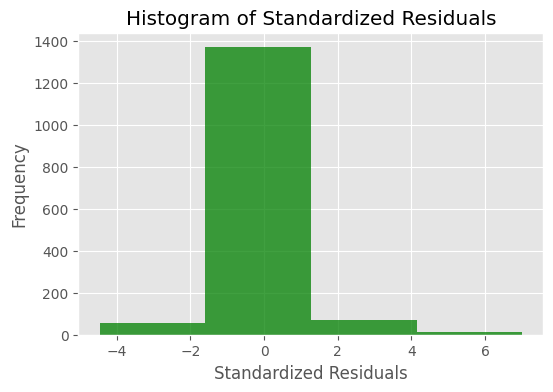


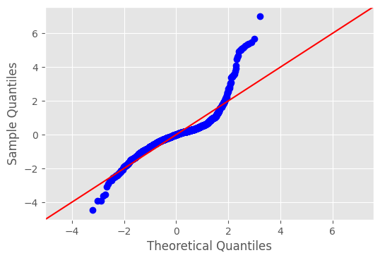


```python
plt.plot(res_dict['y_pre'], res_dict['std_resid'], 'o', color = 'gray')
plt.axhline(y=2, color = 'red', lw = 0.8)
plt.axhline(y=0, color = 'blue')
plt.axhline(y=-2, color = 'red', lw = 0.8)
plt.title('Standardized Residual Plot')
plt.xlabel('Predicted y value')
plt.ylabel('Standardized Residual')
plt.show()
```


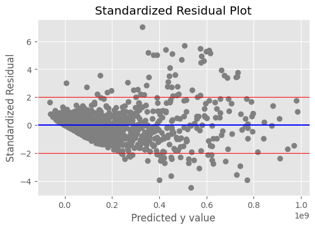


```python
res = mgt2001.model.runs_test(res_dict['std_resid'], cutoff='median') 
```

    ======= Runs Test =======
    (n1 (757) or n2 (757) > 20)
    Runs = 751
    runs_exp (mu_r) = 758.0000
    std (sigma_r) = 19.448646
    
    z-value (observed statistic) = -0.3599
    p-value = 0.7189
    Reject H_0 (Randomness does not exist) → False
    


根據長條圖及qqplot的結果，我們可以暫時假設其殘差為常態分佈。

針對第二個條件，從上面殘差的分佈圖，我們無法拒絕虛無假設，並認定殘差具有同方差性（Homoscedasticity）。

而第三個條件的 $p$ 值 $= 0.7189> \alpha = 0.05$. 我們無法拒絕虛無假設，並認定取樣是隨機的。

+ The Standard Error of Estimate  
    The $s_\epsilon = 100474639.1618$ 和$y$的平均比較起來 ($\bar y =  150390687.2820$)， $s_\epsilon$ 並沒有比較小。因此這個模型並沒有太好的貼合資料。
+ The Coefficient of Determination  
    + $r^2 = 0.7686$ ，代表 76.86% $y$ 的變異可以被這個回歸模型解釋。剩餘的23.14%無法被解釋。
    + 調整後的 $r^2$ is $0.7678$，和 $r^2$的差距小於6%，代表這個模型沒有over-fitting的問題。
+ The $F$-test of ANOVA  
    $F$-test的$p$值 $=0.0000 < \alpha = 0.05$，因此我們可以拒絕虛無假設。代表至少有一個變數的係數不等於0，代表這個模型是**有效的**。
+ Testing of the Coefficients  
    + $H_0$: $\beta_i = 0$ 
    + $H_1$: $\beta_i \neq 0$
    + $i$ =1,2,3,4,5


```python
for x, p in zip(new_x_names, res_dict['df_result'].pvalues[1:]):
    print("p-value of %s = %0.3f" % (x, p))
    if p < 0.05:
        print("  Since p-value < alpha = 0.05, we reject H0 at significance level at alpha = 0.05.")
        print("  There is enough evidence to infer that %s is linearly related to monthly sales.\n" %x)
    else:
        print("  Since p-value > alpha = 0.05, we can not reject H0 at significance level at alpha = 0.05.")
        print("  There is not enough evidence to infer that %s is linearly related to monthly sales.\n" %x)
```

    p-value of budget = 0.000
      Since p-value < alpha = 0.05, we reject H0 at significance level at alpha = 0.05.
      There is enough evidence to infer that budget is linearly related to monthly sales.
    
    p-value of TMDB_vote_count = 0.000
      Since p-value < alpha = 0.05, we reject H0 at significance level at alpha = 0.05.
      There is enough evidence to infer that TMDB_vote_count is linearly related to monthly sales.
    
    p-value of has_collection = 0.000
      Since p-value < alpha = 0.05, we reject H0 at significance level at alpha = 0.05.
      There is enough evidence to infer that has_collection is linearly related to monthly sales.
    
    p-value of rotten_aud_score = 0.000
      Since p-value < alpha = 0.05, we reject H0 at significance level at alpha = 0.05.
      There is enough evidence to infer that rotten_aud_score is linearly related to monthly sales.
    
    p-value of cast_cnt = 0.010
      Since p-value < alpha = 0.05, we reject H0 at significance level at alpha = 0.05.
      There is enough evidence to infer that cast_cnt is linearly related to monthly sales.
    


我們得到的模型為：

$$
ŷ = -97643508.4111 + 1.8114 x_1 + 23805.2576 x_2 + 86918589.9428 x_3 + 755207.4222 x_4 + 1247804.2424 x_5 
$$

+ $b_0 = -97643508.4111$: 當所有的變數皆為0時$y$的截距。但在所有的資料中並不包含這個範圍，因此不解讀截距的意義。
+ $b_1 = 1.8114$: 在這個模型中，預算每多一美金，票房會成長\$1.8114 (在其他變數維持不變的前提下)。
+ $b_2 = 23805.2576$: 在這個模型中，TMDB_vote_count每多一單位，票房會成長\$23805.2576 (在其他變數維持不變的前提下)。
+ $b_3 = 86918589.9428$: 在這個模型中，如果有collection的話，票房會成長\$86918589.9428 (在其他變數維持不變的前提下)。 
+ $b_4 = 755207.4222$: 在這個模型中，rotten_aud_score每多一分，票房就會成長\$755207.4222 (在其他變數維持不變的前提下)。
+ $b_5 = 1247804.2424$: 在這個模型中，演員數每多一名，票房就會成長\$1247804.2424 (在其他變數維持不變的前提下)。

#### 如果去掉 Outliers 的結果會如何？


```python
regression_df[y_name]
```


    0        29922472
    1       157107755
    2        33583175
    3       112462508
    4        45236543
              ...    
    1509     17133446
    1510     73515024
    1511    191540586
    1512     50401502
    1513    374733942
    Name: revenue, Length: 1514, dtype: int64


+ dependent variables(y): 'revenue'<br>
+ independent variables(x): 'budget'(x1), 'TMDB_vote_count'(x2), 'has_collection'(x3), 'rotten_aud_score(x4)'

has_collection is indicator variable.


```python
standard_resid = res_dict['std_resid']
x_data = regression_df[new_x_names].to_numpy()
y_data = regression_df[y_name]
outlier_index, infobs_index = mgt2001.team.Outlier_and_InfObs (standard_resid=standard_resid, x_data=x_data, y_data=y_data, Multi = True, df=regression_df)

outlier_index = np.array(outlier_index)
infobs_index = np.array(infobs_index)

outlier_infobs = np.concatenate([outlier_index, infobs_index])
outlier_infobs = list(dict.fromkeys(outlier_infobs))
# print(outlier_infobs)
regression_df = regression_df.drop(index=outlier_infobs)

regression_df = regression_df.reset_index()
regression_df = regression_df.drop(columns=['index'])

new_x_names.remove('cast_cnt') #since multicollinearity problem

res_dict_new, assessment_new = mgt2001.model.MultipleRegression(x_names=new_x_names, 
                                                        y_name=y_name, 
                                                        df=regression_df, 
                                                        assessment=False, 
                                                        t_test_c=0, 
                                                        t_test_option='two-tail')
```

    
    
                                OLS Regression Results                            
    ==============================================================================
    Dep. Variable:                revenue   R-squared:                       0.816
    Model:                            OLS   Adj. R-squared:                  0.815
    Method:                 Least Squares   F-statistic:                     1533.
    Date:                Sat, 26 Jun 2021   Prob (F-statistic):               0.00
    Time:                        16:04:21   Log-Likelihood:                -26863.
    No. Observations:                1389   AIC:                         5.374e+04
    Df Residuals:                    1384   BIC:                         5.376e+04
    Df Model:                           4                                         
    Covariance Type:            nonrobust                                         
    ====================================================================================
                           coef    std err          t      P>|t|      [0.025      0.975]
    ------------------------------------------------------------------------------------
    const            -6.274e+07   6.33e+06     -9.910      0.000   -7.52e+07   -5.03e+07
    budget               1.7131      0.047     36.643      0.000       1.621       1.805
    TMDB_vote_count   2.249e+04    837.531     26.848      0.000    2.08e+04    2.41e+04
    has_collection    7.163e+07   3.99e+06     17.948      0.000    6.38e+07    7.95e+07
    rotten_aud_score  4.774e+05   1.04e+05      4.571      0.000    2.73e+05    6.82e+05
    ==============================================================================
    Omnibus:                      114.202   Durbin-Watson:                   2.015
    Prob(Omnibus):                  0.000   Jarque-Bera (JB):              257.857
    Skew:                           0.496   Prob(JB):                     1.02e-56
    Kurtosis:                       4.863   Cond. No.                     2.29e+08
    ==============================================================================
    
    Notes:
    [1] Standard Errors assume that the covariance matrix of the errors is correctly specified.
    [2] The condition number is large, 2.29e+08. This might indicate that there are
    strong multicollinearity or other numerical problems.
    
    ======= Multiple Regression Results =======
    Dep. Variable: revenue
    No. of Observations (n): 1389
    No. of Ind. Vairable (k): 4
    Mean of Dep. Variable: 112473146.0958
    Standard Deviation of Dep. Variable: 141390186.6270
    Standard Error: 60766005.5533 (ȳ = 112473146.0958)
    SSR: 5110430284363340800.0000
    
    R-square: 0.8158
    Adjusted R-square: 0.8153
    Difference (≤ 0.06 True): 0.0005322962023602829
    
    Estimated model: ŷ = -62743630.3927 + 1.7131 x1 + 22486.4149 x2 + 71625474.3703 x3 + 477437.8165 x4
    
    <F-test>
    F(observed value):  1532.6533
    p-value:  0.0000 (Overwhelming Evidence)
    Reject H_0 (The model is valid: at least one beta_i ≠ 0) → True
    


接著，在進一步檢驗這個模型的解釋力前我們要確認其殘差分析滿足下列三個條件：

1. Non-normality （常態性）
2. Heteroscedasticity and homoscedasticity （變異數同質性）
3. Non-independence of the error variable （獨立性）

For the first condition, the hypotheses are as follows:

+ $H_0$: The errors are normally distributed
+ $H_1$: The errors are not normally distributed

For the second condition, the hypotheses are:

+ $H_0$: The residuals are of constant variance (Homoscedasticity)
+ $H_1$: The residuals are not of constant variance (Heteroscedasticity)

For the third condition, the hypotheses are:

+ $H_0$: Randomness exists
+ $H_1$: Randomness does not exist


```python
mu_3 = np.mean(res_dict_new['std_resid'])
sigma_3 = np.std(res_dict_new['std_resid'])
k_3 = res_dict_new['df_result'].df_model
fig, ax = plt.subplots()
counts, bins, patches = plt.hist(res_dict_new['std_resid'], 4, density=False, facecolor='g', alpha=0.75)
plt.xlabel('Standardized Residuals')
plt.ylabel('Frequency')
plt.title('Histogram of Standardized Residuals')
plt.grid(True)
bin_centers = [np.mean(k_3) for k_3 in zip(bins[:-1], bins[1:])]
plt.show()
fig = sm.qqplot(res_dict_new['std_resid'], stats.norm, fit=True, line='45')
```


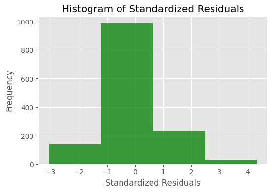


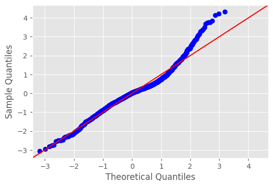


```python
plt.plot(res_dict_new['y_pre'], res_dict_new['std_resid'], 'o', color = 'gray')
plt.axhline(y=2, color = 'red', lw = 0.8)
plt.axhline(y=0, color = 'blue')
plt.axhline(y=-2, color = 'red', lw = 0.8)
plt.title('Standardized Residual Plot')
plt.xlabel('Predicted y value')
plt.ylabel('Standardized Residual')
plt.show()
```


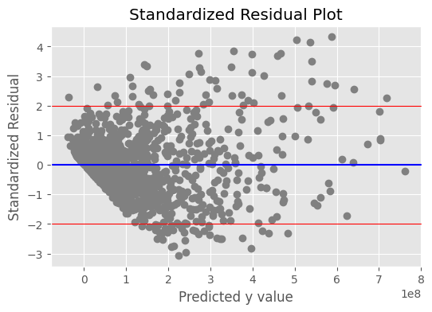


```python
res = mgt2001.model.runs_test(res_dict_new['std_resid'], cutoff='median') 
```

    ======= Runs Test =======
    (n1 (695) or n2 (694) > 20)
    Runs = 699
    runs_exp (mu_r) = 695.4996
    std (sigma_r) = 18.627922
    
    z-value (observed statistic) = 0.1879
    p-value = 0.8509
    Reject H_0 (Randomness does not exist) → False
    


根據長條圖及qqplot的結果，我們可以假設其殘差為常態分佈。

針對第二個條件，從上面殘差的分佈圖，我們無法拒絕虛無假設，並認定殘差具有同方差性（Homoscedasticity）。

而第三個條件的 $p$ 值 $= 0.8509> \alpha = 0.05$. 我們無法拒絕虛無假設，並認定取樣是隨機的。

+ The Standard Error of Estimate  
    The $s_\epsilon = 59949741.3693$ 和$y$的平均比較起來 ($\bar y =  113392305.8323$)， $s_\epsilon$ 並沒有比較小。因此這個模型並沒有太好的貼合資料。
+ The Coefficient of Determination  
    + $r^2 = 0.816$ ，代表 81.6% $y$ 的變異可以被這個回歸模型解釋。剩餘的18.4%無法被解釋。
    + 調整後的 $r^2$ is $0.815$，和 $r^2$的差距小於6%，代表這個模型沒有over-fitting的問題。
+ The $F$-test of ANOVA  
    $F$-test的$p$值 $=0.0000 < \alpha = 0.05$，因此我們可以拒絕虛無假設。代表至少有一個變數的係數不等於0，這個模型是**有效的**。
+ Testing of the Coefficients  
    + $H_0$: $\beta_i = 0$ 
    + $H_1$: $\beta_i \neq 0$
    + $i$=1,2,3,4


```python
for x, p in zip(new_x_names, res_dict_new['df_result'].pvalues[1:]):
    print("p-value of %s = %0.3f" % (x, p))
    if p < 0.05:
        print("  Since p-value < alpha = 0.05, we reject H0 at significance level at alpha = 0.05.")
        print("  There is enough evidence to infer that %s is linearly related to monthly sales.\n" %x)
    else:
        print("  Since p-value > alpha = 0.05, we can not reject H0 at significance level at alpha = 0.05.")
        print("  There is not enough evidence to infer that %s is linearly related to monthly sales.\n" %x)
```

    p-value of budget = 0.000
      Since p-value < alpha = 0.05, we reject H0 at significance level at alpha = 0.05.
      There is enough evidence to infer that budget is linearly related to monthly sales.
    
    p-value of TMDB_vote_count = 0.000
      Since p-value < alpha = 0.05, we reject H0 at significance level at alpha = 0.05.
      There is enough evidence to infer that TMDB_vote_count is linearly related to monthly sales.
    
    p-value of has_collection = 0.000
      Since p-value < alpha = 0.05, we reject H0 at significance level at alpha = 0.05.
      There is enough evidence to infer that has_collection is linearly related to monthly sales.
    
    p-value of rotten_aud_score = 0.000
      Since p-value < alpha = 0.05, we reject H0 at significance level at alpha = 0.05.
      There is enough evidence to infer that rotten_aud_score is linearly related to monthly sales.
    


我們得到的模型為：

$$
ŷ = -62743630.3927 + 1.7131 x_1 + 22486.4149 x_2 + 71625474.3703 x_3 + 477437.8165 x_4
$$

+ $b_0 = -62743630.3927$: 當所有的變數皆為0時$y$的截距。但在所有的資料中並不包含這個範圍，因此不解讀截距的意義。 
+ $b_1 = 1.7131$: 在這個模型中，預算每多一美金，票房會成長\$1.7131 (在其他變數維持不變的前提下)。
+ $b_2 = 22486.4149$: 在這個模型中，TMDB_vote_count每多一單位，票房會成長\$22486.4149 (在其他變數維持不變的前提下)。
+ $b_3 = 71625474.3703 $: 在這個模型中，如果有collection的話，票房會成長\$71625474.3703 (在其他變數維持不變的前提下)。 
+ $b_4 = 477437.8165$: 在這個模型中，rotten_aud_score每多一分，票房就會成長\$477437.8165 (在其他變數維持不變的前提下)。

接著利用此 model 進行預測，預測 2020/1 的電影票房。


```python
#['budget', 'TMDB_vote_count', 'has_collection', 'rotten_aud_score']
real_revenue = np.array([245692007,42800000,40882928,26925979,18472775,1023510,22059211])
x_pre = np.array([[1, 175000000, 2540, 0, 76],#Dolittle
                  [1, 10000000, 801, 0, 23], #The Grudge
                  [1, 80000000, 2076, 0, 60], #Underwater
                  [1, 29000000, 482, 0, 65], #Like a Boss
                  [1, 14000000, 643, 0, 15], #The Turning
                  [1, 6000000, 737, 0, 82], #Color Out of Space
                  [1, 5000000, 944, 0, 23]]) #Gretel & Hansel

y_pre = res_dict_new['df_result'].predict(x_pre)
print('prediction revenue: ', y_pre)
gap = np.absolute(real_revenue-y_pre)/real_revenue
print('gap: ', gap)
print('average gap: ', gap.sum()/7)
```

    prediction revenue:  [ 3.30448696e+08 -1.66199961e+07  1.49632005e+08  2.88080236e+07
     -1.71399737e+07  3.25732605e+06 -2.19699119e+07]
    gap:  [0.34497129 1.38831767 2.66001196 0.06989698 1.92785051 2.18250535
     1.99595184]
    average gap:  1.5099293705639918


因為 female_cast_cnt 與 male_cast_cnt 與 cast_cnt 會有多元共線性的問題，加上顯著度不高，於是我們選擇刪除這些變數。  

我們最後所得到的 Gap 其實非常大（1.5），我們推測可能的原因是標準差太大，所以預測結果比較容易失準。

## 電影的賺錢程度 - ROI 與票房的關係

最後，我們想知道 **票房好的電影真的賺的比較多嗎？**


```python
ax1 = u_movie_df.plot.scatter(x ='revenue', y = 'ROI', c='DarkBlue')
plt.title("After removing the outlier")
```


    Text(0.5, 1.0, 'After removing the outlier')


```python
df_compare = u_movie_df[['revenue', 'ROI']]
df_compare = df_compare.dropna().reset_index()
display(df_compare)

temp_1 =  df_compare[df_compare.revenue >= df_compare.revenue.mean()]
temp_2 =  df_compare[df_compare.revenue < df_compare.revenue.mean()]
temp_1 = temp_1.dropna().reset_index()
temp_2 = temp_2.dropna().reset_index()
temp_1 = temp_1.rename(columns={"ROI": "ROI_1"})
temp_2 = temp_2.rename(columns={"ROI": "ROI_2"})
```


<div>
<style scoped>
    .dataframe tbody tr th:only-of-type {
        vertical-align: middle;
    }

    .dataframe tbody tr th {
        vertical-align: top;
    }

    .dataframe thead th {
        text-align: right;
    }
</style>
<table border="1" class="dataframe">
  <thead>
    <tr style="text-align: right;">
      <th></th>
      <th>index</th>
      <th>revenue</th>
      <th>ROI</th>
    </tr>
  </thead>
  <tbody>
    <tr>
      <th>0</th>
      <td>0</td>
      <td>161834276</td>
      <td>3.045857</td>
    </tr>
    <tr>
      <th>1</th>
      <td>1</td>
      <td>144056873</td>
      <td>2.601422</td>
    </tr>
    <tr>
      <th>2</th>
      <td>2</td>
      <td>45554533</td>
      <td>0.518484</td>
    </tr>
    <tr>
      <th>3</th>
      <td>3</td>
      <td>28780255</td>
      <td>3.111465</td>
    </tr>
    <tr>
      <th>4</th>
      <td>4</td>
      <td>106371651</td>
      <td>1.575585</td>
    </tr>
    <tr>
      <th>...</th>
      <td>...</td>
      <td>...</td>
      <td>...</td>
    </tr>
    <tr>
      <th>2783</th>
      <td>2783</td>
      <td>47019435</td>
      <td>1.765849</td>
    </tr>
    <tr>
      <th>2784</th>
      <td>2784</td>
      <td>30763855</td>
      <td>2.076386</td>
    </tr>
    <tr>
      <th>2785</th>
      <td>2785</td>
      <td>76706000</td>
      <td>2.835300</td>
    </tr>
    <tr>
      <th>2786</th>
      <td>2786</td>
      <td>80648577</td>
      <td>1.016214</td>
    </tr>
    <tr>
      <th>2787</th>
      <td>2787</td>
      <td>46586903</td>
      <td>-0.767065</td>
    </tr>
  </tbody>
</table>
<p>2788 rows × 3 columns</p>
</div>


```python
n = df_compare.shape[0] #num of data
print(n)
boo = []

for i in range(n):
    if(df_compare.revenue.iloc[i] >= df_compare.revenue.mean()):
        boo.append('above')
    else:
        boo.append('below')


df_compare['average'] = boo
    
print('Head of dataset:')
display(df_compare.head())

print("Tail of dataset:")
display(df_compare.tail())
```

    2788
    Head of dataset:


<div>
<style scoped>
    .dataframe tbody tr th:only-of-type {
        vertical-align: middle;
    }

    .dataframe tbody tr th {
        vertical-align: top;
    }

    .dataframe thead th {
        text-align: right;
    }
</style>
<table border="1" class="dataframe">
  <thead>
    <tr style="text-align: right;">
      <th></th>
      <th>index</th>
      <th>revenue</th>
      <th>ROI</th>
      <th>average</th>
    </tr>
  </thead>
  <tbody>
    <tr>
      <th>0</th>
      <td>0</td>
      <td>161834276</td>
      <td>3.045857</td>
      <td>above</td>
    </tr>
    <tr>
      <th>1</th>
      <td>1</td>
      <td>144056873</td>
      <td>2.601422</td>
      <td>above</td>
    </tr>
    <tr>
      <th>2</th>
      <td>2</td>
      <td>45554533</td>
      <td>0.518484</td>
      <td>below</td>
    </tr>
    <tr>
      <th>3</th>
      <td>3</td>
      <td>28780255</td>
      <td>3.111465</td>
      <td>below</td>
    </tr>
    <tr>
      <th>4</th>
      <td>4</td>
      <td>106371651</td>
      <td>1.575585</td>
      <td>below</td>
    </tr>
  </tbody>
</table>
</div>


    Tail of dataset:


<div>
<style scoped>
    .dataframe tbody tr th:only-of-type {
        vertical-align: middle;
    }

    .dataframe tbody tr th {
        vertical-align: top;
    }

    .dataframe thead th {
        text-align: right;
    }
</style>
<table border="1" class="dataframe">
  <thead>
    <tr style="text-align: right;">
      <th></th>
      <th>index</th>
      <th>revenue</th>
      <th>ROI</th>
      <th>average</th>
    </tr>
  </thead>
  <tbody>
    <tr>
      <th>2783</th>
      <td>2783</td>
      <td>47019435</td>
      <td>1.765849</td>
      <td>below</td>
    </tr>
    <tr>
      <th>2784</th>
      <td>2784</td>
      <td>30763855</td>
      <td>2.076386</td>
      <td>below</td>
    </tr>
    <tr>
      <th>2785</th>
      <td>2785</td>
      <td>76706000</td>
      <td>2.835300</td>
      <td>below</td>
    </tr>
    <tr>
      <th>2786</th>
      <td>2786</td>
      <td>80648577</td>
      <td>1.016214</td>
      <td>below</td>
    </tr>
    <tr>
      <th>2787</th>
      <td>2787</td>
      <td>46586903</td>
      <td>-0.767065</td>
      <td>below</td>
    </tr>
  </tbody>
</table>
</div>


**檢查是否為常態分佈**


```python
_ = plt.hist(temp_1['revenue'], bins = 'auto', alpha=0.5, label='above')
_ = plt.hist(temp_2['revenue'], bins = 'auto', alpha=0.5, label='below')
plt.legend()
plt.show()
```


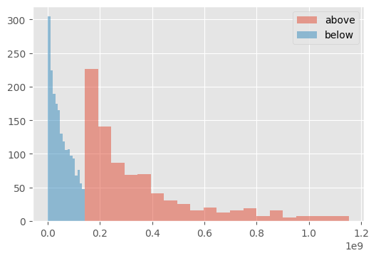


```python
_ = plt.hist(df_compare['ROI'], bins = 'auto', alpha=0.5)
plt.show()
```


由於資料不是常態分佈，因此我們使用Wilcoxon Rank Sum Test。

**Wilcoxon Signed Rank Sum Test**

+ $H_0:$ The locations of two populations are the same.
+ $H_1:$ The location of population 1(Better Revenue) is to the right of the location of population 2 (i.e., population 1 is greater).


```python
df_compare_ = pd.DataFrame([temp_1["ROI_1"], temp_2["ROI_2"]])
df_compare_ = df_compare_.T
```


```python
stats.wilcoxon(df_compare_['ROI_1'], df_compare_['ROI_2'], alternative='greater')
```


    WilcoxonResult(statistic=271329.0, pvalue=1.0)


**Friedman Test**


Suppose the data are not normally distributed.


+ $H_0:$ The locations of two populations are the same.
+ $H_1:$ At least two population locations differ.


```python
_ = non.friedman_chi2_test(data=df_compare_)
```

    ======= Friedman Test with Chi-squared Test =======
    (Number of blocks = 1957 >= 5 or number of populations 2 >= 5)
    
    F_r statistic value (observed) = -10689.0910
    chi2 critical value = 3.8415
    p-value = 1.0000 (No Evidence)
    Reject H_0 (Not all 2 population locations are the same) → False
        


Wilcoxon signed rank sum test 和 Friedman Test 的 $p$-value 皆大於 $\alpha$。因此我們並不能拒絕虛無假設。<br>

**結論：所以我們可以得知票房較好並不代表ROI較高。**

<div class="alert alert-block alert-info">
<b>🍿 你知道嗎？</b><br>
    
2009年，派拉蒙影業公司發行的《鬼影實錄》是目前投資報酬率最高的電影，僅憑1.1萬美金的製作成本，換回了全球1.97億的票房</div>
